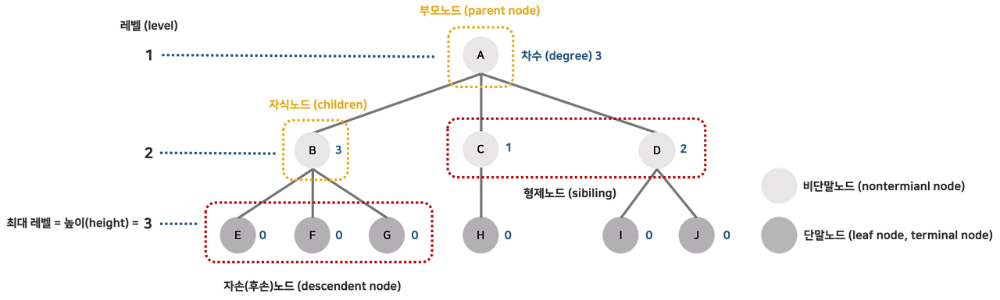

# Day 28 - Tree와 Heap

# Tree

- 비선형 자료구조로 그래프의 한 종류이다
- 계층적인 자료를 표현하기에 적합하다
- DAG(Directed Acyclic Graphs)의 한 종류이다. 즉, 사이클이 없다



- 루트 노드(root node) : 부모가 없는 노드 (트리의 최상위 노드)
  - A 노드
- 단말 노드 (leaf node) : 자식이 없는 노드
  - E, F, G, H, I, J 노드들은 단말 노드
- 내부 노드(internal, non-terminal node, 비단말노드) : 단말 노드가 아닌 노드
  - A, B, C, D 노드들은 내부 노드
- 형제 노드 (sibling) : 같은 부모를 가지는 노드
  - C와 D는 형제 노드
- 노드의 크기(size) : 자신을 포함한 모든 자식 노드들의 총 개수(특정 노드를 루트 노드로 하는 서브 트리의 총 노드 수)
  - B의 크기는 4
- 노드의 깊이(depth) : 루트에서 어떤 노드에 도달하기 위해 거쳐야 하는 간선의 수
  - 루트 노드의 깊이는 0이고, 아래로 갈 때 마다 1씩 증가
- 노드의 레벨(level) : 트리의 특정 깊이를 가지는 노드의 집합
  - 루트 노드의 레벨은 1
- 노드의 차수(degree) : 하위 간선의 수
  - B의 차수는 3
- 트리의 차수(degree of tree) : 트리의 최대 차수
  - 사진에서는 3
- 트리의 높이(height) : 트리의 최대 레벨
  - 사진에서는 3

## 트리의 종류

### 이진 트리(Binary Tree)

- 각 노드가 최대 두 개의 자식을 갖는 트리
- $n$개의 노드를 가진 이진 트리는 $n-1$개의 간선을 가진다
- 높이가 $h$인 이진 트리의 경우 최소 $h$개의 노드를 가지고 최대 $2^h-1$개의 노드를 가진다.
- 이진 트리 순회
  - 중위 순회(in-order traversal) : 왼쪽 → 현재 → 오른쪽
    ```c
    void inOrderTraversal(TreeNode node) {
    	if (node != null) {
    		inOrderTraversal(node.left);
    		visit(node);
    		inOrderTraversal(node.right);
    	}
    }
    ```
  - 전위 순회(pre-order traversal) : 현재 → 왼쪽 → 오른쪽
    ```c
    void preOrderTraversal(TreeNode node) {
    	if (node != null) {
    		visit(node);
    		inOrderTraversal(node.left);
    		inOrderTraversal(node.right);
    	}
    }
    ```
  - 후위 순회(post-order traversal) : 왼쪽 → 오른쪽 → 현재
    ```c
    void postOrderTraversal(TreeNode node) {
    	if(node != null) {
    		postOrderTraversal(node.left);
    		postOrderTraversal(node.right);
    		visit(node);
      }
    }
    ```
- 이진 트리의 종류
  - 포화 이진 트리 : 각 레벨에 노드가 꽉 차있는 트리
  - 완전 이진 트리 : 마지막 레벨을 제외하고 모든 노드가 채워져있고, 마지막 레벨의 경우 왼쪽에서 오른쪽 순으로 빈틈 없이 채워진 트리 (포화 이진 트리는 완전 이진 트리이다. 역은 성립 X)
  - 기타 이진 트리

### 균형 트리 vs 비균형 트리

- 균형 트리
  - O(log n)시간에 삽입과 검색을 할 수 있을 정도로 균형이 잡혀있는 트리
  - e.g.) red-black tree, AVL tree
- 비균형 트리
  - 균형을 맞추지 않아 한쪽으로 치우친 트리
  - e.g.) 일반적인 이진 트리, 편향 트리

---

# 힙

- 완전 이진 트리의 일종으로 우선순위 큐를 위해 만들어진 자료구조이다
- 최대 힙과 최소 힙으로 나눠진다. 최대 힙은 부모노드의 값이 자식 노드들의 값보다 항상 크고 최소 힙은 그 반대이다. (느슨한 정렬 상태를 유지함)

### 힙의 구현

- 주로 배열을 사용해서 구현함
- 구현의 용이성을 위해 인덱스 0은 사용 안함
- 왼쪽 자식의 인덱스 = 부모 인덱스 \* 2
- 오른쪽 자식의 인덱스 = 부모 인덱스 \* 2 + 1
- 부모의 인덱스 = 자식의 인덱스 / 2


### 힙 삽입

- 아래 예시는 최대 힙


```java
void insert_max_heap(int x) {
	maxHeap[++heapSize] = x;

	for (int i = heapSize; i > 1; i /= 2) {
		if (if (maxHeap[i/2] < maxHeap[i]) {
			swap(i/2, i);
		}
		else {
			break;
		}
	}

}
```

### 힙 삭제

- 루트 노드를 삭제하고, 삭제된 자리에 힙의 마지막 노드를 가져온 뒤 힙 전체를 재구성한다


```java
int delete_max_heap() {
	if (heapSize == 0) return 0;

	int root = maxHeap[1];

	maxHeap[1] = maxHeap[heapSize];
	maxHeap[heapSize--] = 0;

	for (int i = 1; i * 2 <= heapSize;) {
		if (maxHeap[i] > maxHeap[i*2] && maxHeap[i*2 + 1]) {
			break;
		}
		else if (maxHeap[i*2] > maxHeap[i*2 + 1]) {
			swap(i, i*2);
			i = i * 2;
		}
		else {
			swap(i, i*2 + 1);
			i = i * 2 + 1;
		}
	}

	return root;
}
```
