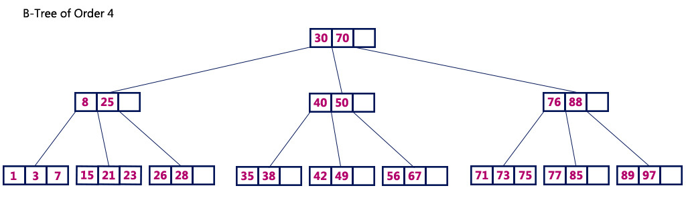
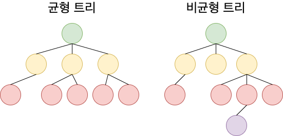
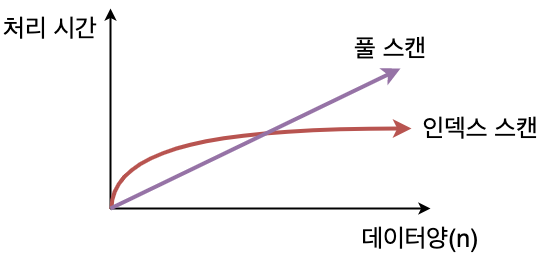
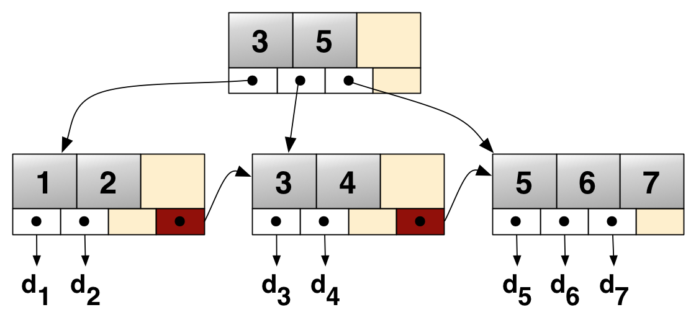

# Day 29 B-Tree & B+Tree

## B-Tree (Balanced-Tree)

- B-tree는 균형 트리로 **루트로부터 리프까지의 거리가 일정한** 트리 구조
- 한 노드 당 자식 노드가 2개 이상 가능함
- key값을 이용해 찾고자하는 데이터를 트리 구조를 이용해 찾음
- 데이터를 검색할 때 빠른 속도로 데이터를 찾을 수 있음
- 트리의 노드가 수정되어야 한다면 재정렬을 해줘야 함(단점)

> 어느 정도 자동으로 균형을 회복하는 기능이 있지만, 갱신 빈도가 높은 테이블에 작성되는 인덱스 같은 경우 인덱스 재구성을 해서 트리의 균형을 되찾는 작업이 필요하다.

- 풀 스캔이 테이블의 크기에 비례하는 형태로 실행 시간이 늘어가는데 비해 인덱스를 사용한 경우 실행 시간의 저하는 보통 원만한 곡선을 그리게 됨

## B+tree

- B-tree의 확장 개념
- B-tree는 internal 또는 branch 노드에 key와 data를 담을 수 있음, B+tree는 **브랜치 노드에 key만** 담아두고 data를 담지 않음. 오직 **리프 노드에만 key와 data를 저장**하고, **리프 노드끼리 Linked List**로 연결되어 있음

### 장점
- 리프 노드를 제외하고 데이터를 담아두지 않기 때문에 메모리를 더 확보 -> 더 많은 key 수용 -> 하나의 노드에 더 많은 key들을 담을 수 있음 -> 트리의 높이 낮아짐

- 풀 스캔 시, B+tree는 리프 노드에 데이터가 모두 있기 떄문에 한 번의 선형 탐색만 하면 됨 -> B-tree보다 빠름(B-tree의 경우 모든 노드를 확인해야 함)

## 참고
| 구분      | B-Tree     | B+Tree    |
| ------- | ---------- | --------- |
| 실제 데이터  | 내부/Leaf 노드 | Leaf 노드   |
| Leaf 연결 | 보통 X       | O         |
| 단일 값 검색 | 빠름         | 빠름        |
| 범위 검색   | 가능         | **더 효율적** |
| DB 인덱스  | 사용 가능      | **주로 사용** |

### 시험용 정리
- **B-Tree**: 여러 개의 키와 자식을 가지는 균형 탐색 트리
- **B+Tree**: 실제 데이터를 Leaf Node에만 저장하고 Leaf끼리 연결하여 범위 검색에 유리한 트리
- **Full Scan**: 인덱스를 이용하지 않고 테이블의 모든 데이터를 처음부터 끝까지 검사하는 방식

### 풀 스캔
- 인덱스를 이용하지 않고 데이터를 처음부터 끝까지 전부 확인하는 것