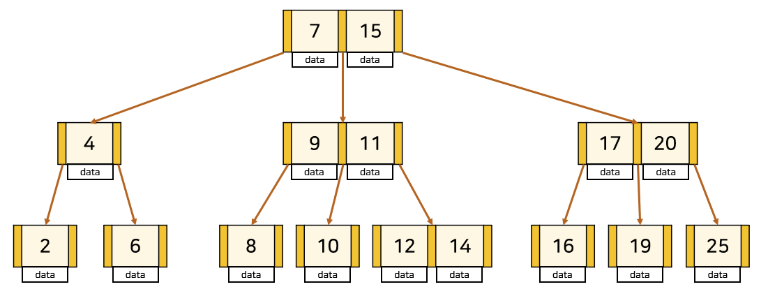
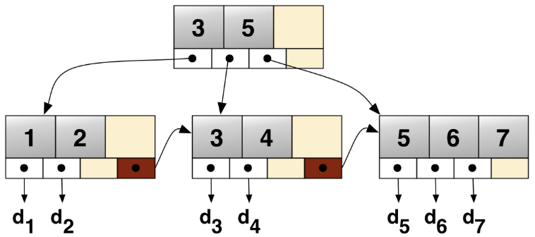

# B Tree & B+Tree

Date: 2026년 8월 11일
Status: In progress

# 개념

<aside>
📜

**B-Tree**

Balanced Tree로, 균형 잡힌 트리라는 의미의 자료구조이다.

**B+Tree**

B-Tree의 비효율적인 검색 성능을 보완한 Balanced Tree이다.

DB 테이블에서 데이터를 빠르게 검색할 수 있도록 도와주는 자료구조로서, Database-Index 파트를 참고하자~

[Index](https://app.notion.com/p/Index-3a8dcbefcab580e8aa09d03533c35c18?pvs=21) 

</aside>

---

# B-Tree

트리의 노드가 한쪽으로만 쏠리지 않도록 노드 삽입 및 삭제 시 **특정 규칙**에 맞게 재정렬하여 **전체적인 균형**을 유지한다.

### 특징

- 한 node의 key가 **k**개라면, 자식 노드의 개수는 **k+1**이다.
- node의 **key**는 **항상 정렬**된 상태이다.
- leaf node가 아닌 node는 항상 **2개 이상**의 자식 node를 가진다.
- 모든 leaf node들은 **항상 같은 level**에 위치한다.
- 각 node는 여러 개의 key와 각 key에 대응하는 data를 가지며, node들의 key는 **중복되지 않는다**.
- 각 node는 자식 node를 참조하는 **포인터**를 갖고 있다.

---

# B+Tree

데이터 검색 시 부모 node까지 전부 순회해아 하는 비효율이 있기 때문에 이를 보완하여, leaf node만 탐색해도 되는 구조이다.

### 차이점

- 데이터는 **leaf node**에만 저장한다. leaf가 아닌 root node와 중간 node들은 자식 node로 향하는 **포인터만** 갖는다.
- 모든 leaf node들은 **linked list**를 통해 서로 연결되어 있다.
- 중간 node들의 key를 통해 leaf node를 찾아가므로, node들이 갖는 key는 **중복될 수 있다**.

### 장점

- leaf가 아닌 node들에 실제 데이터를 저장하지 않고, key에 따라 자식 node로 향하는 포인터만 가질 수 있으므로, 저장 공간을 절약해 **더 많은 포인터**를 저장할 수 있다. → 한 node가 가질 수 있는 자식 node의 최대 개수를 늘릴 수 있으므로, 트리의 depth를 낮출 수 있다.
- **Full scan**시, **linked list**로 연결된 leaf node들에 대해서만 읽기를 진행하면 되므로 시간이 단축된다.

### 단점

- 실제 Data까지 접근하기 위해서는 **무조건** 트리의 맨 아래에 있는 **leaf node까지 접근**해야 한다.