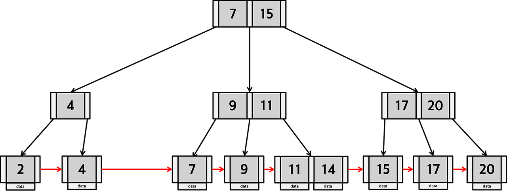

# Day 29 - B Tree & B+Tree

# B Tree

B Tree는 트리 자료구조의 일종으로 이진 트리를 확장해 하나의 노드가 가질 수 있는 자식 노드의 최대 숫자가 2보다 큰 트리 구조이다. (일반적으로 B- Tree를 B Tree라고 함)

### 특징

> 차수가 m인 B Tree 기준

1. 한 노드의 Key는 정렬되어 있다
2. 각 노드는 최대 m개의 자식과 m-1개의 Key를 가진다
3. 루트를 제외한 노드는 최소 ⌈m/2⌉개의 자식을 가진다
4. 모든 리프 노드는 같은 레벨에 있어야 한다
5. Key의 범위에 따라 자식 노드가 정해진다 (key 보다 작은 값, key들 사이에 있는 값, key 보단 큰 값)
6. 삽입으로 최대 Key 수를 초과하면 Split 한다
7. 삭제로 최소 Key 수 보다 적어지면 재분배 혹은 Merge한다

### 연산

#### 탐색

루트 노드에서부터 하향식으로 탐색한다

자식 노드의 데이터는 부모 노드의 데이터에 따라 오름차순으로 정렬되어 있다

### 삽입과 삭제

삽입과 삭제 연산의 경우 다음 [블로그](https://code-lab1.tistory.com/217)를 확인하자. 이해하기 쉽게 잘 설명되어 있다.

## B\* Tree

기존 B-Tree에서 자식 노드가 최소 ⌈m/2⌉개의 데이터를 가져야 했는데 얘는 최소 ⌈2m/3⌉개의 데이터를 가져야 한다

또 다른 차이점은 노드가 가득 찼을 때 바로 분리하는게 아니라 우선 형제 노드와 재분배 해보고 그래도 부족하면 분리한다

## B+ Tree

실제 데이터는 리프 노드에 저장하고 내부 노드는 탐색을 위한 Key와 자식 노드를 가리키는 포인터를 저장한다

리프 노드끼리 연결되어 있어 범위 검색에 유리하고, DB 인덱스에서 많이 사용된다

특정 값을 찾기 위해 반드시 리프 노드까지 탐색해야하지만, 인접 노드를 알 수 있기 때문에 다른 서브 트리에 존재하는 Key를 찾기 위해 다시 루트부터 탐색하지 않고, 선형적으로 탐색할 수 있어 순차 탐색과 범위 검색에 유리하다.
