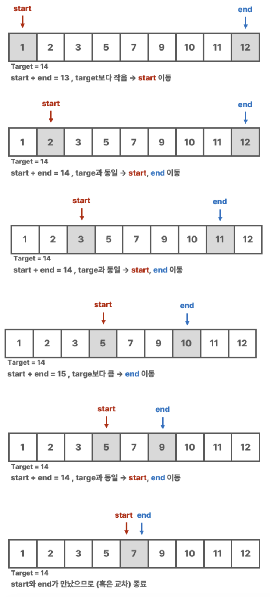
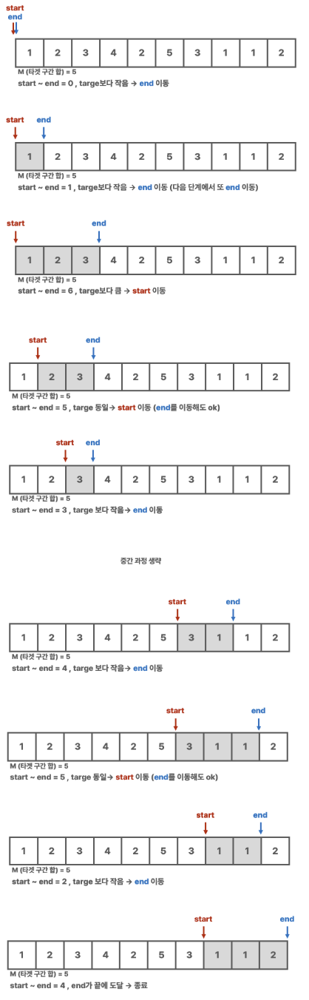

# Two Pointer

Date: 2026년 7월 3일
Status: Done

# 개념

<aside>
📜

1차원 배열에서 두 개의 포인터를 이동하며 원하는 값을 얻는 방식. (보통 정렬된 배열을 다룸)

- 1차원 배열의 양 끝에 각 포인터를 두고, 각 포인터가 중앙으로 오는 방식
- 한쪽 끝에 두 포인터를 두고, 전진하는 방식
- 일반적이진 않지만, 기준 인덱스로부터 양 끝으로 이동하는 방식도 있음
</aside>

---

# 예제

> n개의 서로 다른 양의 정수로 이루어진 수열 arr이 있을 때, arr[i] + arr[j] = x가 되는 (i, j) 쌍을 구하시오.
> 

```bash
두 포인터 left, right를 양 끝에 두고 아래 규칙에 따라 이동시킨다.
- arr[left]와 arr[right]의 합이 target보다 작으면, left를 이동
- arr[left]와 arr[right]의 합이 target보다 크면, right를 이동
- arr[left]와 arr[right]의 합이 target과 같으면, 둘 다 이동
```



> N개의 수로 구성된 수열 arr에서 i ~ j 번째 수의 합이 M이 되는 경우의 수를 구하시오.
> 

```bash
두 포인터 start, end를 한 쪽 끝인 시작점에 두고, 아래 규칙에 따라 포인터를 이동시키며 start ~ end 구간에 있는 수들의 합을 구한다.
- 합이 M보다 작으면 end를 우측으로 이동
- 합이 M보다 크면 start를 우측으로 이동
- 합이 M과 같으면 두 포인터 중 하나를 우측으로 이동
```



> 주어진 문자열에서 가장 긴 Palindromic Substring을 구하시오.

**Leetcode 5.Longest Palindromic Substring 참조**
> 

```python
# "babad" -> "bab" or "aba"
# "cbbd" -> "bb" 

# 문자열에 있는 문자 하나씩을 기준점으로 두고, 기준점으로부터 양 끝으로 포인터를 이동시키며 palindrome인지를 확인하는 로직으로 문제를 풀어나가면 된다.

class Solution:
    def longestPalindrome(self, s: str) -> str:
        def expand(left: int, right: int) -> str:
            while left >= 0 and right < len(s) and s[left] == s[right]:
                left -= 1
                right += 1
            return s[left + 1:right] # 팰린드롬이 아닌 경우, 마지막으로 팰린드롬이었던 부분을 반환한다.
        
        if len(s) < 2 or s == s[::-1]:
            return s
        
        result = ''
        for i in range(len(s) - 1):
            result = max(
                result, 
                expand(i, i + 1), 
                expand(i, i + 2), 
                key=len) # expand 함수를 사용하여 홀수 길이와 짝수 길이의 팰린드롬을 모두 검사한다. max 함수는 세 가지 문자열 중에서 가장 긴 문자열을 반환한다.
        
        return result
```

---

# 시간복잡도

일반적으로 정렬된 1차원 배열에서 두 포인터가 각각 선형으로 움직이며, 최대로는 모든 원소를 조회하면 연산이 끝나므로 O(n)이라고 할 수 있다.