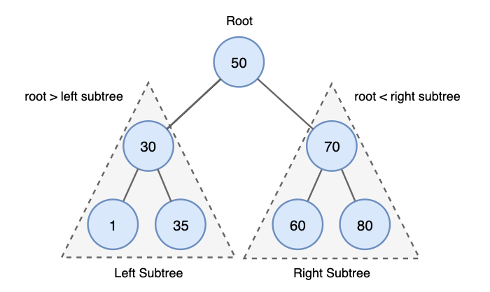
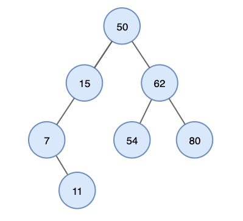
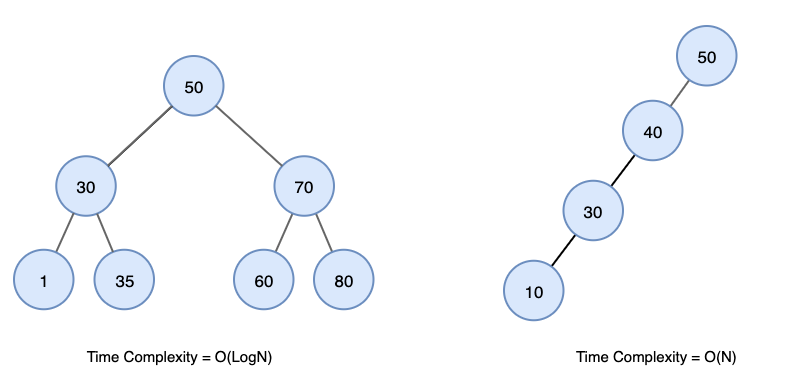
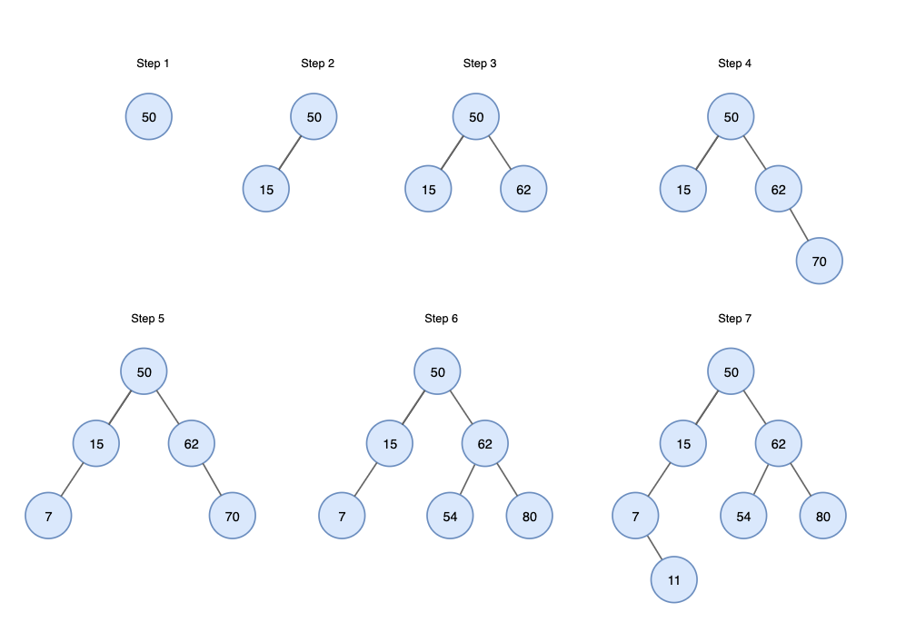
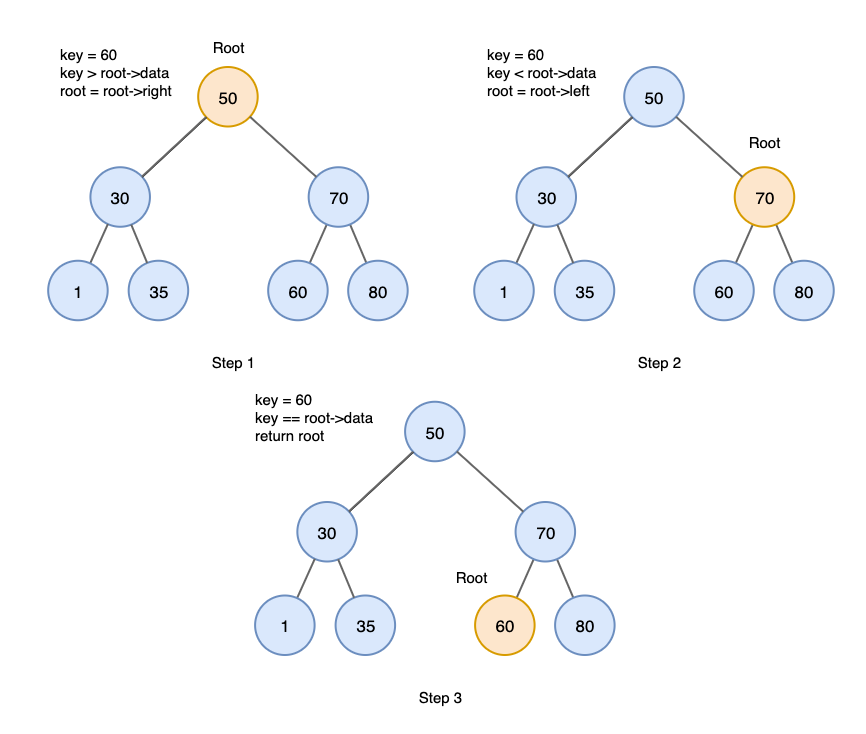
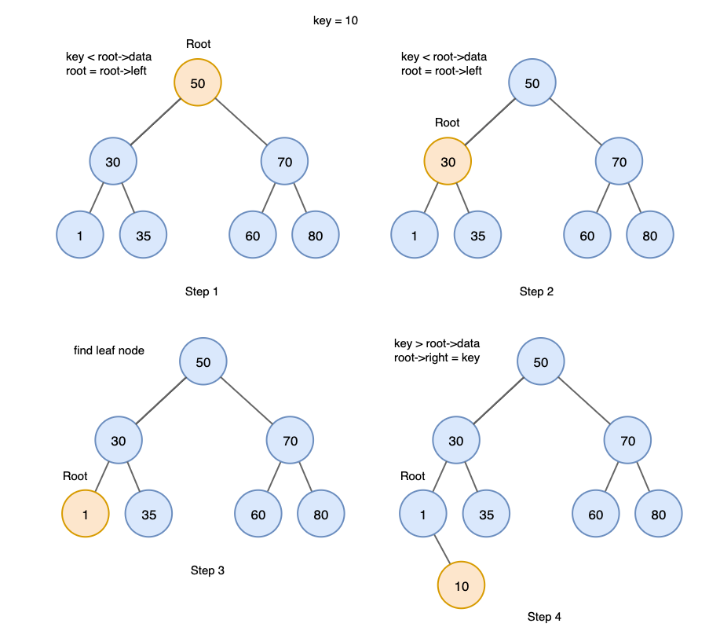
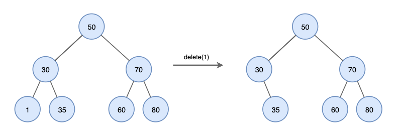
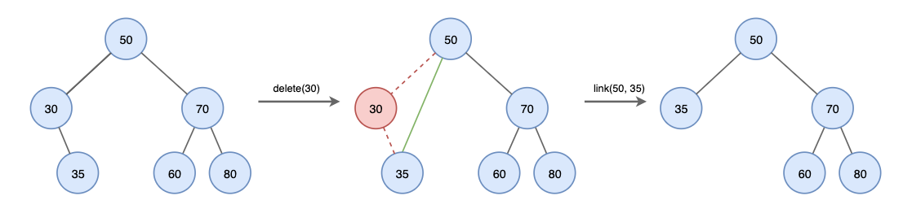
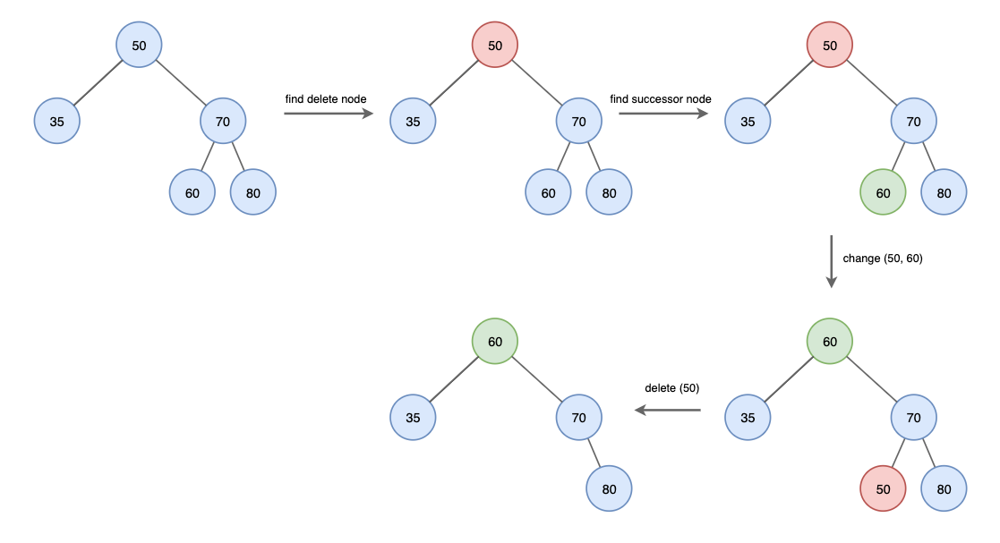

# Day30-1 BST(Binary Search Tree)

## 이진 탐색 트리 (BST, Binary Search Tree)



### 특징

- 노드의 왼쪽 자식 트리에는 노드의 key보다 작은 key가 있는 노드만 포함
- 노드의 오른쪽 자식 트리에는 노드의 key보다 큰 key가 있는 노드만 포함
- 왼쪽 / 오른쪽 자식 트리도 각각 이진 탐색 트리여야 함
- 중복된 key 허용하지 않음
- BST의 Inorder Traversal을 수행하면 모든 key를 정렬된 순서로 가져올 수 있음



inorder traversal 결과: `7, 11, 15, 50, 54, 62, 80`

- BST의 검색에 대한 시간복잡도
    - 균형 상태: O(logN)
    - 불균형 상태: 최대 O(N)




### 예시(BST 삽입 과정)

```text
50, 15, 62, 80, 7, 54, 11 BST
```




### 이진트리의 연산

#### 검색(Search)
1. 루트에서 시작
2. 검색값을 루트와 비교. 루트보다 작으면 왼쪽에 대해 재귀, 크면 오른쪽으로 재귀
3. 일치하는 값을 찾을 때까지 절차 반복
4. 검색 값이 없을 경우 null 반환

(Ex key = 60을 찾는 과정)



##### 구현
```python

class Node:
    def __init__(self, data):
        self.data = data
        self.left = None
        self.right = None


def search(root, key):
    # 찾지 못했거나 key를 찾은 경우
    if root is None or root.data == key:
        return root

    # key가 현재 노드보다 작으면 왼쪽 탐색
    if key < root.data:
        return search(root.left, key)

    # key가 현재 노드보다 크면 오른쪽 탐색
    return search(root.right, key)


# BST 생성
root = Node(50)

root.left = Node(30)
root.right = Node(70)

root.left.left = Node(1)
root.left.right = Node(35)

root.right.left = Node(60)
root.right.right = Node(80)


# 60 탐색
result = search(root, 60)

if result:
    print("찾음:", result.data)
else:
    print("찾지 못함")
```

#### 삽입(insert)

1. 루트에서 시작
2. 삽입 값을 루트와 비교. 루트보다 작으면 왼쪽으로 재귀, 크다면 오른쪽으로 재귀
3. 리프 노드에 도달한 후 노드보다 클 경우 오른쪽에, 작다면 왼족에 삽입



##### 구현

```python

class Node:
    def __init__(self, data):
        self.data = data
        self.left = None
        self.right = None


def insert(root, key):
    # 빈 위치를 찾으면 새 노드 삽입
    if root is None:
        return Node(key)

    # key가 현재 노드보다 작으면 왼쪽으로
    if key < root.data:
        root.left = insert(root.left, key)

    # key가 현재 노드보다 크면 오른쪽으로
    elif key > root.data:
        root.right = insert(root.right, key)

    return root


# 기존 BST 생성
root = Node(50)

root.left = Node(30)
root.right = Node(70)

root.left.left = Node(1)
root.left.right = Node(35)

root.right.left = Node(60)
root.right.right = Node(80)


# key = 10 삽입
root = insert(root, 10)

```

### 삭제(Delete)

#### 삭제할 노드가 리프노드인 경우
- 노드를 삭제하기만 하면 됨




#### 삭제할 노드에 자식이 하나만 있는 경우
- 노드를 삭제하고 자식 노드를 삭제된 노드의 부모에 연결




#### 삭제할 노드에 자식이 둘 있는 경우
- successor 노드(right subtree에서 최소값, inorder 순회에서 다음 노드)를 찾아야 함

1. 삭제할 노드를 찾음
2. 삭제할 노드의 successor 노드를 찾음
3. 삭제할 노드와 successor 노드의 값을  바꿈
4. successor 노드를 삭제




##### 구현

```python
class Node:
    def __init__(self, data):
        self.data = data
        self.left = None
        self.right = None


# 오른쪽 서브트리에서 가장 작은 값 찾기
def find_min(node):
    current = node

    while current.left is not None:
        current = current.left

    return current


def delete(root, key):
    # 삭제할 노드를 찾지 못한 경우
    if root is None:
        return root

    # 삭제할 값이 현재 노드보다 작음
    if key < root.data:
        root.left = delete(root.left, key)

    # 삭제할 값이 현재 노드보다 큼
    elif key > root.data:
        root.right = delete(root.right, key)

    # 삭제할 노드를 찾음
    else:

        # 1. 왼쪽 자식이 없는 경우
        # 리프 노드이거나 오른쪽 자식만 있는 경우
        if root.left is None:
            return root.right

        # 2. 오른쪽 자식이 없는 경우
        # 왼쪽 자식만 있는 경우
        elif root.right is None:
            return root.left

        # 3. 자식이 둘 다 있는 경우
        else:
            # 오른쪽 서브트리의 최소값 = successor
            successor = find_min(root.right)

            # successor의 값을 현재 노드에 복사
            root.data = successor.data

            # 기존 successor 노드 삭제
            root.right = delete(root.right, successor.data)

    return root

# 예시와 같은 트리 생성
root = Node(50)

root.left = Node(30)
root.right = Node(70)

root.left.left = Node(1)
root.left.right = Node(35)

root.right.left = Node(60)
root.right.right = Node(80)

# 리프노드 1 삭제
root = delete(root, 1)

# 자식이 하나인 30 삭제
root = delete(root, 30)

# 자식이 둘인 50 삭ㅈ제
root = delete(root, 50)
```

## 출처
[출처](https://yoongrammer.tistory.com/71)