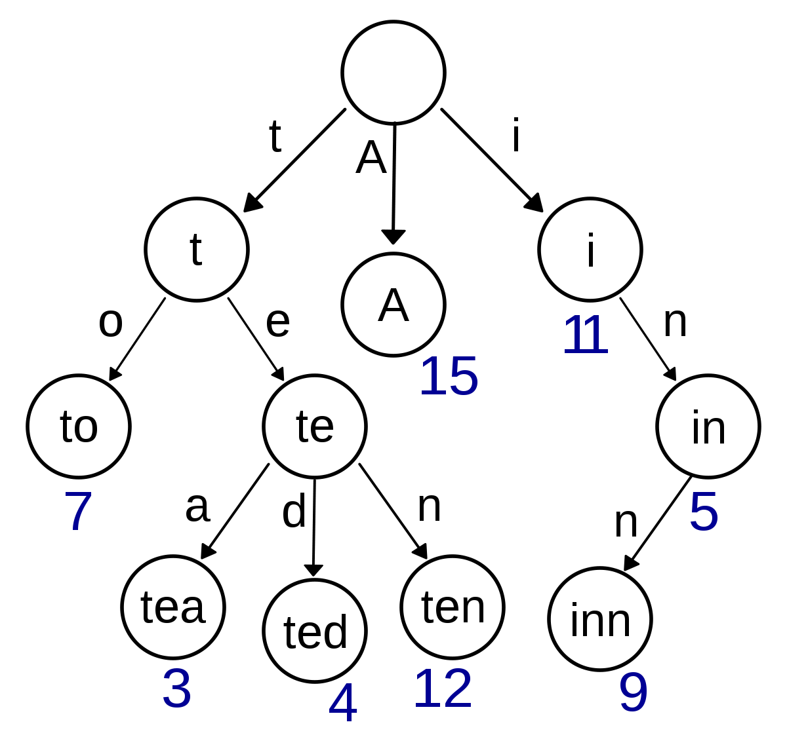
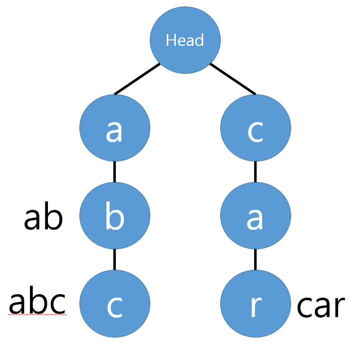
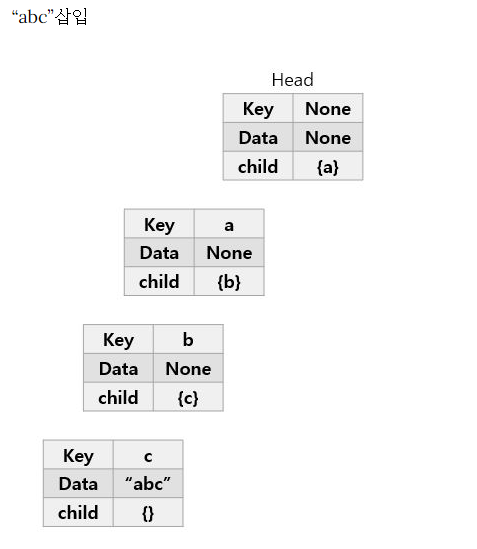
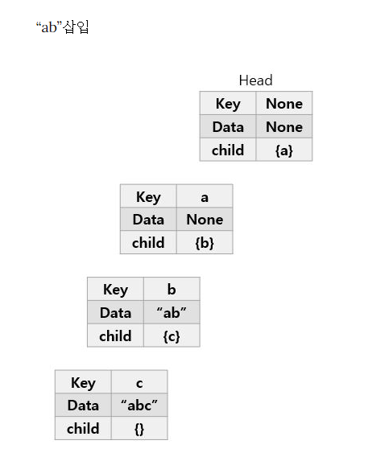
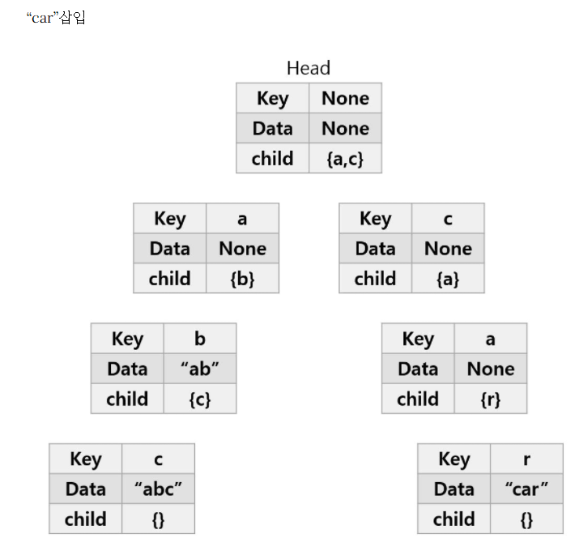

# Day 30-2 Trie(트라이) 자료구조

## 트라이(Trie)란



- 문자열을 저장하고 효율적으로 탐색하기 위한 트리 형태의 자료구조
- 자동완성 기능, 사전 검색 등 `문자열 탐색`에 특화 되어있는 자료구조
- 래딕스 트리(radix tree), 접두사 트리(prefix tree), 탐색 트리(retreival tree)라고도 함

```text
(Ex) 'Datastructure'라는 단어 검색

제일 먼저 'D'를 찾고, 다음에 'a','t', ...의 순서로 찾음
```


## 장단점
- 문자열 검색을 빠르게 함
- 하나하나씩 전부 비교하면서 탐색하는 것보다 시간복잡도 측면에서 효율적
- 각 노드에서 자식들에 대한 포인터들을 배열로 모두 저장하고 있다는 점에서 저장 공간의 크기가 크다(메모리 측면에서 비효율적)


## 예제

'abc','ab','car' 단어들을 'abc'부터 `트라이`에 저장한다 가정



1. **'abc'** `트라이(Trie)`에 삽입
    - 첫 번째 문자는 'a': 초기에 트라이 자료구조 내에는 아무것도 없으므로 Head의 자식노드에 'a'를 추가해준다.
    - 'a'노드에도 현재 자식이 하나도 없으므로, 'a'의 자식노드에 'b'를 추가
    - 'c'도 마찬가지로 'b'의 자식노드로 추가
    - 'abc' 단어가 여기서 끝남을 알리기 위해 현재 노드에 abc라고 표시. (Data)

    

2. **'ab'** `트라이(Trie)`에 삽입
    - 현재 Head의 자식노드로 'a'가 이미 존재한다. 따라서 'a'노드를 추가하지 않고, 기존에 있는 'a'노드로 이동함
    - 'b'도 'a'의 자식노드로 이미 존재하므로 'b'노드로 이동함
    - 'ab' 단어가 여기서 끝이므로 현재 노드에 ab를 표시

    

3. **'car'** `트라이(Trie)`에 삽입
    - Head의 자식노드로 'a'만 존재하고, 'c'는 존재하지 않음. 따라서 'c'를 자식노드로 추가
    - 'c'의 자식노드가 없으므로 마찬가지로 'a'를 추가
    - 'a'의 자식노드가 없으므로 마찬가지로 'r'을 추가
    - 'car' 단어가 여기서 끝이므로 현재 노드에 car를 표시

    


## 구현

```python
class Node:
    def __init__(self, key, data=None):
        self.key = key              # 현재 노드의 문자
        self.data = data            # 단어의 끝이면 해당 단어 저장
        self.children = {}          # 자식 노드들


class Trie:
    def __init__(self):
        self.head = Node(None)

    # 문자열 삽입
    def insert(self, string):
        current_node = self.head

        for char in string:
            # 해당 문자가 자식 노드에 없으면 새로 생성
            if char not in current_node.children:
                current_node.children[char] = Node(char)

            # 다음 노드로 이동
            current_node = current_node.children[char]

        # 문자열의 끝임을 표시
        current_node.data = string

    # 문자열 검색
    def search(self, string):
        current_node = self.head

        for char in string:
            # 해당 문자가 없으면 검색 실패
            if char not in current_node.children:
                return False

            current_node = current_node.children[char]

        # 문자열의 끝인지 확인
        return current_node.data is not None

    # 접두사 존재 여부 확인
    def starts_with(self, prefix):
        current_node = self.head

        for char in prefix:
            if char not in current_node.children:
                return False

            current_node = current_node.children[char]

        return True

# 예시
trie = Trie()

trie.insert("abc")
trie.insert("ab")
trie.insert("car")

print(trie.search("abc"))   # True
print(trie.search("ab"))    # True
print(trie.search("car"))   # True

print(trie.search("a"))     # False
print(trie.search("ca"))    # False

print(trie.starts_with("a"))    # True
print(trie.starts_with("ca"))   # True
print(trie.starts_with("cat"))  # False
```

## 탐색 과정 예시

1. 'abc' 문자열 탐색
    - Head의 child에 'a'가 존재 --> 'a'노드(key='a')로 이동
    - 'a'노드의 child에 'b'가 존재 --> 'b'노드(key='b')로 이동
    - 'b'노드의 child에 'c'가 존재 --> 'c'노드(key='c')로 이동
    - 문자열 탐색이 완료됨 --> 현재 노드('c'노드)에 Data값이 존재! --> 따라서 'abc'라는 문자열이 존재함을 알 수 있음

2. 'ca' 문자열 탐색
    - Head의 child에 'c'가 존재 --> 'c'노드(key='c')로 이동
    - 'c'노드의 child에 'a'가 존재 --> 'a'노드(key='a')로 이동
    - 문자열 탐색이 완료됨 --> 현재 노드('a'노드)에 Data값이 없음! --> 따라서 'ca'라는 문자열은 존재 X


### 출처
[출처](https://velog.io/@kimdukbae/%EC%9E%90%EB%A3%8C%EA%B5%AC%EC%A1%B0-%ED%8A%B8%EB%9D%BC%EC%9D%B4-Trie)