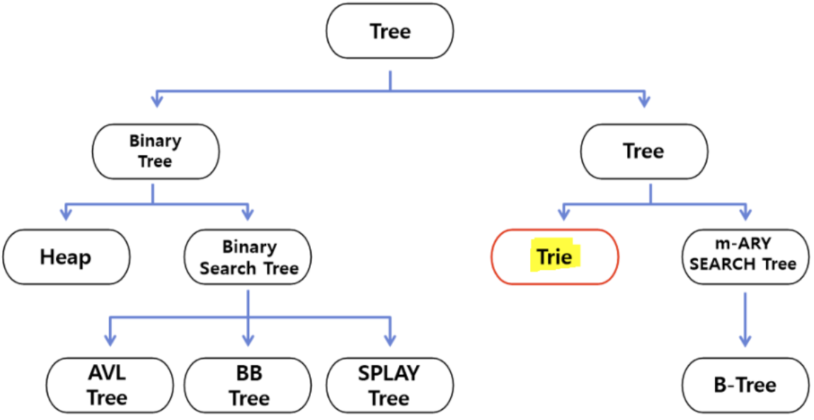
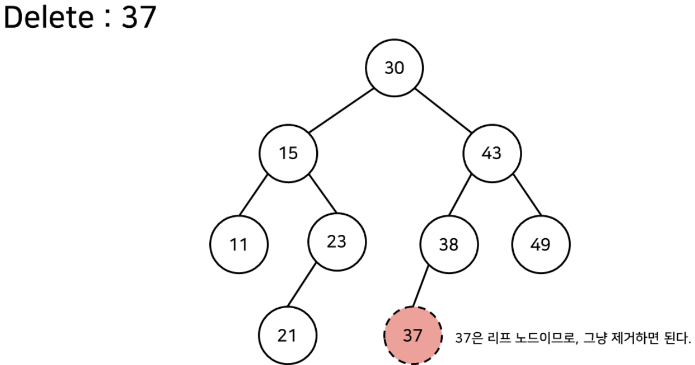
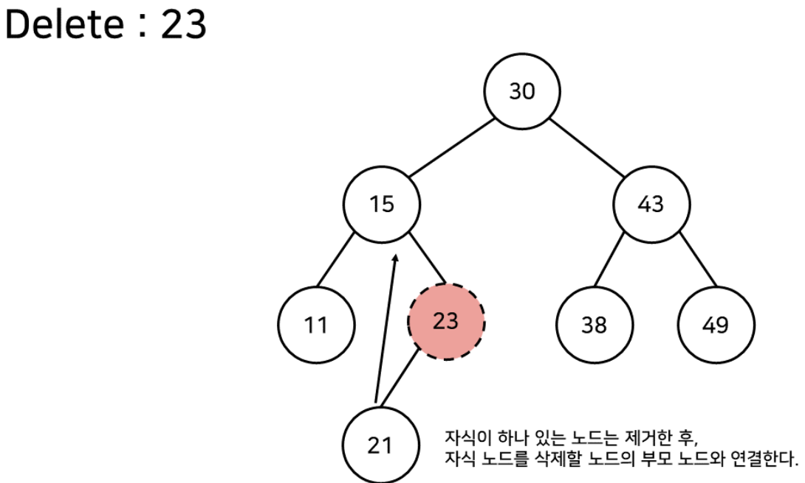
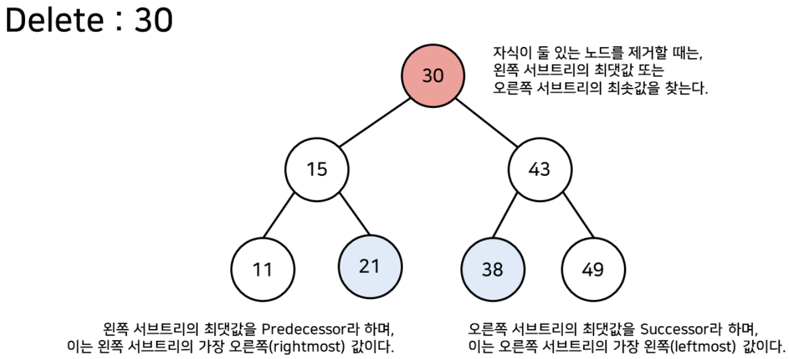
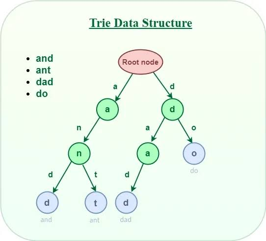
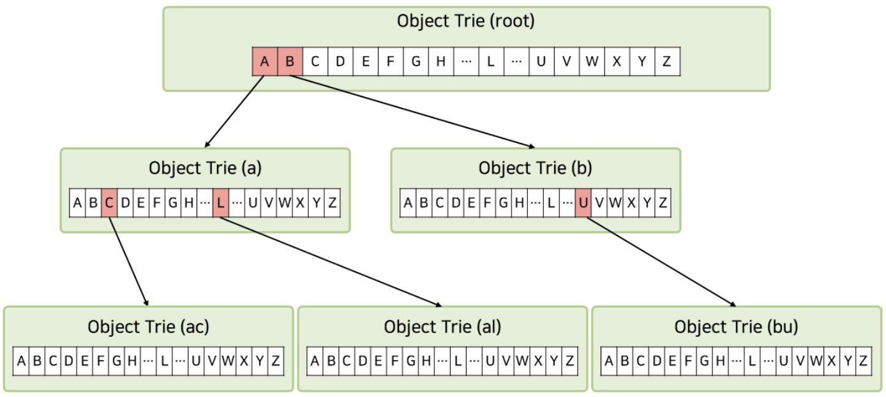

# 이진탐색트리 & Trie

Date: 2026년 8월 12일
Status: Done

# 개념

<aside>
📜

**Binary Search Tree**

이진 트리의 한 종류로, 왼쪽은 부모보다 작고 오른쪽은 부모보다 큰 것이 특징이다.

**Trie**

문자열의 정보를 담은 자료구조이다.

</aside>

---

# **Binary Search Tree**

다음 조건들을 만족하는 이진트리

- 각 노드는 서로 다른 하나의 값을 갖는다.
- 왼쪽 서브 트리의 모든 값들은 root보다 작다.
- 오른쪽 서브 트리의 모든 값들은 root보다 크다.
- BST의 모든 서브 트리는 BST이다.

#### 데이터의 검색과 삽입은 root부터 대소를 비교하면서 순회하는데, 삭제 과정을 잘 알고 있어야 한다.

- 자식 노드가 없는 경우
    - 리프 노드니까 그냥 제거
    
    
    
- 자식 노드가 하나만 있는 경우
    - 자식을 삭제하려는 노드의 부모 노드에 그대로 연결
    
    
    
- 자식 노드가 두 개 있는 경우
    - 왼쪽 서브 트리의 최댓값, 오른쪽 서브 트리의 최솟값 중 하나를 삭제하려는 노드 자리에 둔다.
    
    
    

---

# Trie

우리가 사전에서 단어를 찾을 때와 동일한 과정을 담은 구현한 자료구조로, 문자열을 이루는 문자들과 그 순서 정보를 그대로 담고 있다.

- 찾으려는 단어의 길이가 n이라면, O(n)의 시간복잡도를 가진다.
- 공통 접두사를 공유하기 때문에 접두사를 검색하기에도 좋다.
- 각 노드가 Trie 객체로, 26개의 알파벳을 모두 가리키는 포인터 배열을 포함하고 있기 때문에 공간복잡도가 취약하다.
- 검색창에서 자동 완성 기능, 맞춤법 검사 등에 사용

