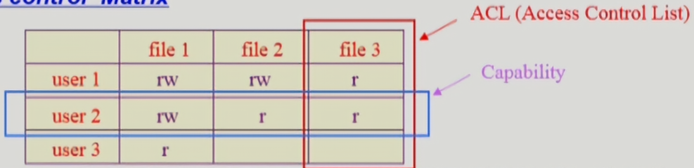
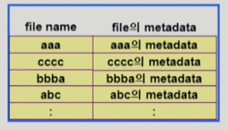
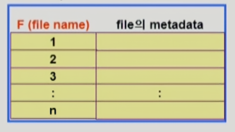
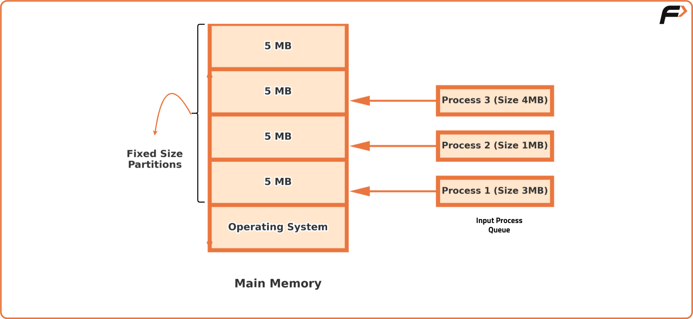
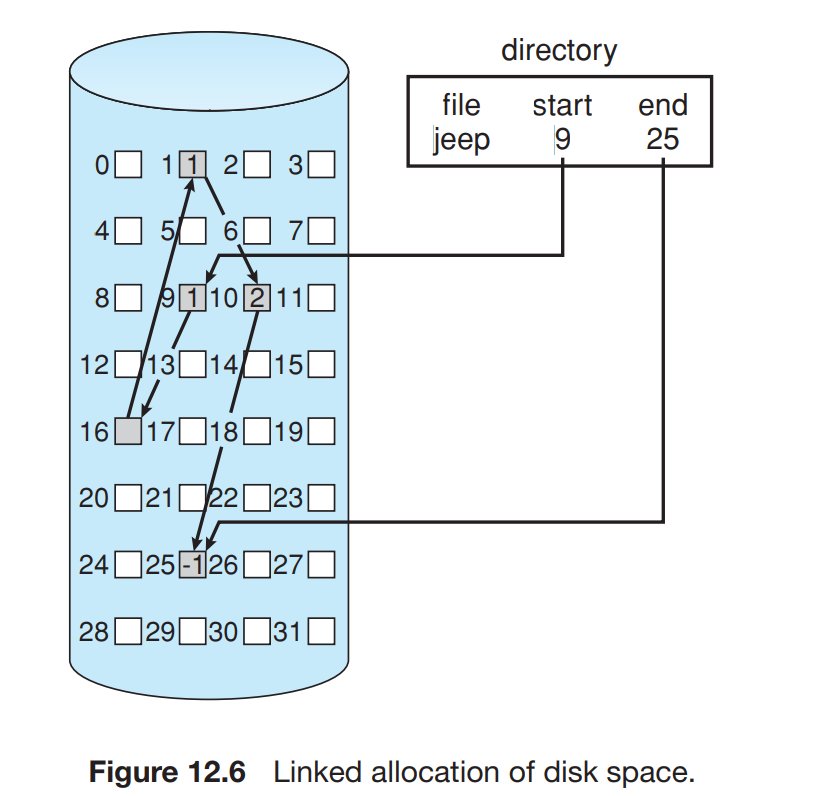
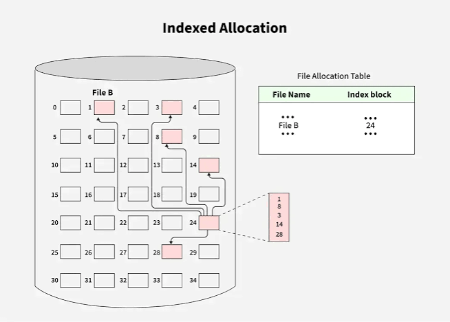
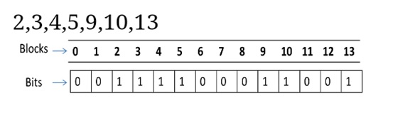
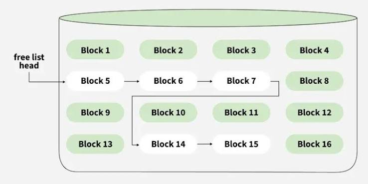

# Day 31 File System

## 1. File System이란
- 파일, 디렉토리를 OS에서 관리하는 것
- 파일 및 파일의 메타데이터, 디렉토리 정보 등을 관리
- 파일의 저장 방법을 결정하고 파일을 보호


## 2. File이란
- 비휘발성
- 보조기억장치(하드디스크, SSD 등)에 저장됨
- OS는 다양한 저장 장치를 file이라는 동일한 논리적 단위로 볼 수 있게 해줌
- 파일 생성(Create), 열기(Open), 읽기(Read), 쓰기(Write),
  위치 이동(Seek), 닫기(Close), 삭제(Delete) 등의 연산을 지원

### File Attribute (Metadata)
- 파일 자체의 내용이 아닌 `파일을 관리`하기 위한 각종 정보들을 나타냄
    - 파일 이름 / 유형 / 저장된 위치 / 파일 사이즈 / 소유자 등
    - 접근 권한 (읽기 / 쓰기 / 실행)
    - 시간 (생성 / 수정 / 접근)


### File Protection
- 각 사용자가 파일에 대해 `어떠한 권한`이 있는지 확인


#### Access Control 방법


##### Access Control Matrix
- 사용자(주체)와 파일(객체)의 조합에 따라 어떤 접근 권한을 가지는지 행렬 형태로 나타내는 방법



##### Grouping
- 전체 사용자를 `owner, group, others`의 세 그룹으로 구분
- 각 그룹별로 읽기(r), 쓰기(w), 실행(x) 권한을 3비트로 표현
    - 각각 owner, group, others
    - rwx | r-- | r-- (111, 100, 100)


##### password
- 파일이나 디렉터리에 암호를 설정하여 접근을 제한
- 여러 암호를 관리해야 하는 단점이 있음


## 3. Directory

- 파일 이름과 파일의 위치 또는 메타데이터 정보를 관리하는 특수한 파일
- 파일 검색, 생성, 삭제, 목록 조회, 이름 변경, 디렉터리 탐색 등의 연산을 수행

### 디렉토리 구현 방법


#### Linear list 방식



- 파일 이름과 관련 정보를 순차적으로 저장
- 구현이 간단함
- 파일 검색 시 처음부터 순차 탐색해야 하므로 검색 속도가 느림


#### Hash Table 방식



- 파일 이름에 해시 함수를 적용하여 디렉터리 항목을 탐색
- Linear List보다 빠르게 파일을 검색할 수 있음
- 해시 충돌이 발생할 수 있음


## 4. Directory Structure
- 파일의 디렉터리를 `어떤 형태로 조직할지`를 나타냄

### Single-Level Directory
- 모든 파일을 하나의 디렉터리에 저장
- 서로 다른 사용자가 같은 파일 이름 사용할 수 없음
- 구조 단순, 구현이 쉽지만 파일 수가 많아지면 관리가 어려움

```text
Directory
├── A.txt
├── B.txt
└── C.txt
```


### Two-Level Directory
- 사용자마다 별도의 디렉터리를 생성
- 서로 다른 사용자가 같은 파일 이름을 사용할 수 있음
- 사용자 간 파일 공유 어려움

```text
Root
├── User A
│   ├── A.txt
│   └── B.txt
│
└── User B
    ├── A.txt
    └── C.txt
```


### Tree-Structured Directory
- 디렉터리 내부에 하위 디렉터리를 만들 수 있는 계층 구조
- 파일을 종류나 목적에 따라 체계적으로 관리 가능
- 현재 대부분의 OS에서 사용하는 형태

```text
Root
├── Documents
│   ├── study
│   │   └── OS.txt
│   └── report.pdf
│
└── Images
    └── photo.jpg
```


### Acyclic Graph Directory
- 하나의 파일 또는 디렉터리를 여러 디렉터리에서 공유할 수 있는 구조
- 같은 파일을 여러 위치에서 참조 가능
- **Cycle(순환) 허용하지 않음**
- 파일 및 디렉터리 공유가 가능함
- 공유 파일 삭제 시 참조 관계 관리가 필요함

```text
        Root
       /    \
      A      B
       \    /
       Shared
```


## 5. File Allocation

- 파일의 데이터를 디스크 블록에 어떤 방식으로 배치할지 결정하는 방법

### Contiguous Allocation(연속 할당)




- 파일을 `연속된 디스크 블록`에 저장
- 파일의 시작 블록과 길이만 알면 됨
- 순차 접근, 직접 접근 모두 빠름
- 파일의 크기가 커질 경우 연속된 빈 공간 확보 어려움
- 외부 단편화 발생할 수 있음

```text
ex)

File A

[10][11][12][13]


File A가 10번 블록부터 4개 블록 차지한다면

시작 블록 = 10, 길이 = 4 만 관리하면 됨
```


### Linked Allocation(연결 할당)




- 파일의 각 블록이 `다음 블록의 위치를 포인터`로 저장
- 블록들이 연속되어 있을 필요가 없음
- 외부 단편화가 발생하지 않음
- 순차 접근에 적합, 직접 접근은 느림
- 포인터를 저장할 추가 공간 필요


### Indexed Allocation(인덱스 할당)




- 파일마다 `Index Block`을 두고 해당 파일이 사용하는 블록 주소들을 모아 저장
- 직접 접근, 순차 접근 모두 가능
- 외부 단편화 발생하지 않음
- Index Block을 위한 추가 공간 필요
- 연결 할당처럼 각 데이터 블록에 포인터를 넣는 게 아니라, 포인터들을 하나의 Index Block에 모아두는 방식

| 방식     | 직접 접근 | 외부 단편화 | 핵심 단점     |
| ------ | ----- | ------ | --------- |
| 연속 할당  | O     | 발생 가능  | 파일 확장 어려움 |
| 연결 할당  | 어려움   | 없음     | 포인터 공간 필요 |
| 인덱스 할당 | O     | 없음     | 인덱스 블록 필요 |


## 6. Free Space Management

- 디스크에서 현재 사용하지 않는 빈 블록을 관리하는 방법
- 파일을 새로 저장하려면 OS가 어떤 블록이 비어있는지 알아야 함 -> Bit Map, Linked List 방식

### Bit Map

- 디스크의 각 블록마다 1비트를 사용해 사용 여부를 표시
- 보통 `예: 0 = 빈 공간`, `1 = 사용 중`처럼 표현



- 연속된 빈 공간을 찾기 쉬움
- 디스크가 크면 비트맵 자체를 저장할 공간이 필요


### Linked List




- 빈 블록들을 `포인터로 서로 연결`하여 관리
- 각 빈 블록이 다음 빈 블록의 위치를 가리킴
- 구현이 비교적 간단함
- 전체 빈 공간을 순차적으로 탐색해야 하므로 연속된 빈 공간을 찾기 어려움
