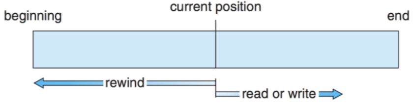
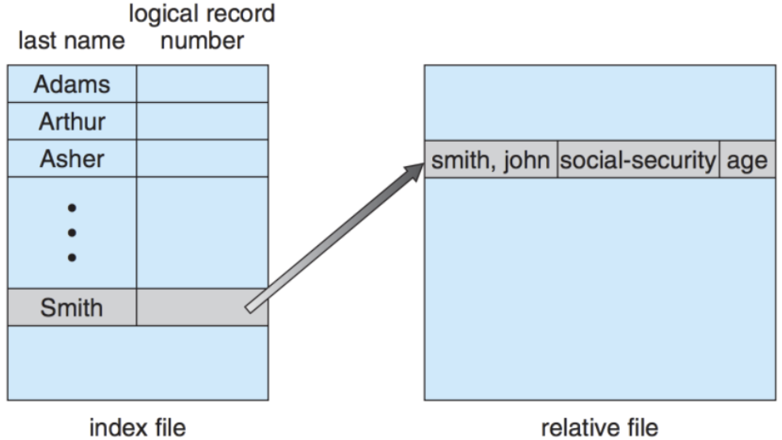
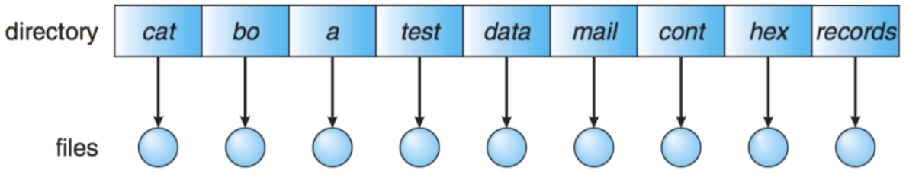
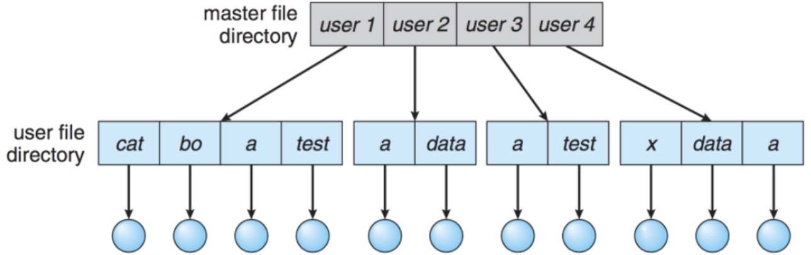
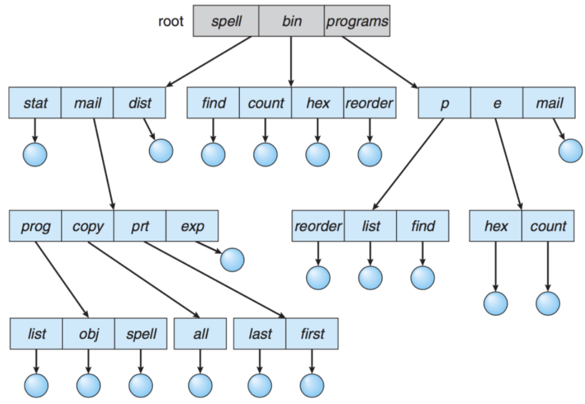
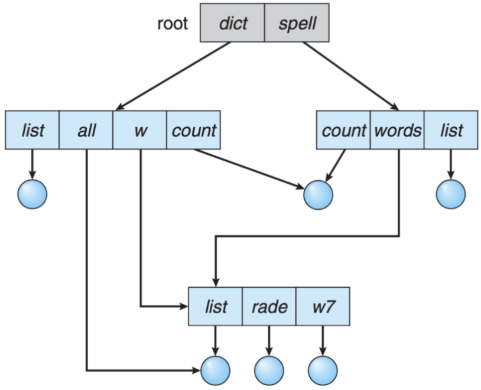
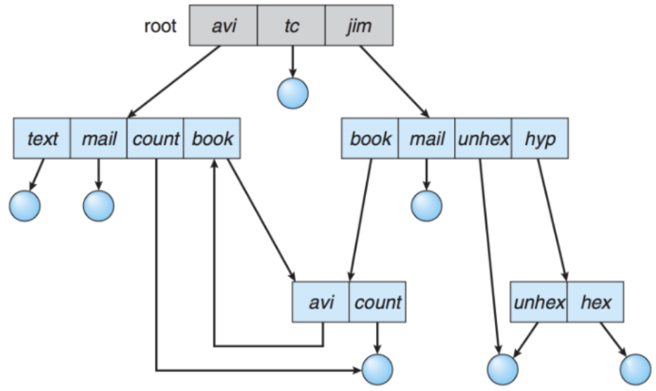
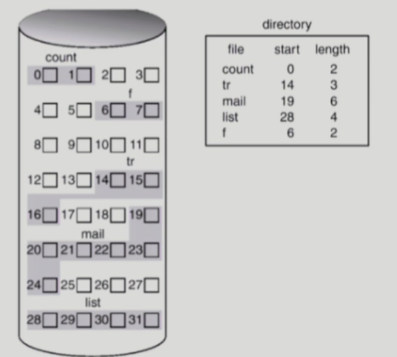
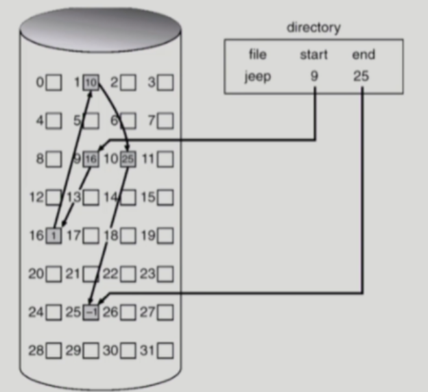
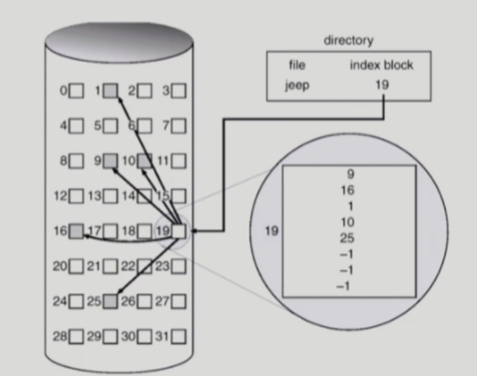

# File System

Date: 2026년 8월 13일
Status: Done

# 개념

<aside>
📜

**File**

논리적인 저장 단위로, 관련된 자료들의 집합에 이름을 붙인 것

**File System**

OS와 모든 데이터, 프로그램의 저장과 접근을 위한 기법을 제공한다.

File System에 대한 내용은 상당히 방대하기 때문에 실제 필기고사를 토대로 중요한 부분만 정리했다.

자세한 내용은 아래 블로그를 참조하자~

https://moil-develop.tistory.com/178

</aside>

---

# Access Methods

> 시스템이 제공하는 파일 정보의 접근 방식으로 Sequential, Random, Index Access 등이 있다.
> 

## 1. Sequential Access

- 카세트테이프 사용 방식과 동일
    - 현재 위치에서 읽거나 쓰면 offset이 증가하고, 뒤로 돌아가기 위해선 되감기가 필요

## 2. Random Access

- LP 판 사용 방식과 동일
    - 임의의 순서로 접근하여, 읽기 및 쓰기의 순서에 제약이 없음

## 3. Index Access

- 레코드를 찾기 위해 index를 먼저 찾고 대응되는 포인터를 갖고 접근하여 원하는 데이터를 얻음
- 크기가 큰 파일에서 유용

---

# Directory

> 파일의 메타데이터 중 일부를 보관하고 있는 일종의 특별한 파일이다.
해당 directory에 속한 파일 이름과 속성들을 포함하며, 다양한 방법으로 구성되고, 아래 기능들을 제공한다.
- Search
- Create
- Delete
- List
- Rename
- Traverse
> 

## 1. Single-Level Directory

- 모든 파일들이 directory 밑에 존재
- 다수의 사용자가 사용하는 시스템에선 불편함

## 2. Two-Level Directory

- 각 사용자별로 별도의 directory를 갖는 형태
- 서로 다른 사용자가 같은 이름의 파일을 가질 수 있고 효율적인 탐색 가능
- 그룹화 불가능

## 3. Tree-Structured Directory

- 사용자들이 자신의 sub directory를 만들어서 파일을 구성함
- 절대 경로 및 상대 경로로 고유한 경로를 가지며 효율적인 탐색이 가능하고 그룹화 가능
- two-level인 경우 ufd 밑은 무조건 file이었지만, 이젠 directory인 경우도 있어서 file인지 directory인지를 별도의 bit로 구분해야함

## 4. Acyclic-Graph Directory

- Directory들이 sub directory들과 파일을 공유함
- 참조되는 파일의 참조 계수를 두어, 몇 개의 포인터가 이 파일을 가리키는지 확인
    - 파일 삭제 시 먼저 참조 관계를 제거하고, 참조 계수가 0인 경우에만 파일을 삭제함

## General Graph Directory

- 순환을 허용하여 무한 루프 가능성이 존재함

---

# Allocation of File Data in Disk

 

> 파일 데이터를 디스크에 할당하는 방법으로 아래 세 가지 방식이 존재한다.
- Contiguous Allocation
- Linked Allocation
- Indexed Allocation
> 

## 1. Contiguous Allocation

- 파일을 디스크에 연속되게 저장
- 시작 위치, 파일 크기를 안다면 전체를 탐색할 수 있음
- 외부 단편화

## 2. Linked Allocation

- 빈 공간에 자유롭게 할당하고, 현재 데이터 다음으로 읽어야 할 위치를 포인터로 가리킴
- 파일 시작 위치, 종료 위치만 저장
- 신뢰성 문제
    - 데이터를 저장할 공간(block)에 포인터를 저장하는데 byte 배수가 맞지 않음으로 비효율이 발생하거나, 하나의 sector가 고장나면 다른 sector 또한 접근하지 못해 많은 부분을 읽게 됨
    - 포인터를 별도로 보관하는 FAT(File-allocation table)이 도입됨

## 3. Indexed Allocation

- 한 공간(block)에 하나의 파일에 대한 데이터의 index들을 모두 저장
- 특정 공간(block)의 위치만 저장하면 됨