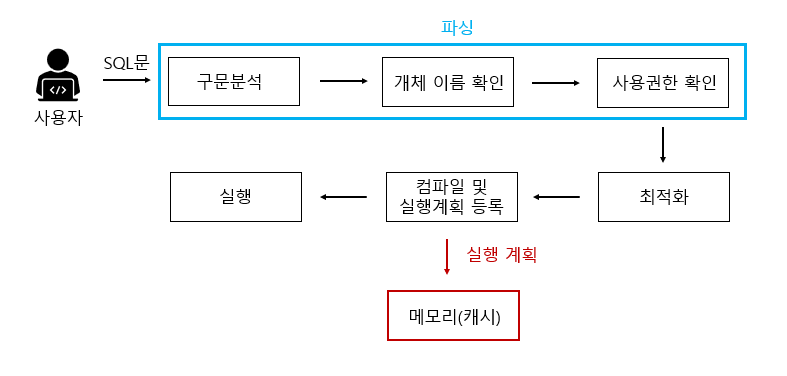
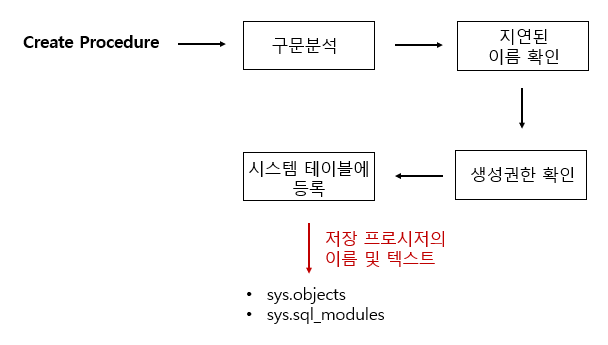
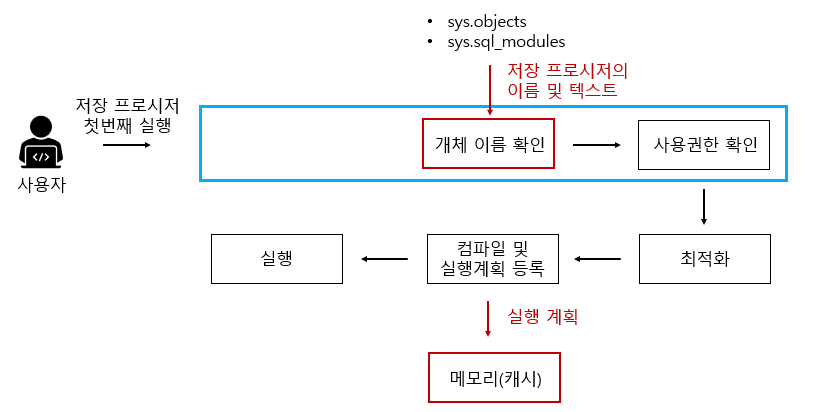
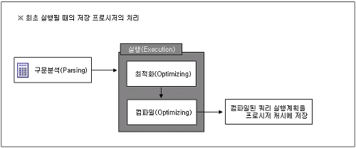

# Day 32-2 Stored Procedure (SP); 저장 프로시저

- 일련의 쿼리를 마치 하나의 함수처럼 실행하기 위한 쿼리문들의 집합

> 특정 로직의 쿼리를 함수로 만들어 놓은 것

## 저장 프로시저와 함수의 차이
| 저장 프로시저                            | 함수                           |
| ---------------------------------- | ---------------------------- |
| 특정 작업/절차 수행 목적                     | 특정 값을 계산해서 반환하는 목적           |
| 반환값이 없을 수도 있고 여러 결과를 반환할 수도 있음     | 일반적으로 반환값이 반드시 있음            |
| `CALL`, `EXEC` 등으로 호출              | SQL문 안에서 사용 가능               |
| INSERT, UPDATE, DELETE 등 다양한 작업 수행 | DBMS에 따라 데이터 변경에 제약이 있을 수 있음 |


## 일반 쿼리문 vs 저장 프로시저

### 일반 쿼리문 작동 방식


#### 예시
```sql
SELECT name FROM userTbl;
```

- **구분 분석**: 구문 자체에 오류가 없는지 분석, 오타가 있으면 이 단계에서 에러메시지 출력
- **개체 이름 확인**: userTbl이라는 테이블이 현재 데이터베이스에 있는지 확인, 만약 userTbl이 있으면 그안에 name이라는 열이 있는지를 확인
- **사용권한 확인**: userTbl을 현재 접근중인 사용자가 권한이 있는지를 확인
- **최적화**: 해당 쿼리문이 가장 좋은 성능을 낼 수 있는 경로를 설정, 인덱스 사용여부에 따라 경로가 결정됨.
- **컴파일 및 실행 계획 등록**: 해당 실행계획 결과를 메모리(캐시)에 등록
- 컴파일된 결과 **실행**


### 저장 프로시저

#### 1. 저장 프로시저 정의 단계




- **구문 분석**: 구문의 오류 파악
- **지연된 이름 확인**: 저장 프로시저를 정하는 시점에서 해당 개체(ex. 테이블)가 존재하지 않아도 상관 없음. 프로시저 실행 당시 테이블 존재 여부 확인
- **생성 권한 확인**: 현재 사용자가 저장 프로시저를 생성할 권한이 있는지 확인
- **시스템 테이블 등록**: 저장 프로시저의 이름 및 코드가 시스템 테이블에 등록


#### 2. 처음 저장 프로시저 실행




구문 분석 단계를 제외하고 일반적 쿼리문과 동일
지연된 이름 확인에서 미루어 두었던 '해당 개체 존재 유무'를 개체 이름 확인을 통해 수행


#### 3. 이후 저장 프로시저 실행


### 저장 프로시저 장점




#### 1. SQL Server의 성능 향상
- 여러개의 쿼리를 한번에 실행할 수 있음
- 캐시에 있는 것을 가져와 사용하므로 속도가 빨라짐

#### 2. 유지 및 재활용
- 개발 언어에 비의존적
- 응용프로그램에서 직접 SQL문을 호출하지 않고 SP를 호출하도록 설정하여 많이 사용함
- SP 파일만 수정하기 때문에 유지보수에 유리

#### 3. 보안을 강화
- 사용자별로 테이블에 권한을 주지 않고, SP에만 접근 권한을 주는 방식

#### 4. 네트워크 부하 줄일 수 있음
- 클라이언트에서 서버로 쿼리의 모든 텍스트가 전송될 경우 네트워크에는 큰 부하가 발생
- 저장 프로시저를 사용하면 이름, 매개변수 등 몇 글자만 전송하면 되기 때문에 부하를 크게 줄일 수 있음


### 단점

#### 1. DB 확장 어려움
- 서버 수 늘려야 할 때, DB의 수를 늘리는 것이 더 어려움
- DB 교체는 거의 불가능


#### 2. 데이터 분석의 어려움
- 개발된 프로시저가 여러 곳에서 사용될 경우 수정했을 때 영향의 분석이 어려움
- 배포, 버전 관리 등에 대한 이력 관리가 힘듦
- APP에서 SP를 호출하여 사용하는 경우 문제가 생겨도 해당 이슈에 대한 추적이 힘듦


#### 3. 낮은 처리 성능
- 문자, 숫자열 연산에 SP를 사용하면 오히려 c, java보다 느린 성능을 보일 수 있음


##### 최종 정리
```text
[Stored Procedure]

- DB에 미리 저장해둔 여러 SQL문의 집합으로, 하나의 프로그램처럼 호출해서 실행할 수 있다.

- 장점
    - 실행 계획 재사용에 따른 성능 이점
    - SQL 재사용 및 유지보수
    - 테이블 직접 접근을 제한하여 보안 강화
    - 클라이언트와 DB 간 네트워크 통신 감소

- 단점
    - 특정 DBMS에 종속될 수 있음
    - 복잡해질수록 유지보수와 디버깅이 어려움
    - 복잡한 계산 작업은 일반 프로그래밍 언어보다 비효율적일 수 있음
```

[출처](https://eunsun-zizone-zzang.tistory.com/52)