# Day 32-1 Normalizaion 정규화

## 정규화 (Normalization)
- 데이터의 **중복을 줄이고 삽입·수정·삭제 이상(Anomaly)을 방지**하기 위해 테이블을 구조화하는 과정
- 중복된 데이터를 허용하지 않음으로써 **무결성, 일관성, 유연성** 향상, DB 저장 용량 줄임

### 제 1정규화
- 테이블의 컬럼이 원자값(하나의 값)을 갖도록 테이블을 분해하는 것

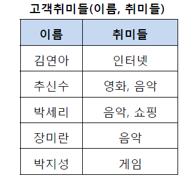


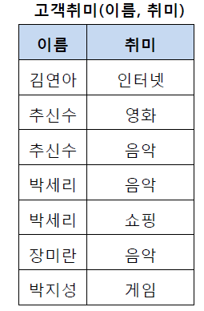


### 제 2정규화
- 제 1정규화를 진행한 테이블에 대해 **완전 함수 종속**을 만족하도록 테이블 분해

#### 완전 함수 종속
- 기본키가 복합키일 때, 일반 속성이 기본키의 일부가 아니라 기본키 전체에 종속되는 것

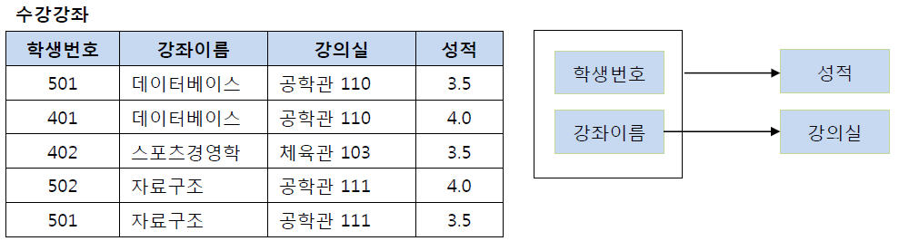


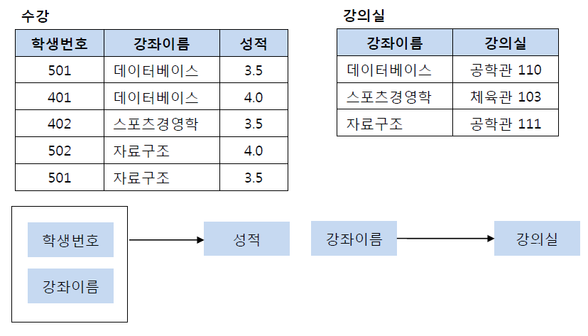


### 제 3정규화
- 제 2정규화를 진행한 테이블에 대해 **이행적 종속**을 없애도록 테이블을 분해

#### 이행적 종속
- A->B, B->C가 성립할 때 A->C가 성립되는 것

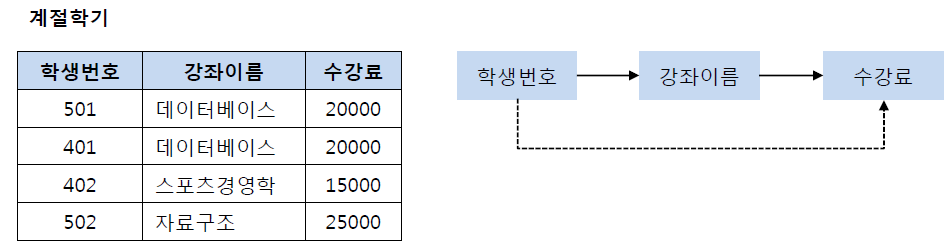


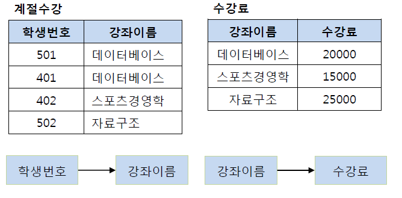


- 일반적으로 제 3정규화까지만 진행하고 더 이상 진행하지 않음
```text
[정규화가 너무 많이 진행될 경우]
1. 엔터티가 증가
2. 엔터티 사이의 관계가 증가
3. 데이터 조회 시 조인이 늘어나 조회 성능이 하락함
...
```


### BCNF 정규화
- 제 3정규화를 진행한 테이블에 대해 **모든 결정자가 후보키**가 되도록 테이블을 분해

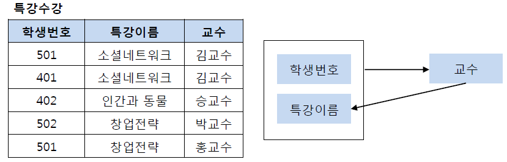


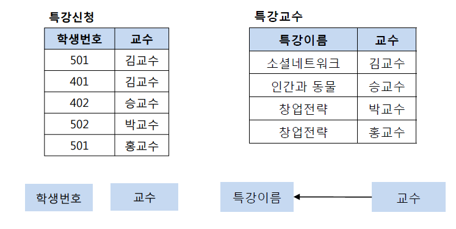


### 제 4정규화
- BCNF를 만족하는 테이블에 대해 **다치 종속을 제거**

### 다치 종속
- 같은 테이블 내의 독립적인 두 개 이상의 컬럼이 또 다른 컬럼에 종속되는 것

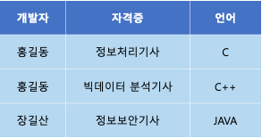


위의 테이블은 개발자가 자격증을 결정하며 동시에 언어도 결정함


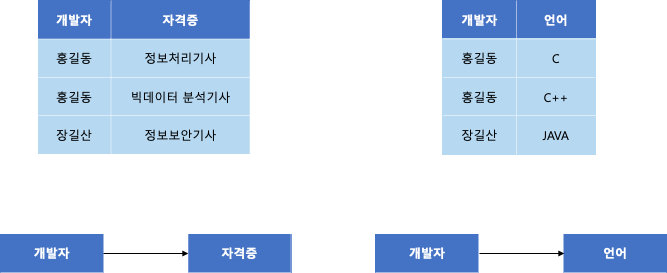


### 제 5정규화
- 4정규형을 만족하는 테이블에 대해 **조인 종속을 제거**
- 하나의 릴레이션을 여러 릴레이션으로 분해한 뒤 다시 조인했을 때 원래 릴레이션을 정확하게 복원할 수 있는 관계


#### 조인 종속
- 하나의 릴레이션을 여러 개의 릴레이션으로 분해했다가 다시 조인했을 때 필요없는 데이터가 생기는 것
- 다치 종속의 개념을 더 일반화 한 것


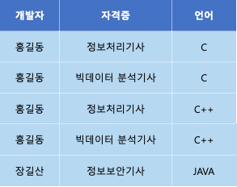


조인 이후 필요없는 결과가 생겨남


아래와 같이 분리하면 조인 종속 제거

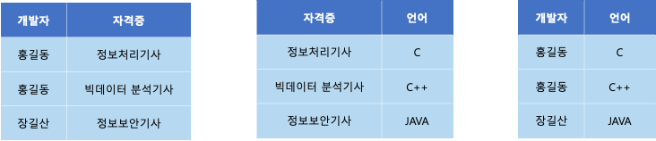


## 정리
| 정규형      | 핵심           |
| -------- | ------------ |
| **1NF**  | 원자값          |
| **2NF**  | 부분 함수 종속 제거  |
| **3NF**  | 이행적 함수 종속 제거 |
| **BCNF** | 모든 결정자가 후보키  |
| **4NF**  | 다치 종속 제거     |
| **5NF**  | 조인 종속 제거     |


[출처](https://2junbeom.tistory.com/73)