# 정규화

Date: 2026년 8월 14일
Status: Done

# 개념

<aside>
📜

정규화

Anomaly가 있는 relation을 분해하여 anomaly를 없애는 과정

중복된 데이터를 허용하지 않음으로써 무결성, 일관성, 유연성을 향상시킬 수 있다.

</aside>

---

# 종류

## 제 1 정규화 (1NF)

- 1NF는 테이블의 컬럼이 Atomic한 Value를 갖도록 분해하는 것이다.
- 규칙
    - 각 컬럼이 하나의 속성만을 가진다.
    - 각 컬럼이 유일한 이름을 가져야 한다.
    - 하나의 컬럼은 같은 종류나 타입의 값을 가진다.

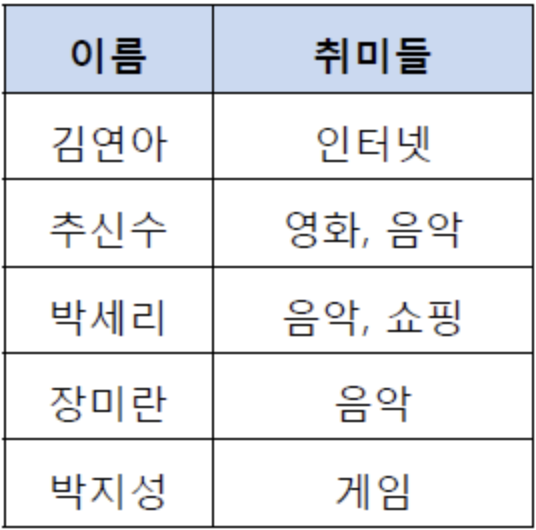

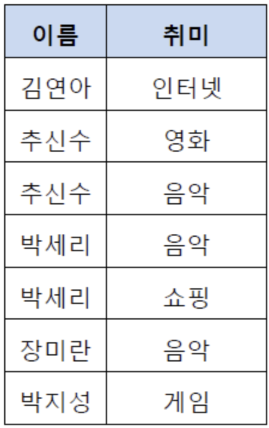

## 제 2 정규화 (2NF)

- 1NF를 만족하는 테이블에 대해 완전 함수 종속을 만족하도록 분해하는 것이다.
    - 완전 함수 종속이란 기본키의 부분집합이 결정자가 되어선 안됨을 의미한다.
- 규칙
    - 1NF를 만족한다.
    - 모든 컬럼이 부분적 종속이 없어야 한다. 즉, 모든 컬럼이 완전 함수 종속을 만족해야 한다.

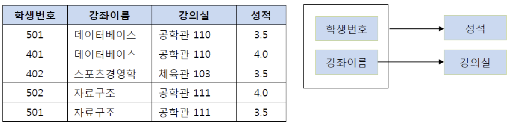

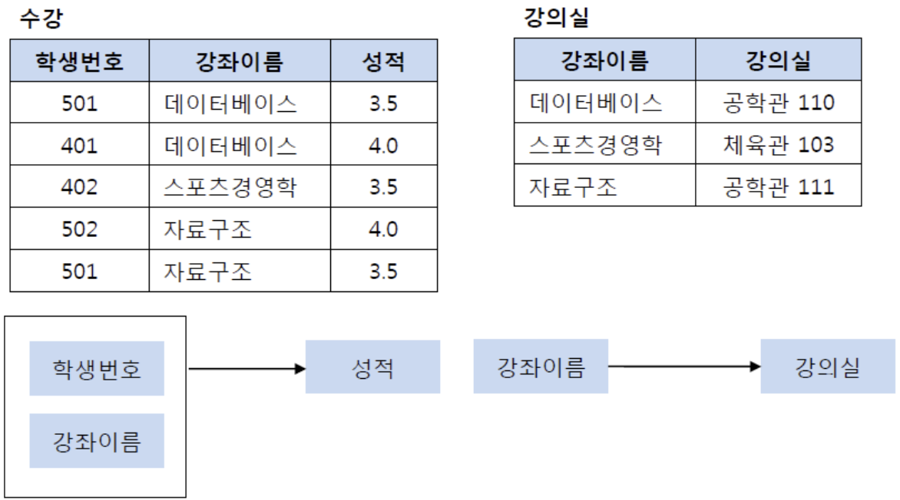

## 제 3 정규화 (3NF)

- 2NF를 만족하는 테이블에 대해 이행적 종속을 없애도록 분해하는 것이다.
    - 이행적 종속이란 A → B, B → C 가 성립할 때 A → C 가 성립함을 의미한다.
- 규칙
    - 2NF를 만족한다.
    - 기본키를 제외한 속성들 간의 이행적 종속이 없어야 한다.

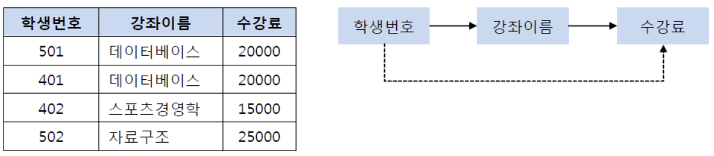

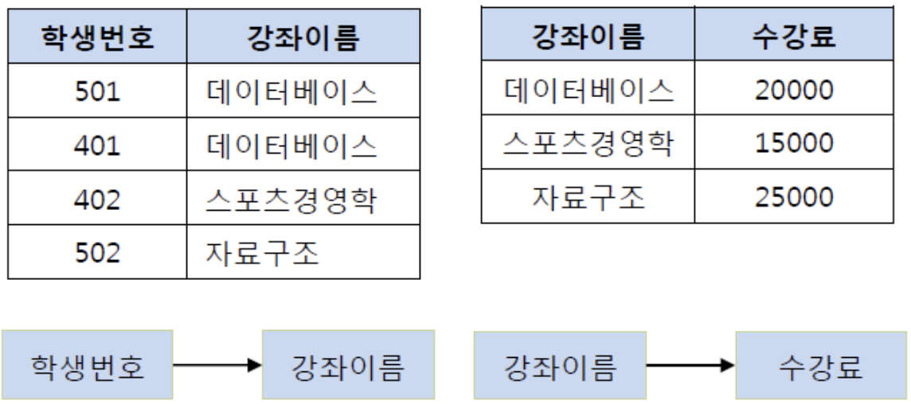

## BCNF (Boyce-codd Normal Form)

- 3NF에서 해결하지 못하는 anomaly를 해결한다.
    - 3NF를 만족하면서 모든 결정자가 후보키 집합에 속한다.
- 규칙
    - 3NF를 만족한다.
    - 모든 결정자가 후보키 집합에 속해야 한다.

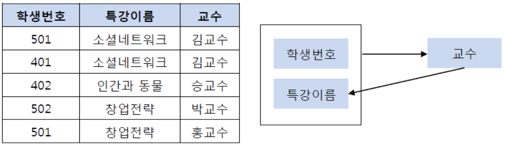

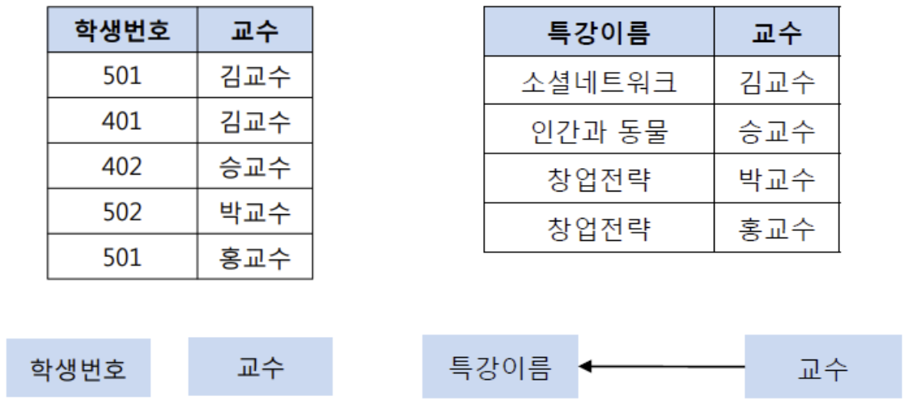

## 제 4 정규화 (4NF)

- BCNF를 만족하는 테이블에 대해 다치 종속을 제거하는 것이다.
    - 다치 종속이란 같은 테이블 내의 독립적인 두 개 이상의 컬럼이 또 다른 컬럼에 종속됨을 의미한다.
    - A → B 인 경우, 단일 A에 대해 B가 여러 종류 존재함을 다치 종속이라고 한다. (컬럼 2개 이상 종속)
- 규칙
    - BCNF를 만족한다.
    - 다치 종속을 제거한다.

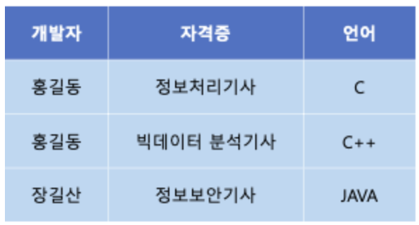

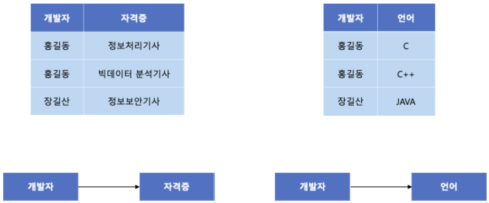

## 제 5 정규화 (5NF)

- 4NF를 만족하는 테이블에 대해 조인 종속을 제거하는 것이다.
    - 조인 종속이란 하나의 테이블을 여러 테이블로 분해했다가, 다시 조인했을 때 데이터 손실이 없고, 필요없는 데이터가 생기는 것을 의미한다.
- 규칙
    - 4NF를 만족한다.
    - 조인 종속을 제거한다.

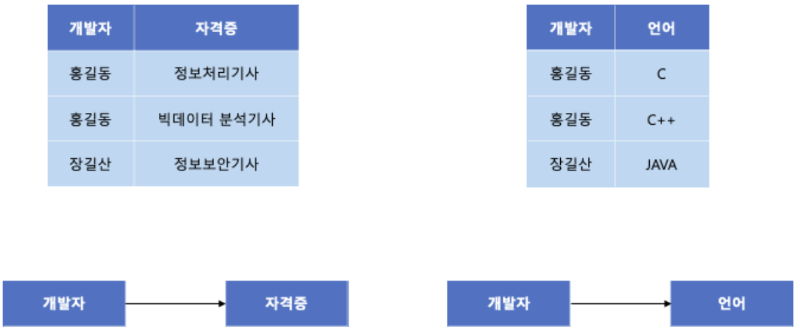

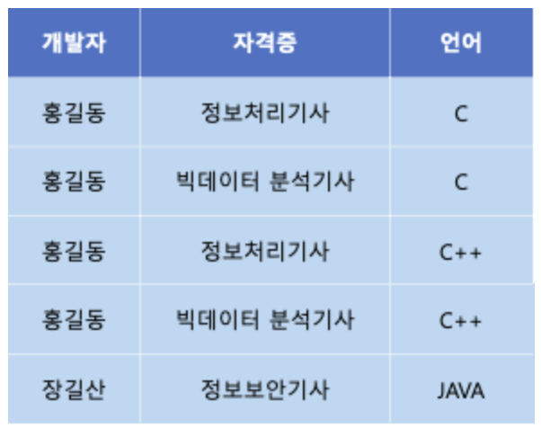

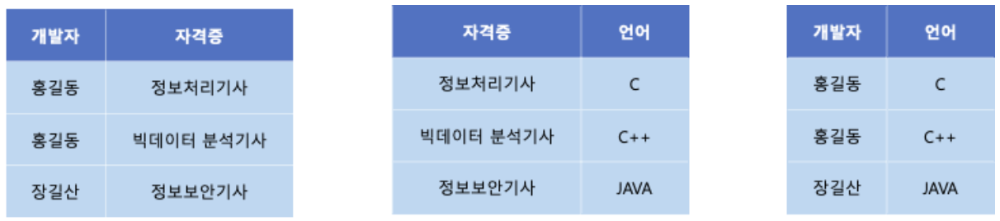

---

# 주의할 점

보통 3NF까지만 진행하는데 그 이유는 다음과 같다.

- 엔티티가 증가한다.
- 엔티티 사이의 관계가 증가한다.
- 데이터 조회 시 조인이 늘어나, 조회 성능이 하락한다.