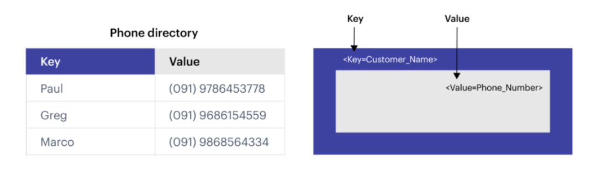
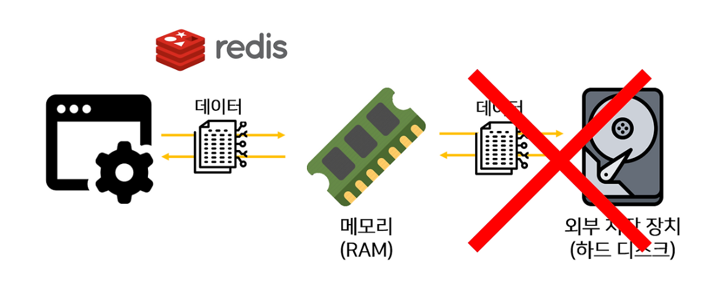
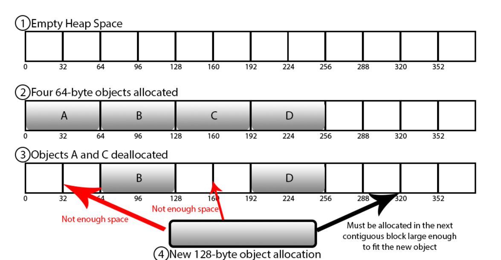
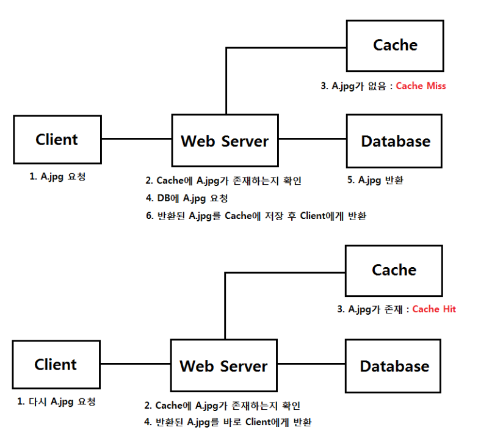
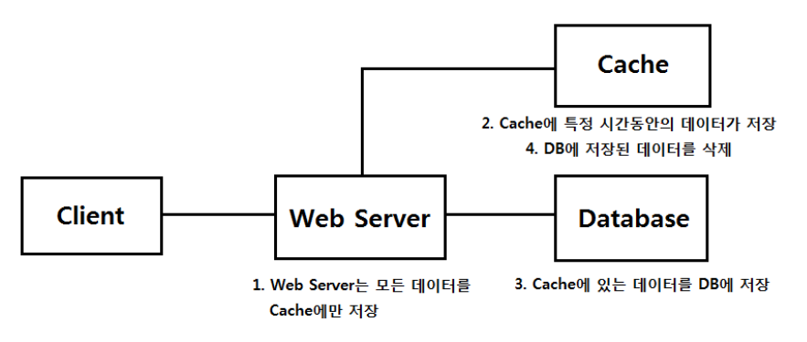

# Day 33 Redis(레디스)

## 1. 레디스란?

### Redis (Remote Dictionary Server)
- `Remote(원격)`에 위치하고 프로세스로 존재하는 In-Memory 기반의 `Dictionary(key-value)` 구조 데이터 관리 서버 시스템

### Key-value 구조
- Redis는 NoSQL 데이터 저장소
- mySql같은 관계형 데이터가 아닌 비관계형 구조로서 데이터를 그저 `키-값`형태로 단순하게 저장하는 구조
- 관계형 DB처럼 SQL과 JOIN을 이용한 복잡한 질의를 중심으로 하지 않고, Key를 기반으로 데이터를 빠르게 조회·수정하는 데 최적화




### In-Memory 솔루션
- 데이터를 주로 디스크가 아닌 메모리(RAM)에 저장하고 처리하기 때문에 읽기/쓰기 속도가 빠름




## 2. Redis 활용

### Redis에 저장하는 것들
- 캐시: 자주 조회하는 데이터
- 로그인 세션: 로그인한 사용자 정보
- 인증번호: 이메일/문자 인증번호
- 조회수: 게시글 조회수
- 랭킹: 게임 점수 순위
- 임시 데이터: 일정 시간이 지나면 없어져도 되는 데이터

## 3. Redis 주의점

### 시간 복잡도
- Redis는 **주요 명령어 처리를 단일 스레드 방식으로 수행**하므로 하나의 명령어가 오래 걸리면 다른 요청 처리에도 영향을 줄 수 있음
- `KEYS`,`FLUSHALL`,`HGETALL`등 많은 **데이터를 한꺼번에 탐색하거나 처리하는 명령어**는 주의해서 사용할 필요가 있음


### 메모리 파편화

- 데이터의 생성·삭제가 반복되면서 메모리의 빈 공간이 조각나는 현상
- 실제 저장된 데이터 크기보다 Redis가 사용하는 메모리 크기가 커질 수 있음ㄴ




## 참고

### 캐시의 구조 패턴

#### Look aside Cache 패턴
-캐시를 한 번 접근하여 데이터가 있는지 판단한 후, 있다면 캐시의 데이터를 사용하고 없으면 실제 DB 또는 API를 호출

```text
[Look aside Cache 쿼리 순서]

1. 클라이언트에서 데이터 요청
2. 서버에서 캐시에 데이터 존재 유무 확인
3. 데이터가 있다면 캐시의 데이터 사용 (빠른 조회)
4. 데이터가 없다면 실제 DB 데이터에 접근
5. DB에서 가져 온 데이터를 캐시에 저장하고 클라이언트에 반환
```




#### Write Back 패턴 
- 쓰기 작업이 많아 INSERT 쿼리를 일일이 날리지 않고 한꺼번에 배치 처리를 하기 위해 사용

```text
[write back 쿼리 순서]

1. 모든 데이터를 캐시에 저장
2. 캐시의 데이터를 일정 주기마다 DB에 한꺼번에 저장 (배치)
3. 잔존 데이터를 캐시에서 제거(DB에 저장했으니)
```




### Redis 정리
```text
[Redis란]
- In-Memory 기반
- Key-Value 기반 NoSQL
- 빠른 읽기/쓰기
- 캐시, 세션, 인증번호, 랭킹 등에 활용
```
> Redis는 데이터를 Key-Value 형태로 RAM에 저장하여 매우 빠르게 읽고 쓸 수 있는 데이터 저장소다.

[출처](https://inpa.tistory.com/entry/REDIS-%F0%9F%93%9A-%EA%B0%9C%EB%85%90-%EC%86%8C%EA%B0%9C-%EC%82%AC%EC%9A%A9%EC%B2%98-%EC%BA%90%EC%8B%9C-%EC%84%B8%EC%85%98-%ED%95%9C%EB%88%88%EC%97%90-%EC%8F%99-%EC%A0%95%EB%A6%AC)