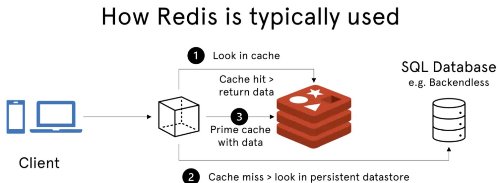
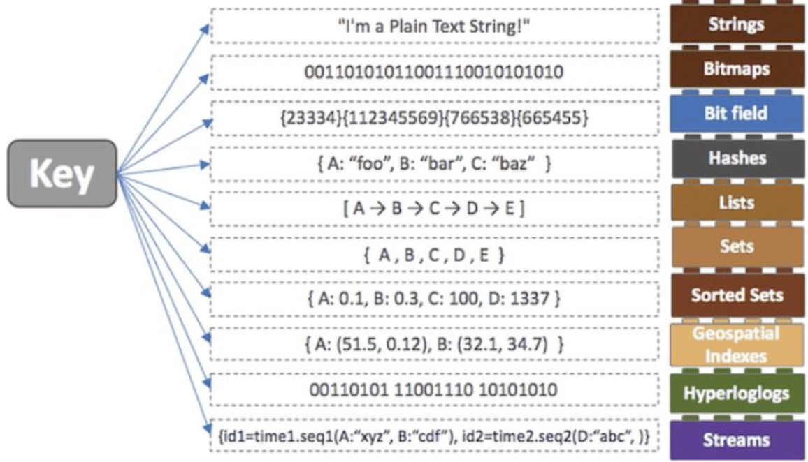

# Redis

Date: 2026년 8월 18일
Status: Done

# 개념

<aside>
📜

**Redis (REmote DIctionary Server)**

애플리케이션 캐시 또는 빠른 응답 데이터베이스로 사용되는 인 메모리, NoSQL 키/값 저장소이다.

인 메모리 기반이기 때문에 모든 데이터를 메모리로 불러와서 처리한다.

</aside>

---

# 특징

- Key - Value 저장소로서, 다양한 자료 구조의 Value를 지원한다.
    
    
    
- 모든 데이터를 메모리에 저장 후 사용하기 때문에 대기 시간이 적고 처리량이 많다.
- 쿼리문을 작성할 필요가 없다.
- 영속성을 보장하기 위해 데스크에도 저장할 수 있다.
- 싱글 스레드 방식으로, race condition의 위험이 없다.

---

# 사용 사례

- 캐싱
    - 다른 db보다 cpu에 가깝게 배치된 redis는 인 메모리 캐시를 생성하여 접근 지연을 줄이고 처리량을 늘린다.
- 세션 관리
    - 각 세션 키에 대한 적절한 ttl을 값으로 저장하여 관리한다.
- 대기열
    - redis list로 간단한 대기열을 구현할 수 있다.
- 채팅 및 메시지
    - pub/sub 표준을 지원하여, 실시간 채팅, 코멘트 스트림 및 상호 통신을 지원한다.