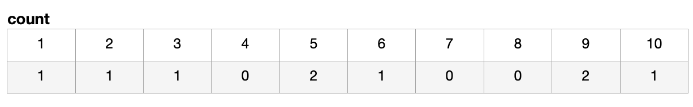
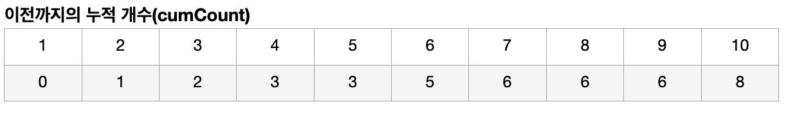
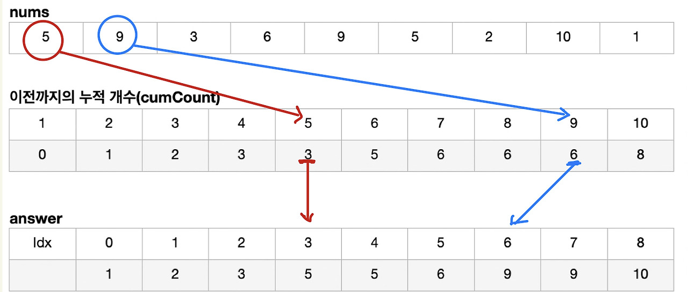

# Day 34 Counting Sort(계수 정렬)

## 계수 정렬이란
- 주어진 배열의 값의 범위가 작은 경우 빠른 속도를 갖는 정렬 알고리즘
- 최댓값과 입력 배열의 원소 값 개수를 누적합으로 구성한 배열로 정렬을 수행함

## 예시: nums = [5, 9, 3, 6, 9, 5, 2, 10, 1] 정렬

### 0. 정렬한 nums 배열 입력

### 1. count 배열 생성
- 입력된 nums 배열의 최댓값을 길이로 갖는 count 배열 생성
- 각 원소가 nums 배열에 몇 번 나오는지 횟수를 count 배열에 기록

### 2. 이전까지의 누적 개수를 기록하는 배열 생성(cumCount 배열)
- count 배열에서 각 원소가 몇 개씩 나오는지 알 수 있음
- 이를 이용해 지금까지 몇 개의 원소가 앞에 나왔는지를 기록하는 누적개수배열 생성

### 3. nums 배열에서 첫 번째 원소부터 cumCount 배열에 기록되어 있는 값에 따라 인덱스 위치를 정함

## 시간복잡도
- 최댓값이 주어지지 않은 경우 -> 전체 배열 탐색 -> **O(N)**
- Count  배열 생성하면서 갯수를 세는 과정 **O(N)**
- 누적 배열을 생성하면서 누적 갯수를 세는 과정 **O(N)**
- answer에 배열에 값을 입력하는 과정 **O(N)**

시간복잡도: O(N)

배열의 길이와는 독립적으로 배열의 최댓값을 M이라고 한다면, 정렬 시간은 M을 따라가므로 **O(N + M)**이라고 보는 것이 정확

[출처](https://10000cow.tistory.com/entry/%EC%A0%95%EB%A0%AC-8%EA%B3%84%EC%88%98-%EC%A0%95%EB%A0%ACCounting-Sort)