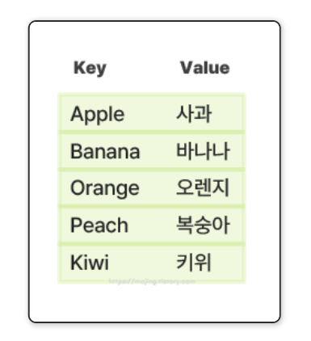
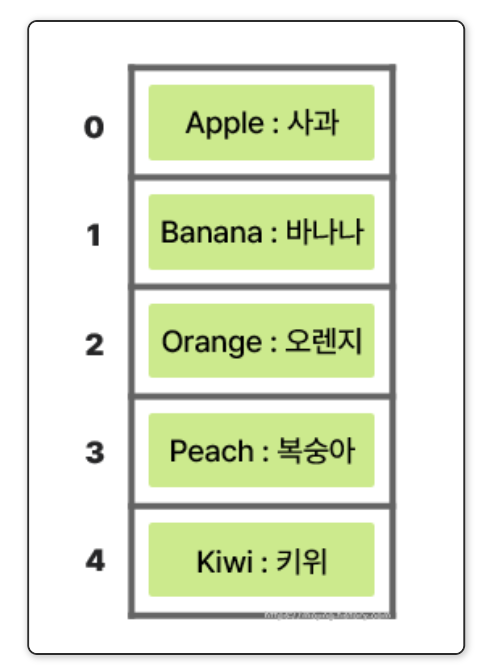
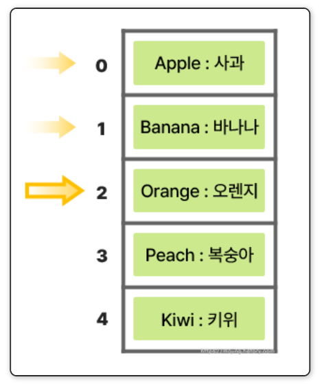
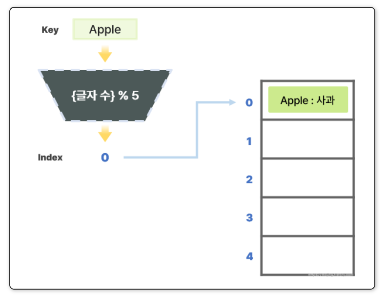
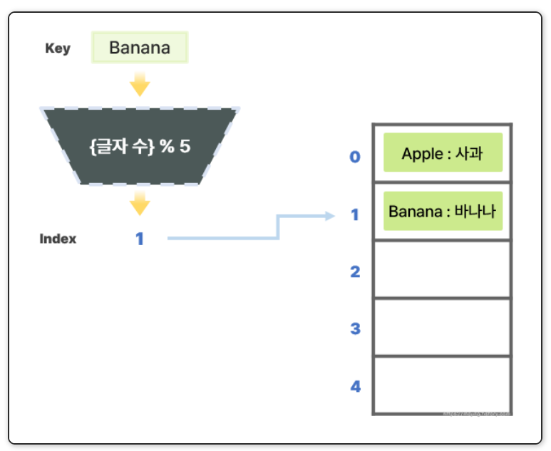
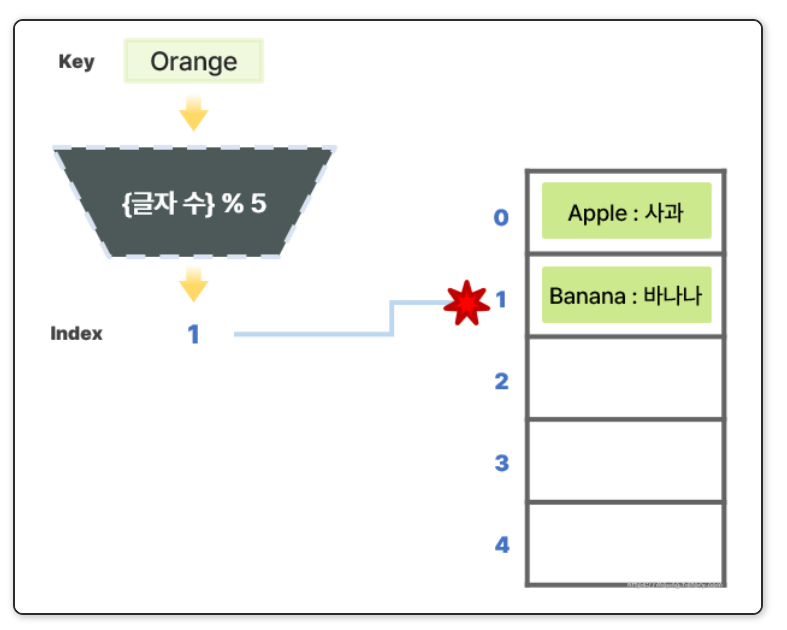
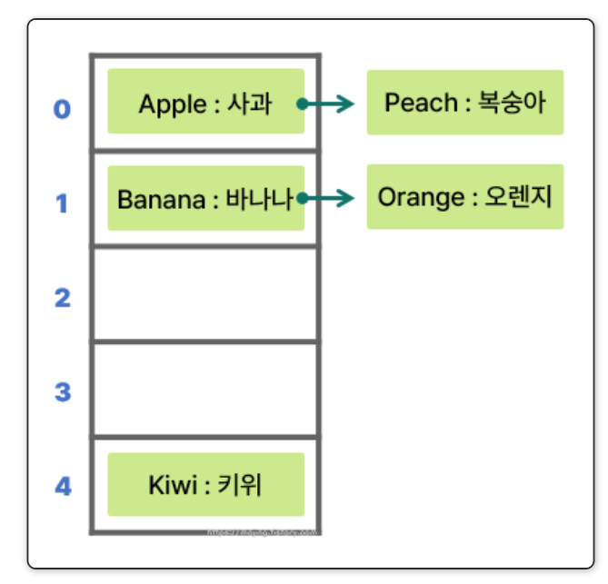
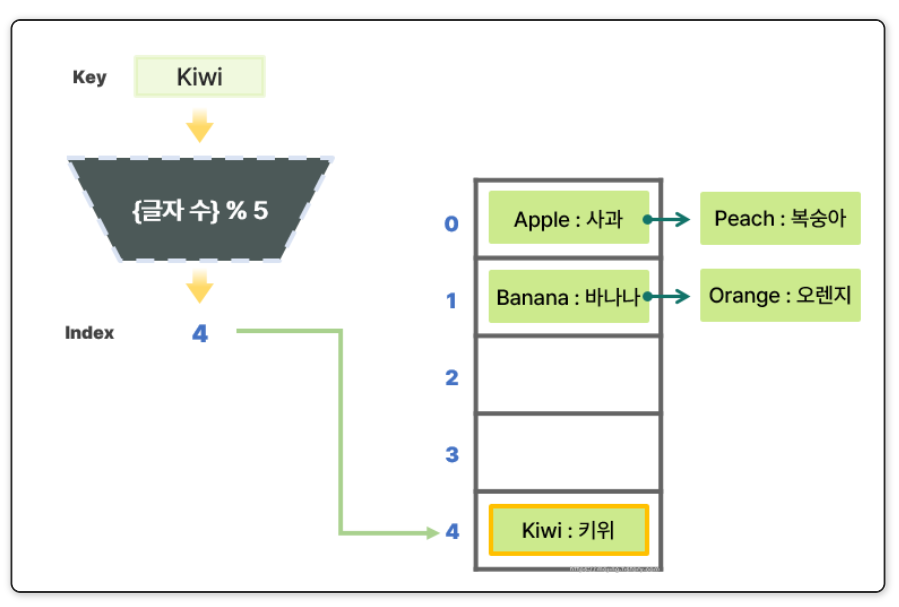
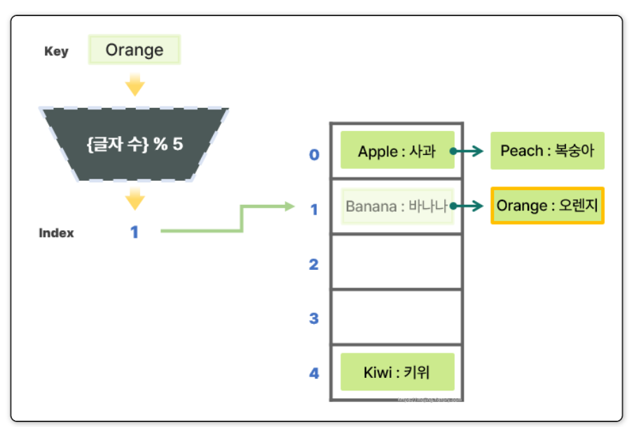

# Day 35 Hash Table

## 해시 테이블 정의
- 키(Key)를 특정 연산(해시 함수)을 통해해시 값(Hash Value)으로반환하고, 이를 인덱스로사용하여 데이터를 저장하는 **키-값(Key-Value)** 구조

## 동작원리

### 배열과 해시테이블 비교

아래의 키-값 구조의 데이터를 저장한다 가정

#### 배열

##### 저장

- 고정된 크기의 공간에 차례대로 저장

##### 검색
- `Orange`의뜻을 알고 싶다 가정 -> 배열 0번 인덱스부터 **선형 탐색**
- 2반 인덱스에 저장된 키(Key)가 `Orange`와 일치하므로 값(Value)을 불러옴

- 선형 탐색은 O(n)의 시간 복잡도를 가지므로 데이터가 많을수록 찾는 시간도 오래 걸림

#### 해시 테이블

##### 저장
- `키`를 `해시 함수`를 이용하여 `인덱스`로 변환, 해당 인덱스에 **키-값 데이터** 저장
- 키와 해시 함수로 **실제 데이터를 저장할 주소**를 반환받음

- 해시 함수: 모듈로 연산 이용한다 세팅(제산 함수)

- 키(Key)인 `Apple`을 해시 함수를 이용해 해시 값을 추출
- `Apple`의 글자 수는 5이므로 해시 값으로 0이 나옴
- 이 0을 인덱스로 이용하여 `키-값 데이터`를 저장

- 키(Key)인 `Banana`는 해시 함수를 이용해 변환하면 6 % 5 = 1, 1번 인덱스에 데이터를 저장

- 키(Key)인 `Orange`는 해시 함수를 이용해 변환하면 6 % 5 = 1, 1번 인덱스에 데이터를 저장해야 하는데 `Banana` 데이터가 저장되어 있음
=> 서로 다른 키(Key)가 해시 함수에 의해 저장 위치가 겹치는 것을 **충돌(Collision)**이라 함

###### 충돌로 인한 오버플로우 해결 방법
- **체이닝(Chaining)**: 같은 해시 값을 가지는 데이터들을 연결 리스트(Linked List) 또는 트리(Tree)를 이용하여 저장하는 방식

- **오픈 어드레싱(Open Addressing)**: 충돌이 발생하면 다른 빈 공간을 찾아 데이터를 저장하는 방식

##### 검색
- `Kiwi`의 뜻을 알고싶다 가정
- `Kiwi`의 해시 값은 4 % 5의 결과인 `4`이므로 해당 인덱스에 저장된 데이터의 키가 `Kiwi`인지 검사함

- `Orange`의 뜻을 알고 싶다 가정
- 1번 인덱스에서 `Banana`와 가장 먼저 마주치고, `선형 탐색`을 통해 연결리스트 탐색

## 해시 테이블 장점

- 검색 속도가 빠름
    - 평균 시간 복잡도: O(1)
    - 충돌 많을 경우 최악 시간 복잡도: O(n)
- 해시 테이블은 키를 기준으로 데이터를 저장 -> **중복 검사** 과정이 매우 빠르고 간단함
- 유연한 키-값 저장과 동적으로 크기 조절이 가능
    - 다양한 타입의 데이터를 저장할 수 있음
    - 연결 리스트를 사용 -> 저장할 데이터 수가 정해져있지 않더라도 유연한 대응이 가능함

## 해시 테이블 단점

- 충돌(Collision) 발생
    - 해시 함수가 동일한 해시 값을 생성하거나 배열의 크기가 너무 작을 경우 충돌이 많아짐 -> 선형 탐색 빈도가 높아짐

- 메모리 사용량이 많음(배열 기반; 사용되지 않는 공간 생길 가능성 높음)

- 데이터 삽입 순서 보장 x
- 해시 함수를 신중하게 설계해야 함(데이터가 균등하게 분배되도록. 그렇지 않으면 특정 주소에 데이터가 몰려 성능이 저하될 수 있음)

## 해시 테이블 사용
- C#의 `Dictionary`, C++의 `unordered_map` 구현
- 데이터베이스 인덱싱
- 캐싱(Cache) 시스템

## 참고

### 해시 함수
- 주어진 데이터를 고정 길이의 불규칙한 숫자로 변환하는 함수