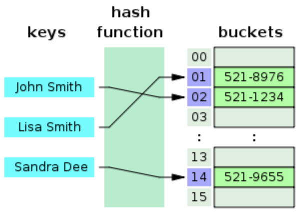
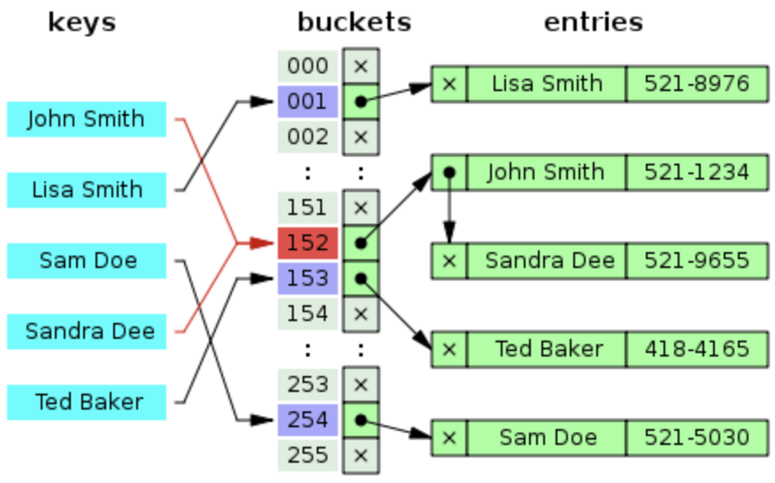

# Hash Table

Date: 2026년 8월 20일
Status: Done

# 개념

<aside>
📜

**Hash Table**

Key와 Value가 매핑되어 있고, Value의 주소는 해싱 함수에 Key를 넣으면 알 수 있다.

</aside>

---

# Hash Table

- bucket에 저장된 데이터의 주소는 hash function에 key를 넣으면 알 수 있음
- 기본적으로 O(1)의 시간복잡도를 갖지만, collision 발생 시 O(n)까지 떨어질 수 있음
- Hash Function 예시
    - Division Method
        - 나눗셈을 이용하는 방법으로 입력값을 테이블의 크기로 나누어 계산
        - 테이블의 크기를 소수로 정하고 2의 제곱수와 먼 값을 사용하면 효과가 좋다고 함
    - Digit Folding
        - 각 Key의 문자열을 ASCII 코드로 바꾸고 값을 합한 데이터를 테이블 내의 주소로 사용
    - Multiplication Method
        - 숫자로 된 Key 값 K와 0과 1사이의 실수 A, 보통 2의 제곱수인 m을 사용하여 다음과 같이 계산
            - $h(k)=(k*A mod1)*m$의 정수부
    - Universal Hashing
        - 다수의 hash function을 만들어 집합 H에 넣어두고, 무작위로 hash function을 선택해 hash를 만듦
- Hash Collision
    - 서로 다른 key들로 hash function을 돌려 나온 값이 같다면 큰 문제가 발생함
    - 해결책
        - Separate Chaining
            - 동일한 주소를 가리킬 때, 추가 메모리를 사용하여 데이터들을 Linked List 처럼 연결시킴
            - 캐시 효율성 감소
            
            
            
        - Open Addressing
            - 이미 그 공간에 다른 데이터가 있다면, 비어있는 공간에 저장하는 방법으로 3가지가 있음
                - Linear Probing
                    - 현재 주소부터 고정된 크기만큼 이동하여 비어있는지 검색
                - Quadratic Probing
                    - 검색하는 폭을 제곱으로 늘리면서 빈 공간 검색
                - Double Hashing Probing
                    - $h(k,i) = (h1(k) + i*h2(k)) mod m$
                    - 2개의 hash function을 이용하는 동시에 횟수가 늘어날 때마다 i값을 증가시켜 독립적인 hash를 갖는 방법
            - 데이터 삭제 후 남은 공간은 dummy space로, hash table 정리 작업이 필요함