# Day 36 LIS(Longest Increasing Subsequence)

## LIS란?
- 최장 증가 부분 수열
- 주어진 수열에서 **항상 증가하는 부분 수열 중 가장 긴 부분**을 찾는 문제

```text
입력: [10, 20, 10, 30, 20, 50]
출력: 3 (가능한 LIS: [10, 20, 30] 또는 [10, 20, 50])
```


### 해결 방법
- 동적 계획법(DP): O(N^2)
- 이분 탐색을 활용한 최적화: O(N log N)


## 동적 계획법(DP)으로 풀기
- 시간복잡도가 O(N^2)이기 때문에 원소의 개수가 작은 경우에 해당 풀이로 가능

(Ex) {10, 20, 10, 30, 20, 50}

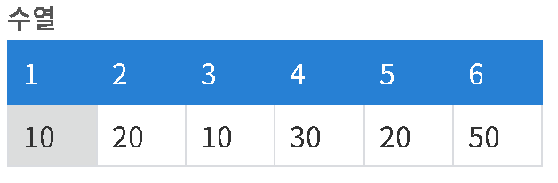

- **DP[i] = i번째 원소를 포함하는 증가 수열의 최대 원소 개수**
- N = 1
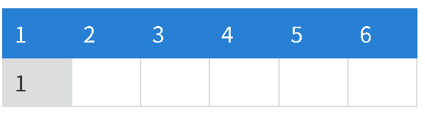


- N = 2
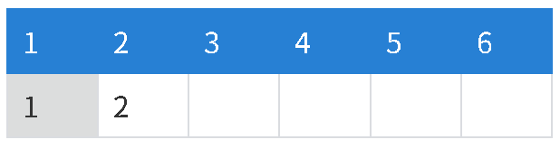


    - 현재 index의 원소 값, 그 미만의 index의 원소 값 비교
    - 현재 원소보다 작은 원소가 있다면 해당 index의 dp값 중 최대값에 +1을 한 것이 현재 dp[i]의 값이 됨

    - 20보다 작은 값이 10이 있으며, 10의 dp 값은 1이므로 dp[2] = 2가 됨


- N = 3
    - 3번 인덱스의 경우, 이전 원소에서 10보다 작은 원소가 없음. 그러므로 dp[3] = 1
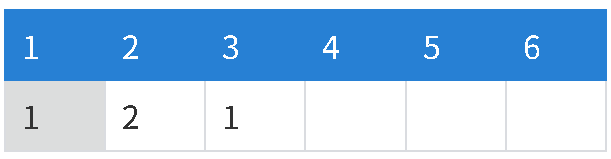


- N = 4
    - 1,2,3 모두 4번 인덱스 값인 30보다 작은 원소들
    - 이중 dp 값의 최대는 dp[2] = 2이므로 dp[4] = 2 + 1 = 3
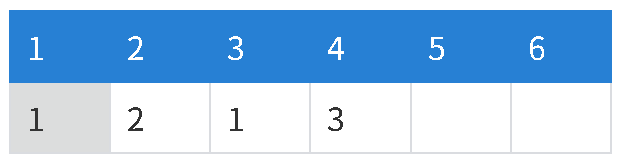


- N = 5
    - 20보다 작은 값은 1, 3번 인덱스며 최대값은 1이므로 dp[5] = 2
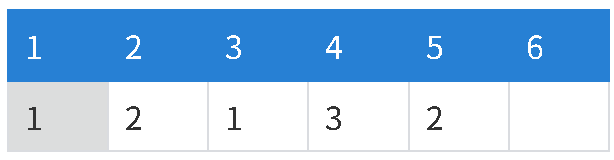


- N = 6
    - 50보다 작은 원소값이면서 dp값의 최대는 dp[4] = 3이므로 여기에 1을 더한 값인 dp[6] = 4


## 이분 탐색(Lower Bound)으로 풀기
- 수열을 순회하면서 현재 값을 신규 배열에 넣거나 치환하는 방식으로 구현
- 현재 값의 lowerbound(타겟 값 이상의 값이 나오는 처음 위치)가 없다면 삽입
- lowerbound가 있다면 해당 값을 찾아서 치환
- 이분 탐색 방식으로는 최장 길이만 구할 수 있으므로 실제 LIS 수열을 구하기 위해서는 따로 역추적 과정을 거쳐야 함

(Ex) {10, 20, 10, 30, 20, 50}

- N = 1
    - 첫 번째 원소를 넣는다


- N = 2
    - LIS 배열에 마지막 원소가 현재 원소보다 작다면 lowerbound를 찾을 수 없으므로 그대로 값을 넣음


- N = 3
    - LIS 배열에 lowerbound를 찾아서 해당 값으로 치환함


- N = 4
    - 삽입


- N = 5
    - 치환


- N = 6
    - 삽입
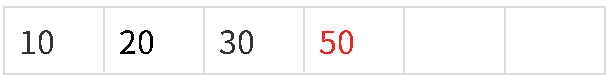


### LIS 수열 구하기
- 이분 탐색으로 최장 길이를 구할 수는 있지만, 이를 구성하는 수열을 정확히 알 수는 없다
- 예를 들어 {10 20 30 5 25} 수열을 위 방식으로 lowerbound를 찾아 치환한 결과는 {5, 20, 25}
- 실제 답은 {10, 20, 30} 또는 {10, 20, 25} 가 되어야 함
- LIS 수열 자체를 구하기 위해서는 입력받은 수가 어떤 index에 들어가는지 정보를 저장해서 역추적 하는 과정이 필요

- N = 1
    - 첫 번째 원소 넣음
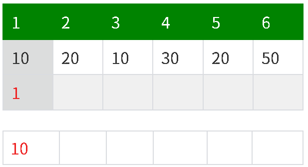


- N = 2
    - LIS 배열에 마지막 원소가 현재 원소보다 작다면 lowerbound를 찾을 수 없으므로 그대로 값을 넣는다
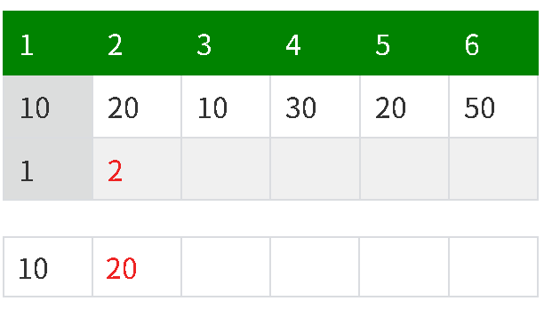


- N = 3
    - LIS 배열에 lowerbound를 찾아서 해당 값으로 치환
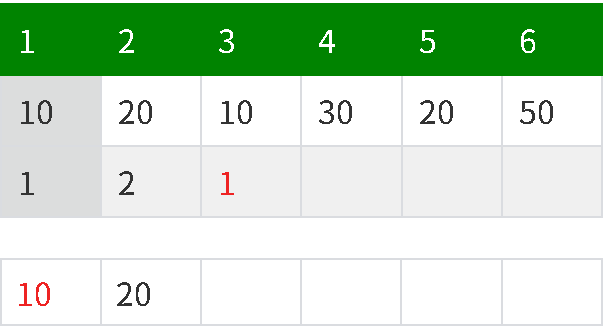


- N = 4
    - 삽입
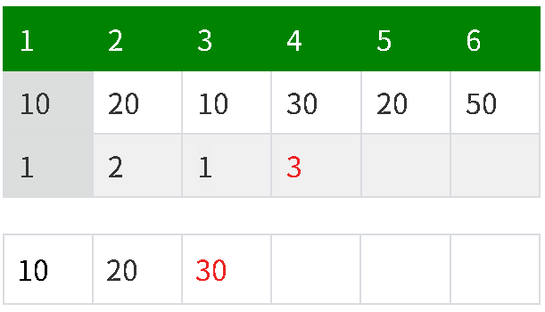


- N = 5
    - 치환
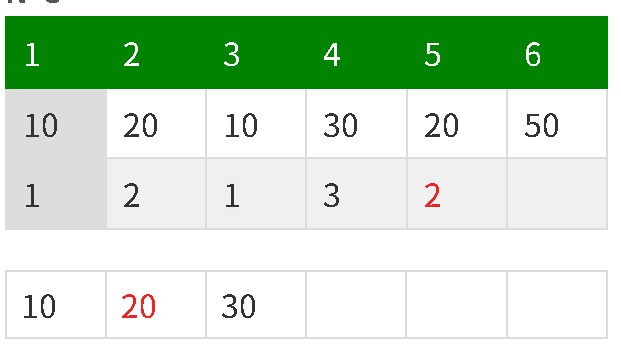


- N = 6
    - 삽입
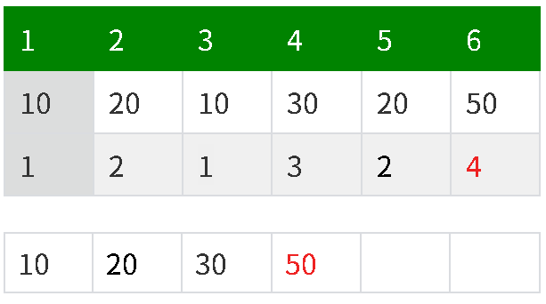


#### 역추적 과정
- 배열의 마지막부터 순회
- 신규 배열에 마지막으로 들어간 숫자를 찾음
- 그 이전에 들어간 숫자를 찾음(반복)
- 배열 순회가 끝나면 아래의 숫자들이 Stack에 들어간 것 확인 가능
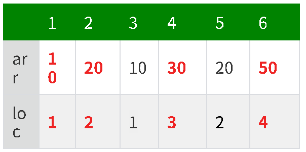


## DP, 이분탐색+역추적 비교
| 구분        | DP             | 이분 탐색 + 역추적      |
| --------- | -------------- | ---------------- |
| 저장하는 정보   | 각 원소까지의 LIS 길이 | 각 원소가 들어간 LIS 단계 |
| 길이 계산     | 이전 원소를 전부 비교   | 이분 탐색으로 위치 탐색    |
| 길이 계산 복잡도 | `O(N²)`        | `O(N log N)`     |
| 역추적 복잡도   | `O(N)`         | `O(N)`           |
| 전체 복잡도    | `O(N²)`        | `O(N log N)`     |


[출처](https://gom20.tistory.com/91)