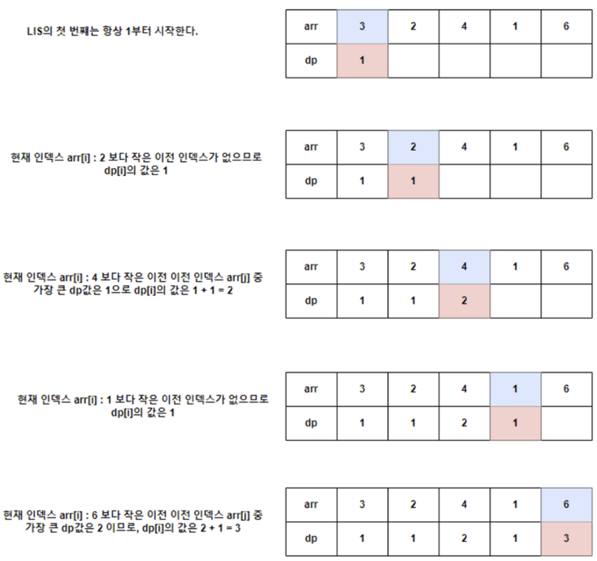
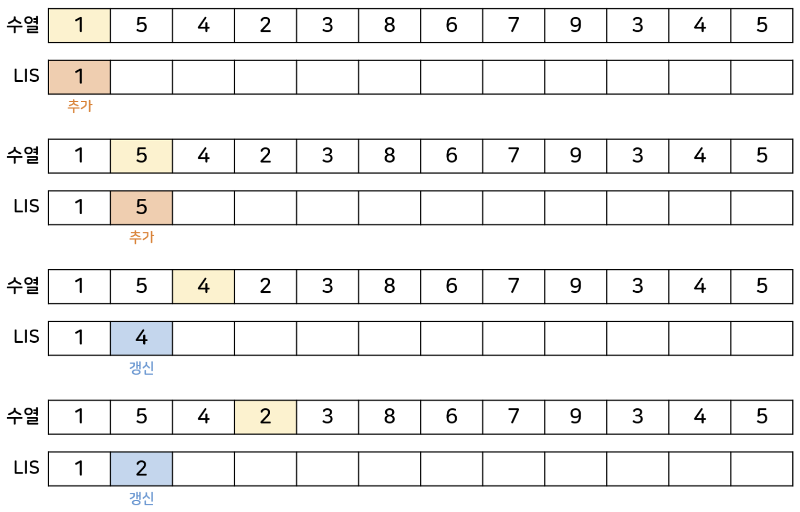
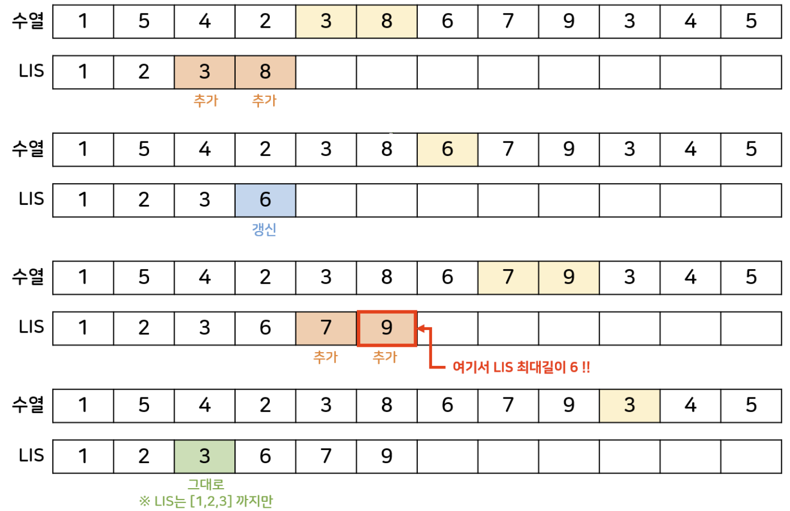
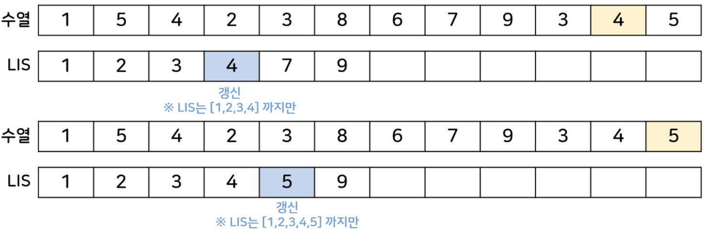

# LIS

Date: 2026년 8월 21일
Status: Done

# 개념

<aside>
📜

**LIS (Longest Increasing Subsequence)**

어떤 수열에서 오름차순으로 증가하는 가장 긴 부분수열을 의미한다.

→ LIS 는 정말 **별 다 줄** 이다 ㅋㅋ

</aside>

---

# 구현

## DP → O(n^2)

짧은 LIS들 중 최대 길이인 것들을 선택하고, 반복하다보면 최종 LIS를 구할 수 있다.

```python
def lis_dp(arr):
    if not arr:
        return 0
    
    n = len(arr)
    # 모든 원소는 자기 자신만으로 길이 1인 부분 수열이 되므로 1로 초기화
    dp = [1] * n
    
    for i in range(n):
        for j in range(i):
            # 이전 원소(j)가 현재 원소(i)보다 작을 때만 증가하는 수열이 성립
            if arr[j] < arr[i]:
                # 현재 저장된 값과 j를 거쳐서 오는 값 중 큰 값으로 갱신
                dp[i] = max(dp[i], dp[j] + 1)
                
    return max(dp)
```



## Binary Search → O(nlogn)

별도의 리스트에 규칙에 따라 차례대로 원소를 추가한다.

- 새로운 원소가 현재 리스트의 마지막 원소보다 크다면 추가
- 그렇지 않다면  binary search를 통해 해당 원소가 들어갈 위치를 찾는데 그 위치에 있는 값을 새로운 원소로 변경
- lis를 구할 땐 별도의 리스트에서 처음부터 최근에 추가한 원소까지만 고려하고, 그 뒤 index에 있는 원소들은 무시한다.

```python
import bisect

def lis_binary_search(arr):
    if not arr:
        return 0
        
    # 증가하는 수열을 기록할 배열
    lis_arr = [arr[0]]
    
    for num in arr[1:]:
        # 현재 숫자가 lis_arr의 마지막 숫자보다 크면 그냥 이어 붙임
        if num > lis_arr[-1]:
            lis_arr.append(num)
        # 그렇지 않다면, lis_arr 안에서 들어갈 위치를 이분 탐색으로 찾아 교체함
        else:
            idx = bisect.bisect_left(lis_arr, num)
            lis_arr[idx] = num
            
    return len(lis_arr)
```





