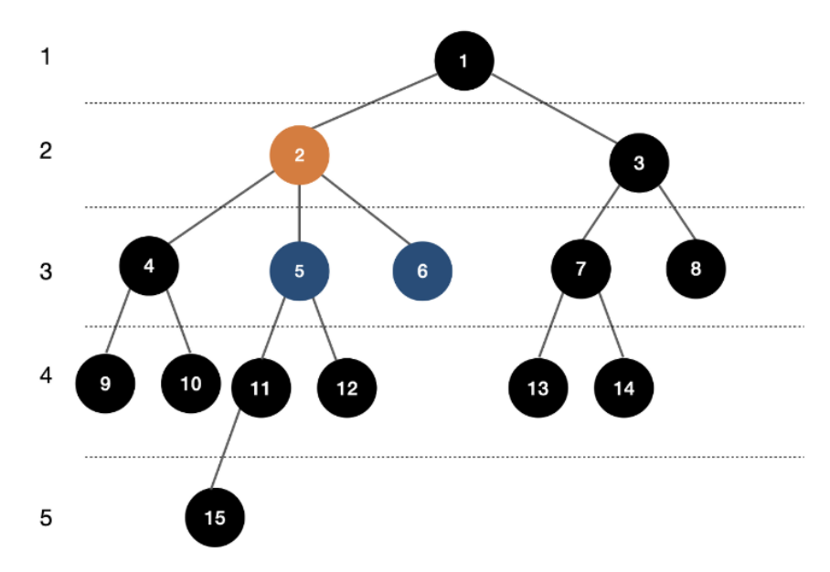

# Day37 LCA 알고리즘

## LCA(Lowest Common Ancestor) 알고리즘
- 트리에서 주어진 두 노드의 `최소 공통 조상`을 찾는 알고리즘




## 간단한 LCA 알고리즘: O(N)

1. DFS를 이용해 루트 노드를 기준으로 각 노드의 트리 깊이(depth)와 부모 노드를 저장
    - 루트 노드의 깊이를 `0`으로 설정
    - DFS로 트리를 탐색하면서 각 노드에 대해 아래와 같이 저장
        - `depth[node]`: 루트에서 해당 노드까지의 깊이
        - `parent[node]`: 해당 노드의 바로 위 부모
2. 두 노드의 높이를 같게 맞춤
    - 두 노드 중 더 깊은 노드를 부모 방향으로 계속 이동시킴
    - 두 노드가 같은 깊이에 위치할 때까지 반복
    ```text
    예: depth(A) = 4
    depth(B) = 2

    A를 부모 방향으로 2번 이동
    → depth(A) = depth(B) = 2
    ```

3. 두 노드가 일치할 때까지 동시에 부모 방향으로 이동
    - 깊이가 같아진 후에도 두 노드가 서로 가를 경우
    - 두 노드를 **한 단계씩 동시에 부모 노드로 이동**
    - 처음으로 두 노드가 같은 노드가 됨 -> 그 노드가 **LCA**

- 일반적인 트리에서는 문제가 없지만 편향트리에서는 O(N)의 시간복잡도를 보임


## LCA + DP 알고리즘(Binary Lifting): O(logN)
- 단순 LCA 방식에서는 부모 노드를 한 칸씩 올라가기 때문에 트리의 높이가 크면 최대 O(N)번 이동
- 이를 개선하기 위해 **Binary Lifting** 사용
```text
dp[a][b] = a번 노드의 2^b번째 조상

dp[5][0] = 5번 노드의 1번째 조상   (2^0 = 1)
dp[5][1] = 5번 노드의 2번째 조상   (2^1 = 2)
dp[5][2] = 5번 노드의 4번째 조상   (2^2 = 4)
dp[5][3] = 5번 노드의 8번째 조상   (2^3 = 8)
-> 부모 정보 미리 저장
```

- 특정 부모 노드까지 한 칸씩 이동하지 않고 `2의 제곱 단위`로 이동
```text
(Ex)
현재 노드에서 100번째 부모 노드로 이동

100 = 64 + 32 + 4
    = 2^6 + 2^5 + 2^2

64칸 -> 32칸 -> 4칸으로 총 3번만 이동하면 됨
```
- DP 테이블 생성에는 `O(NlogN)`, LCA 탐색 1회에는 `O(logN)`의 시간복잡도가 걸림

### 구현1) DP 배열의 2번째 인덱스 최대값 구하기
- `DP[a][b]`에서 b는 2^b번째 부모 노드를 의미
- 트리의 최대 깊이는 최대 N-1이므로 2^b >= N이 되는 정도까지 저장하면 충분함
```Java
public static int getMaxIndex() {
    return (int)Math.ceil(Math.log(N) / Math.log(2)) + 1;
}
```

```text
(ex) N = 100

2^6 = 64
2^7 = 128
```
- 따라서 약 `logN`개의 부모 정보만 저장하면 됨


### 구현2) DFS를 통해 각 노드의 depth와 바로 위 부모 노드 저장
- DFS를 이용해 각 노드의 깊이와 바로 위 부모 저장
- `DP[node][0]`은 `2^0 = 1`이므로 해당 노드의 바로 위 부모를 의미

```Java
public static void init(int ind, int h, int before) {
    depth[ind] = h;

    for (int i = 0; i < map.get(ind).size(); i++) {
        int next = map.get(ind).get(i);

        if (next == before) continue;

        dp[next][0] = ind;
        init(next, h + 1, ind);
    }
}
```


### 구현3) 나머지 DP 테이블 채우기
- `DP[index][a]`는 `index` 노드의 `2^a`번째 부모 노드
- `2^a = 2^(a-1) + 2^(a-1)`이므로 먼저 `2^(a-1)`번째 부모로 이동한 뒤, 그 노드에서 다시 `2^(a-1)`번째 부모로 이동
```text
DP[index][a] = DP[DP[index][a-1]][a-1]
```
```Java
public static void fillDp() {
    for (int i = 1; i < maxInd; i++) {
        for (int ind = 1; ind <= N; ind++) {
            dp[ind][i] = dp[dp[ind][i - 1]][i - 1];
        }
    }
}
```

- 각 노드마다 약 logN개의 부모 정보를 저장하므로 DP 테이블 생성 시간복잡도는 **O(NlogN)**


### 구현4) LCA 구하기
- DP 테이블을 이용한 LCA 탐색 과정
```text
1. 두 노드의 깊이를 같게 맞춤
2. 두 노드를 LCA 바로 아래까지 동시에 이동
3. 두 노드의 바로 위 부모가 LCA
```

#### 1. 두 노드의 깊이 맞추기
- 두 노드 중 더 깊은 노드를 위로 이동시켜 깊이를 같게 만듦
- 이때 부모 노드를 한 칸씩 이동하지 않고 `2^k` 단위로 이동

```Java
if (depth[a] < depth[b]) {
    int tmp = a;
    a = b;
    b = tmp;
}

for (int i = maxInd - 1; i >= 0; i--) {
    if (Math.pow(2, i) <= depth[a] - depth[b]) {
        a = dp[a][i];
    }
}
```

- 깊이를 맞춘 후 두 노드가 같다면 해당 노드가 LCA
```Java
if (a == b) return a;
```

#### 2. 두 노드를 LCA 바로 아래까지 이동
- 큰 `2^k`부터 확인하면서 두 노드의 `2^k`번째 부모가 서로 다른 경우 두 노드를 동시에 이동
```Java
for (int i = maxInd - 1; i >= 0; i--) {
    if (dp[a][i] == dp[b][i]) continue;

    a = dp[a][i];
    b = dp[b][i];
}
```

- dp[a][i] == dp[b][i]인 경우 해당 위치까지 올라가면 두 노드가 같은 조상에 도달하게 되므로 이동하지 않음
- 반대로 dp[a][i] != dp[b][i]라면 아직 서로 다른 가지에 있으므로 두 노드를 위로 이동시킬 수 있음
- 이를 반복하면 두 노드는 최종적으로 LCA의 바로 아래 노드까지 이동하게 됨

```text
        LCA
       /   \
      a     b
```
- 두 노드의 바로 위 부모가 LCA
```Java
return dp[a][0];
```

```Java
public static int LCA(int a, int b) {

    // a를 더 깊은 노드로 설정
    if (depth[a] < depth[b]) {
        int tmp = a;
        a = b;
        b = tmp;
    }

    // 1. 두 노드의 깊이 맞추기
    for (int i = maxInd - 1; i >= 0; i--) {
        if (Math.pow(2, i) <= depth[a] - depth[b]) {
            a = dp[a][i];
        }
    }

    if (a == b) return a;

    // 2. 두 노드를 LCA 바로 아래까지 이동
    for (int i = maxInd - 1; i >= 0; i--) {
        if (dp[a][i] == dp[b][i]) continue;

        a = dp[a][i];
        b = dp[b][i];
    }

    // 3. 바로 위 부모가 LCA
    return dp[a][0];
}
```


### 시간복잡도
- `DFS를 통한 depth, 부모 초기화`: O(N)
- `DP 테이블 생성`: O(NlogN)
- `LCA 탐색 1회`: O(logN)


## 참고

### DP(동적 계획법, Dynamic Programming)
- 계산한 값을 저장해두고 재사용하는 방식
- LCA에서는 각 노드의 `2^k`번째 부모 노드를 미리 저장하는데 사용
