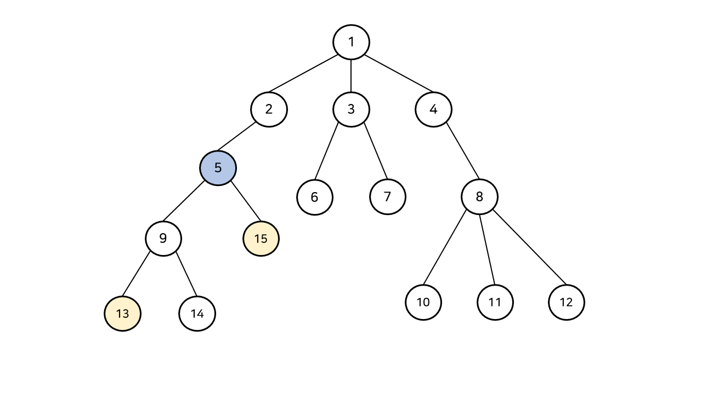
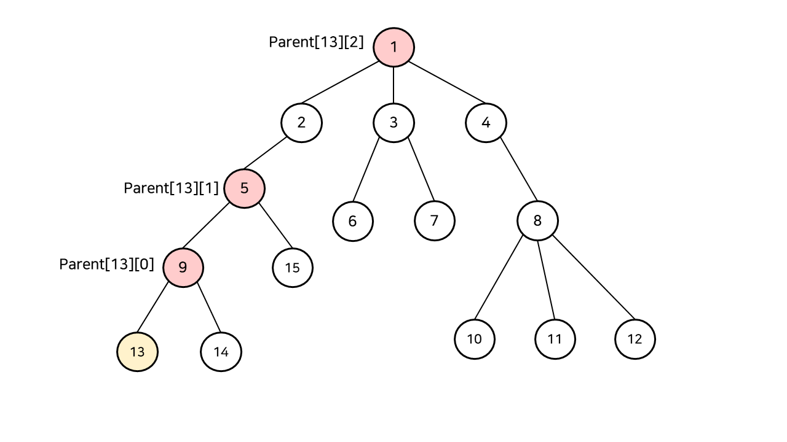

# Day 37 - LCA

최소 공통 조상(Lowest Common Ancestor)는 주어진 두 노드 a와 b의 가장 가까운 조상을 찾는 알고리즘이다



위와 같은 그림에서 13, 15번 노드의 LCA는 5번 노드가 된다

### 선형 탐색: O(Depth)

가장 단순한 방법으로, 두 포인터를 두고 가리키는 정점이 같을 때까지 부모 노드로 거슬로 올라간다

하지만 이 방법은 둘의 Level이 다르면 문제가 발생한다

따라서 동시에 거슬러 올라가기 전에 두 정점의 깊이를 동일하게 맞추는 과정이 필요하다

(주로 문제에서 parent 노드가 뭔지 알려주니깐 이걸 통해 노드의 depth를 구할 수 있음)

### 이분 탐색: O(log(Depth))

선형 탐색의 경우 부모를 한 단계씩 올라가서 비효율적이다

이를 개선하기 위해 여러 단계의 조상을 미리 저장하고, 한번에 여러 단계를 이동하기 위해 parent 배열을 다음과 같이 정의한다

`parent[x][k] = x의 2^k번째 조상`

```java
parent[x][0] = 1번째 조상
parent[x][1] = 2번째 조상
parent[x][2] = 4번째 조상
parent[x][3] = 8번째 조상
```



찾는 방법은 선형 탐색과 크게 다르지 않다

두 노드의 깊이 맞추기

두 노드를 동시에 위로 올리기

부모 노드로 올라 가는 과정에서 차이가 있는데 선형 탐색과 달리 2^k 번째 조상을 바로 찾을 수 있다
