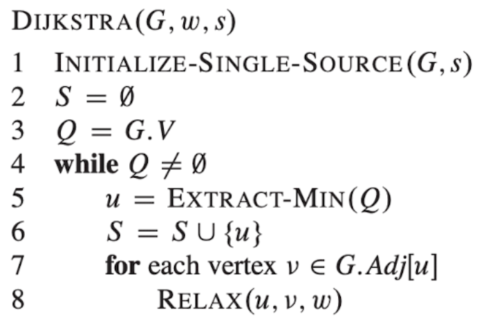

# 다익스트라

Date: 2026년 8월 26일
Status: Done

# 개념

<aside>
📜

**다익스트라 알고리즘**

Weighted, Directed graph에서 single source shortest path를 구하는 알고리즘이다. (weight가 0보다 크거나 같다.)

</aside>

---

# 다익스트라 알고리즘

- Priority Queue에서 최솟값을 추출한다.
- 즉, 가장 작은 값을 가지고 있는 vertex에서 해당 vertex에 연결되어 있는 모든 edge에 대해 edge relaxation을 진행한다.
    - relax란 해당 vertex가 이미 가지고 있는 weight과 현재 vertex에서 해당 vertex로 향하는 weight을 비교 후 작은 weight로 갱신하는 것을 의미한다.

## 동작 원리

1. 우선 시작하고자 하는 노드(s)만을 0으로 초기화하고, 나머지 노드는 모두 무한대로 초기화한다. 
    1. 노드의 값을 무한대로 초기화 하는 이유는, 이후 취할 relaxation이 비교 후 작은 수로 업데이트 해주는 특성을 가지고 있기 때문이다.
    
    
    

1. 현재의 root 노드를 가지고 있는 리스트인 S를 초기화한다.
    1. 마찬가지로 Priority Queue도 초기화한다.
    2. Q에는 Graph(G)의 모든 노드 즉, 모든 vertex(V)가 들어가 있다.
    
    
    

1. Q가 비어있지 않은 상태이므로 Q에서 가장 작은 값을 추출하여 S에 추가한다.

1. u의 Adjacency 즉, u의 모든 인접 노드에 대해 Relaxation을 수행한다. 
    1. 현재 t 노드에 대해 먼저 relaxation을 취해서 10<∞ 이므로, 10으로 값을 업데이트 한다.
    
    
    

1. 현재 u의 인접 노드 중 두번째인 y에 대해서도 relaxation을 취한다.
    
    
    

1. u에 대한 모든 인접 노드에 대해 relaxation이 끝났으므로 다음 u를 새로 추출한다.
    1. Q에서 가장 작은 값을 가지고 있는 노드인 y노드가 다음 u가 된다.
        
        
        

같은 방식으로 Queue가 빌 때까지 위 과정을 반복하면 다음과 같은 과정을 가진다.

---

## 시간복잡도

- 일반 **Array**를 이용하여 Priority Queue를 만들면, **O(V^2)**
    
    
    

- **Binary Heap**을 이용하면, **O[ (V+E) logV ]**
    
    
    

- **Fibonacci Heap**을 이용하면 위 Pseudo Code의 for문(decrease_key) 부분이 상수 시간을 갖게 되어 **O(E + V logV)**
    
    