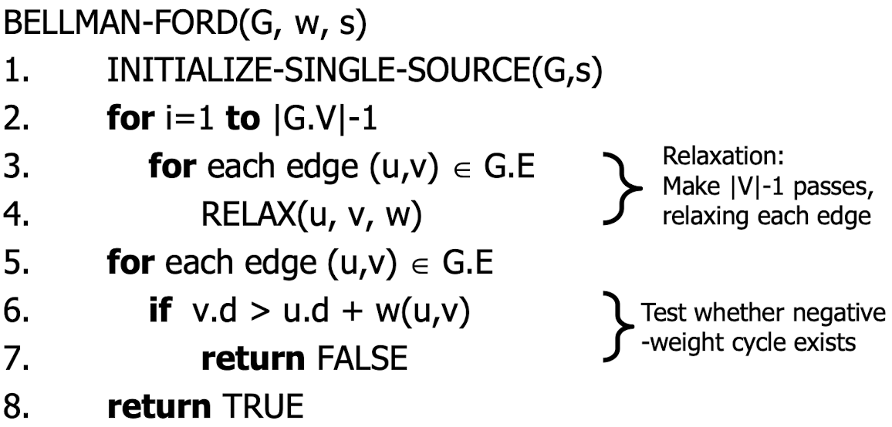

# 벨만 포드

Status: Done

# 개념

<aside>
📜

**벨만 포드 알고리즘**

Weighted, Directed graph에서 음수의 weight도 고려하여 single source shortest path를 구하는 알고리즘이다.

</aside>

---

# 벨만 포드 알고리즘

- Shortest path를 찾는다.
- Negative cycle을 감지한다.
    - relaxation 과정에서 최솟값을 취하는데 음수값이 커져 -∞로 발산하는 불필요한 cycle을 말한다.
    
    
    

## 동작 원리

- 우선 시작하고자 하는 노드(s)만을 0으로 초기화하고, 나머지 노드는 모두 무한대로 초기화한다.
    - 노드의 값을 무한대로 초기화 하는 이유는, 이후 취할 relaxation이 비교 후 작은 수로 업데이트 해주는 특성을 가지고 있기 때문이다.
- 현재 위 edge의 나열을 보면, t → x → y → z → s 노드의 순서로 진행됨을 얼추 알 수 있습니다.

1. 먼저 t 노드의 인접 vertices에 대해 Relax를 진행한다.
    1. 하지만, t의 값이 무한대이므로, relax 이후의 값이 그대로이다.
    
    
    

1. 그 다음으로 x 노드에 대해 인접 노드에 대한 Relax를 진행한다.
    1. 하지만 t와 마찬가지로 현재 x의 값이 무한대이기 때문에 relaxation 이후에도 그래프의 값의 변화가 없다.
    
    
    

1. y 노드와 z 노드에 대해서도 Relax를 수행합니다. 마찬가지로 모두 무한대의 값을 가지므로 변화가 없다.
    
    
    

1. 그 다음 차례인 s 노드에 대해서는 Relaxation을 수행했을 때, 0+6<∞ 이고 0+7<∞ 이므로 t와 y노드의 값이 업데이트 된다.
    1. (a) ~ (j)까지 해당 edge 순서를 모두 돌았으므로, 다시 (t,x)부터 relaxation을 수행합니다.
    
    
    
    
    

1. 이번 trial 부터는 노드에 무한대의 값이 점점 사라져 가게 되므로, 눈에 띄게 Relax가 수행된다.
    
    
    

1. 위와 같은 방식으로 **"모든 edge에 대해 Relaxation을 취할 때까지"** 즉, **"모든 edge에 대해 (Vertex 개수)-1번의 Relaxation을 취할 때까지"** 이 과정을 반복한다.
    
    
    

---

## Negative Cycle 감지 과정

- 위와 같은 방식으로 그래프를 순회하면서, **v.d > u.d + w(y,v)**가 한 번 더 발생하는지의 여부를 감지한다.
    - Edge relaxation은 만약 v.d > u.d + w(y,v)가 존재한다면 더 작은 쪽으로 업데이트한다.
    - For loop을 돌며 Relaxation 작업이 모두 끝났음에도 불구하고, 만약 Relaxation이 될 만한 여지가 한 번 더 감지된다면, Negative Cylce이 그래프 내에 존재한다는 의미이다.

---

## 시간 복잡도

- Bellman-Ford 알고리즘의 Running Time은 O(VE) + O(V) + O(E) 즉, **O(VE)**

