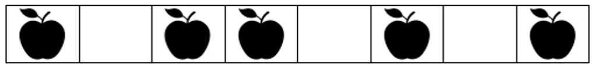

# 비트마스크

Date: 2026년 8월 27일
Status: Done

# 개념

<aside>
📜

**비트마스크**

컴퓨터의 Bit을 사용하여 집합을 표현하고 처리하는 기법으로, 작은 메모리 공간에서 다양한 연산을 수행할 수 있다.



8개의 상자에 들어있는 사과를 아래와 같이 표현할 수 있다.


</aside>

---

# SHIFT 연산 (위치 옮기기)

- a << b : a의 모든 비트를 왼쪽으로 b만큼 이동
    - 숫자에 사용하면 2를 곱해주는 것과 같은 역할
- a >> b : a의 모든 비트를 오른쪽으로 b만큼 이동
    - 오른쪽 bit 데이터가 소실된다.

---

# AND 연산 (원소 확인)

- n번째 위치에 값의 존재 유무를 확인
    - SHIFT 연산을 통해 n번째 위치로 이동한다.
    - & 기호를 통해 AND 연산을 수행한다.


```python
1 << ( n - 1) # 숫자 1을 n번째 위치로 이동
```


---

# OR 연산 (원소 추가)

- n번째 위치에 값을 추가한다.
    - SHIFT 연산을 통해 n번째 위치로 이동한다.
    - | 기호를 통해 OR 연산을 수행한다.


---

# NOT 연산 (원소 삭제)

- n번쨰 위치만 0으로 만들고 나머지를 전부 1로 만들어 AND 연산하면 해당 위치의 값만 삭제된다.
    - SHIFT 연산을 통해 n번째 위치로 이동한다.
    - ~ 기호를 통해 NOT 연산으로 n번쨰 위치의 값은 0으로, 나머지는 1로 만든다.
    - AND 연산으로 n번쨰 값은 무조건 0이 되고, 나머지는 원래의 값을 유지한다.


---

# XOR 연산

- 값이 있으면 삭제, 없으면 추가
    - 1을 SHIFT 연산으로 밀어 놓고, XOR 연산을 하게 되면 0과 만나는 부분은 원래의 값, 1과 만나는 부분은 값이 뒤집힌다.
    - NOT, AND 로 해야하는 연산을 XOR로 간단하게 수행할 수 있다.

