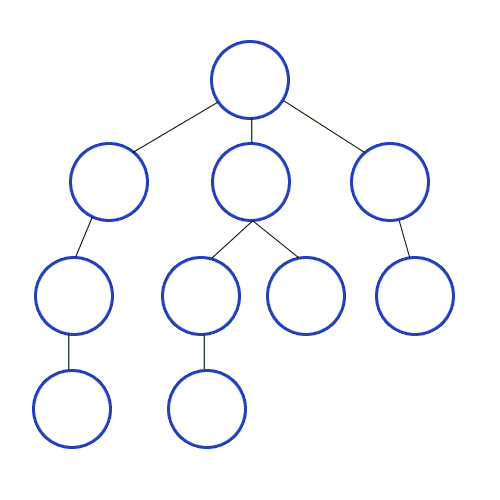

# DFS & BFS

Date: 2026년 7월 7일
Status: Done

# 개념

<aside>
📜

DFS : 깊이 우선 탐색 / BFS : 너비 우선 탐색

개념은 어렵지 않지만 헷갈리는 원인이 뭘까?

- 문제를 읽고 어떤 알고리즘으로 접근해야 하는지 모를 때

1. 최단 거리 / 최소 횟수 → 무조건 BFS
2. 모든 경우의 수, 조합 또는 경로를 다 확인하는 경우 → 무조건 DFS
3. 일정 시간 간격으로 동시에 무언가 발생하는 경우 → 무조건 BFS

→ 이렇게 기준을 나눠봤지만, 코딩테스트를 준비한다면 이 주제로 문제를 주구장창 풀어보는 방법이 젤 유익하다.

두 알고리즘 템플릿을 이해하고 구현한 뒤, 꼭 암기하고 있는 편이 좋을 것이다. 
면접에서 물어볼 수 있고, 코딩테스트 단골 주제이기 떄문이다.

** DFS 구현 시 재귀 호출이 많이 필요하다? → 꼭 스택으로 구현하자.

</aside>

**DFS**


**BFS**



---

# 구현

## 그래프 탐색 템플릿

### DFS (재귀 구현)

```python
# graph: 인접 리스트로 표현된 그래프 (예: [[], [2, 3], [1, 4], ...])
# v: 현재 방문하는 노드 번호
# visited: 방문 체크 배열 ([False] * 노드개수)
def dfs(graph, v, visited):
    # 1. 현재 노드를 방문 처리
    visited[v] = True
    print(v, end=' ') # 방문 노드 출력 (실전에서는 여기에 로직 수행)

    # 2. 현재 노드와 연결된 다른 노드를 재귀적으로 방문
    for neighbor in graph[v]:
        if not visited[neighbor]:
            dfs(graph, neighbor, visited)
```

### DFS (스택 구현)

```python
from collections import deque

# graph: 인접 리스트
# start: 시작 노드 번호
# visited: 방문 체크 배열
def dfs_stack(graph, start, visited):
    # 1. 시작 노드를 스택에 넣기 
    stack = deque([start])

    # 2. 스택이 빌 때까지 반복
    while stack:
        # 스택의 맨 위(가장 최근에 넣은 것) 원소를 pop
        v = stack.pop()

        # 스택에서 꺼내는 순간에 방문 체크
        if not visited[v]:
            visited[v] = True
            print(v, end=' ') # 실제 필요한 로직 처리

            # 연결된 인접 노드들을 확인 (역순으로 넣으면 인접 리스트 정렬 순서대로 방문 가능)
            for neighbor in reversed(graph[v]):
                if not visited[neighbor]:
                    stack.append(neighbor)
```

### BFS (큐 구현)

```python
from collections import deque

# graph: 인접 리스트
# start: 시작 노드 번호
# visited: 방문 체크 배열
def bfs(graph, start, visited):
    # 1. 시작 노드를 큐에 넣고 방문 처리
    queue = deque([start])
    visited[start] = True

    # 2. 큐가 빌 때까지 반복
    while queue:
        # 큐에서 하나의 원소를 뽑아 출력
        v = queue.popleft()
        print(v, end=' ') # 실제 필요한 로직 처리

        # 해당 원소와 연결된, 아직 방문하지 않은 원소들을 큐에 삽입
        for neighbor in graph[v]:
            if not visited[neighbor]:
                queue.append(neighbor)
                visited[neighbor] = True
```

## 2차원 Matrix 탐색 템플릿 (미로 찾기, 섬 개수 세기, 아이템 줍기 등)

### 2차원 DFS (재귀)

```python
# 맵의 세로(R), 가로(C) 크기 정의
R, C = len(grid), len(grid[0])
visited = [[False] * C for _ in range(R)]

# 상하좌우 이동을 위한 방향 설정
dx = [-1, 1, 0, 0]
dy = [0, 0, -1, 1]

def dfs_grid(x, y):
    # 방문 처리
    visited[x][y] = True
    
    # 상하좌우 네 방향 확인
    for i in range(4):
        nx = x + dx[i]
        ny = y + dy[i]
        
        # 1. 지도 범위를 벗어나지 않는지 확인
        if 0 <= nx < R and 0 <= ny < C:
            # 2. 방문한 적 없고, 갈 수 있는 길(조건)인지 확인
            if not visited[nx][ny] and grid[nx][ny] == 1: 
                dfs_grid(nx, ny)
```

### 2차원 DFS (스택)

```python
from collections import deque

R, C = len(grid), len(grid[0])
visited = [[False] * C for _ in range(R)]

# 상하좌우 이동 방향
dx = [-1, 1, 0, 0]
dy = [0, 0, -1, 1]

def dfs_grid_stack(start_x, start_y):
    stack = deque([(start_x, start_y)])
    
    while stack:
        x, y = stack.pop()
        
        # 스택에서 꺼낼 때 방문 체크
        if not visited[x][y]:
            visited[x][y] = True
            
            # 상하좌우 탐색
            for i in range(4):
                nx = x + dx[i]
                ny = y + dy[i]
                
                if 0 <= nx < R and 0 <= ny < C:
                    if not visited[nx][ny] and grid[nx][ny] == 1:
                        stack.append((nx, ny))
```

### 2차원 BFS (큐)

```python
from collections import deque

R, C = len(grid), len(grid[0])
visited = [[False] * C for _ in range(R)]

dx = [-1, 1, 0, 0]
dy = [0, 0, -1, 1]

def bfs_grid(start_x, start_y):
    queue = deque([(start_x, start_y)])
    visited[start_x][start_y] = True
    
    while queue:
        x, y = queue.popleft()
        
        # 상하좌우 탐색
        for i in range(4):
            nx = x + dx[i]
            ny = y + dy[i]
            
            if 0 <= nx < R and 0 <= ny < C:
                if not visited[nx][ny] and grid[nx][ny] == 1:
                    visited[nx][ny] = True
                    queue.append((nx, ny))
                    # 만약 최단 거리를 기록해야 한다면 복사본 맵에 거리 누적 가능
                    # grid[nx][ny] = grid[x][y] + 1
```

---

# (실전) 예제

> 
> 
> 
> ## **여행 경로 찾기**
> 
> ### **문제 설명**
> 
> 주어진 항공권을 모두 사용하여 여행 경로를 만들려고 합니다.
> 
> 여행은 항상 `"ICN"` 공항에서 시작합니다.
> 
> 항공권 정보가 담긴 2차원 배열 `tickets`가 주어질 때, 모든 항공권을 정확히 한 번씩 사용하여 만들 수 있는 여행 경로를 배열로 반환하는 함수 `solution`을 작성하세요.
> 
> 만약 가능한 여행 경로가 2개 이상이라면, 알파벳 순서가 가장 앞서는 경로를 반환해야 합니다.
> 
> ---
> 
> ### **함수 정의**
> 
> ```python
> def solution(tickets):
> ```
> 
> ---
> 
> ### **제한사항**
> 
> - 모든 공항 이름은 알파벳 대문자 3글자로 이루어져 있습니다.
> - 주어진 공항 수는 3개 이상 10,000개 이하입니다.
> - `tickets[i] = [a, b]`는 `a` 공항에서 `b` 공항으로 가는 항공권이 있다는 의미입니다.
> - 주어진 항공권은 모두 사용해야 합니다.
> - 같은 항공권 정보가 여러 장 주어질 수 있습니다.
> - 항상 모든 항공권을 사용하여 여행 경로를 만들 수 있는 경우만 주어집니다.
> - 가능한 경로가 여러 개라면, 알파벳 순서가 가장 앞서는 경로를 반환합니다.
> 
> ---
> 
> ### **반환값**
> 
> 모든 항공권을 사용했을 때 방문하는 공항 경로를 배열로 반환합니다.
> 
> 반환 배열의 길이는 항상 `len(tickets) + 1`입니다.
> 
> ---
> 
> ### **입출력 예**
> 
> | **tickets** | **result** |
> | --- | --- |
> | `[["ICN", "JFK"], ["HND", "IAD"], ["JFK", "HND"]]` | `["ICN", "JFK", "HND", "IAD"]` |
> | `[["ICN", "SFO"], ["ICN", "ATL"], ["SFO", "ATL"], ["ATL", "ICN"], ["ATL", "SFO"]]` | `["ICN", "ATL", "ICN", "SFO", "ATL", "SFO"]` |
> 
> ---
> 
> ### **입출력 예 설명**
> 
> #### **예시 1**
> 
> 입력:
> 
> ```python
> tickets = [
>     ["ICN", "JFK"],
>     ["HND", "IAD"],
>     ["JFK", "HND"]
> ]
> ```
> 
> `"ICN"`에서 출발하면 다음 순서로 모든 항공권을 사용할 수 있습니다.
> 
> ```python
> ["ICN", "JFK", "HND", "IAD"]
> ```
> 
> 따라서 결과는 다음과 같습니다.
> 
> ```python
> ["ICN", "JFK", "HND", "IAD"]
> ```
> 
> ---
> 
> #### **예시 2**
> 
> 입력:
> 
> ```python
> tickets = [
>     ["ICN", "SFO"],
>     ["ICN", "ATL"],
>     ["SFO", "ATL"],
>     ["ATL", "ICN"],
>     ["ATL", "SFO"]
> ]
> ```
> 
> 가능한 여행 경로 중 하나는 다음과 같습니다.
> 
> ```python
> ["ICN", "SFO", "ATL", "ICN", "ATL", "SFO"]
> ```
> 
> 하지만 다음 경로도 모든 항공권을 정확히 한 번씩 사용합니다.
> 
> ```python
> ["ICN", "ATL", "ICN", "SFO", "ATL", "SFO"]
> ```
> 
> 두 경로를 알파벳 순서로 비교하면 `"ATL"`이 `"SFO"`보다 앞서므로, 두 번째 경로가 더 앞서는 경로입니다.
> 
> 따라서 결과는 다음과 같습니다.
> 
> ```python
> ["ICN", "ATL", "ICN", "SFO", "ATL", "SFO"]
> ```
> 
> ---
> 
> ### **구현 조건**
> 
> 다음 사항을 반드시 고려해야 합니다.
> 
> 1. 여행은 항상 `"ICN"` 공항에서 시작해야 합니다.
> 2. 모든 항공권을 정확히 한 번씩 사용해야 합니다.
> 3. 같은 출발지에서 갈 수 있는 도착지가 여러 개라면 알파벳 순서를 고려해야 합니다.
> 4. 단순히 매 순간 알파벳 순으로 가장 앞선 공항을 선택하는 방식은 항상 정답을 보장하지 않습니다.
> 5. 모든 항공권을 사용했을 때의 전체 경로가 알파벳 순으로 가장 앞서야 합니다.

```python
from collections import deque

def solution(tickets):

    visited = [False] * len(tickets)
    results = []

    def dfs(curr):
        if len(curr) == len(tickets) + 1:
            results.append(curr[:])
            return
        for i in range(len(tickets)):
            if not visited[i]:
                if curr[-1] == tickets[i][0]:
                    visited[i] = True
                    curr.append(tickets[i][1])

                    dfs(curr)

                    curr.pop()
                    visited[i] = False

    dfs(["ICN"])

    sorted_results = sorted(results)

    return sorted_results[0]
```

---

> 
> 
> 
> ## **단어 변환**
> 
> ### **문제 설명**
> 
> 두 개의 단어 `begin`, `target`과 단어의 집합 `words`가 주어집니다.
> 
> `begin` 단어를 `target` 단어로 변환하려고 합니다.
> 
> 단어를 변환할 때는 다음 규칙을 따라야 합니다.
> 
> 1. 한 번에 한 개의 알파벳만 바꿀 수 있습니다.
> 2. 변환된 단어는 반드시 `words` 안에 있어야 합니다.
> 
> 예를 들어 `begin = "hit"`, `target = "cog"`, `words = ["hot", "dot", "dog", "lot", "log", "cog"]`라면 다음과 같이 변환할 수 있습니다.
> 
> ```python
> "hit" -> "hot" -> "dot" -> "dog" -> "cog"
> ```
> 
> 이 경우 총 4단계의 변환 과정을 거칩니다.
> 
> `begin`, `target`, `words`가 주어질 때, `begin`에서 `target`으로 변환하기 위한 최소 변환 횟수를 반환하는 함수 `solution`을 작성하세요.
> 
> 만약 `target`으로 변환할 수 없다면 `0`을 반환합니다.
> 
> ---
> 
> ### **함수 정의**
> 
> ```python
> def solution(begin, target, words):
> ```
> 
> ---
> 
> ### **제한사항**
> 
> - 각 단어는 알파벳 소문자로만 이루어져 있습니다.
> - 각 단어의 길이는 3 이상 10 이하입니다.
> - 모든 단어의 길이는 같습니다.
> - `words`에는 3개 이상 50개 이하의 단어가 있습니다.
> - `words`에는 중복되는 단어가 없습니다.
> - `begin`과 `target`은 서로 다릅니다.
> - 변환할 수 없는 경우에는 `0`을 반환합니다.
> 
> ---
> 
> ### **반환값**
> 
> `begin`에서 `target`으로 변환하기 위한 최소 변환 횟수를 정수로 반환합니다.
> 
> ---
> 
> ### **입출력 예**
> 
> | **begin** | **target** | **words** | **return** |
> | --- | --- | --- | --- |
> | `"hit"` | `"cog"` | `["hot", "dot", "dog", "lot", "log", "cog"]` | `4` |
> | `"hit"` | `"cog"` | `["hot", "dot", "dog", "lot", "log"]` | `0` |
> 
> ---
> 
> ### **입출력 예 설명**
> 
> #### **예시 1**
> 
> 입력:
> 
> ```python
> begin = "hit"
> target = "cog"
> words = ["hot", "dot", "dog", "lot", "log", "cog"]
> ```
> 
> `begin`인 `"hit"`에서 시작하여 다음과 같이 변환할 수 있습니다.
> 
> ```python
> "hit" -> "hot" -> "dot" -> "dog" -> "cog"
> ```
> 
> 각 단계마다 한 글자만 바뀌며, 변환된 단어는 모두 `words` 안에 있습니다.
> 
> 변환 과정은 총 4단계이므로 결과는 다음과 같습니다.
> 
> ```python
> 4
> ```
> 
> ---
> 
> #### **예시 2**
> 
> 입력:
> 
> ```python
> begin = "hit"
> target = "cog"
> words = ["hot", "dot", "dog", "lot", "log"]
> ```
> 
> `target`인 `"cog"`가 `words` 안에 없습니다.
> 
> 문제의 규칙상 변환된 단어는 반드시 `words` 안에 있어야 하므로 `"cog"`로 변환할 수 없습니다.
> 
> 따라서 결과는 다음과 같습니다.
> 
> ```python
> 0
> ```
> 
> ---
> 
> ### **구현 조건**
> 
> 다음 사항을 반드시 고려해야 합니다.
> 
> 1. 한 번의 변환에서는 알파벳 한 개만 바꿀 수 있습니다.
> 2. 변환된 단어는 반드시 `words`에 포함되어 있어야 합니다.
> 3. 같은 단어를 반복 방문하면 불필요한 탐색이 발생하므로 방문 처리가 필요합니다.
> 4. 최소 변환 횟수를 구해야 하므로 BFS를 사용하는 것이 적합합니다.
> 5. `target`이 `words` 안에 없다면 변환할 수 없으므로 바로 `0`을 반환할 수 있습니다.

```python
from cmath import inf
from collections import deque

def solution(begin, target, words):
    if target not in words:
        return 0

    queue = deque()
    queue.append((begin, 0))
    min_cnt = inf
    word_len = len(begin)
    visited = [False] * len(words)

    def alphabet_compare(word_a, word_b):
        alphabet_cnt = 0
        for i in range(word_len):
            if word_a[i] == word_b[i]:
                alphabet_cnt += 1

        return alphabet_cnt

    while queue:
        new_target, cnt = queue.popleft()

        if new_target == target:
            if min_cnt > cnt:
                min_cnt = cnt

        for i in range(len(words)):
            if visited[i]:
                continue
            if alphabet_compare(new_target, words[i]) == word_len - 1:
                cnt += 1
                queue.append((words[i], cnt))
                visited[i] = True
                

    return min_cnt
```

---

> 
> 
> 
> ## **얼음 녹이기 (26년 상반기 LG전자 코딩테스트)**
> 
> ### **문제 설명**
> 
> `N x M` 크기의 격자판에 얼음이 놓여 있습니다.
> 
> 격자판의 각 칸은 다음과 같은 의미를 가집니다.
> 
> - `0` : 빈칸
> - `1` 이상의 정수 : 얼음의 남은 시간
> 
> 얼음은 1초마다 상하좌우로 인접한 **공기층의 개수**만큼 남은 시간이 감소합니다.
> 
> 예를 들어, 어떤 얼음 칸이 공기층 2개와 인접해 있다면 1초 후 해당 얼음의 남은 시간은 `2` 감소합니다.
> 
> 단, 모든 빈칸이 공기층인 것은 아닙니다.
> 
> 격자판의 가장자리에 있는 빈칸은 공기층입니다.
> 
> 또한 가장자리의 공기층과 상하좌우로 연결된 빈칸도 공기층입니다.
> 
> 반면, 빈칸이 얼음으로 완전히 둘러싸여 외부 공기층과 연결되어 있지 않다면, 해당 빈칸은 공기층이 아닙니다.
> 
> 따라서 이러한 내부 빈칸은 인접한 얼음의 남은 시간을 감소시키지 않습니다.
> 
> 주어진 시간 `time`초가 지난 뒤의 격자판 상태를 반환하는 함수 `solution`을 작성하세요.
> 
> ---
> 
> ### **함수 정의**
> 
> ```python
> def solution(ice, time):
> ```
> 
> ---
> 
> ### **제한사항**
> 
> - `ice`는 `N x M` 크기의 2차원 정수 배열입니다.
> - `1 <= N, M`
> - `ice[i][j] == 0`이면 빈칸입니다.
> - `ice[i][j] >= 1`이면 얼음이며, 값은 해당 얼음의 남은 시간을 의미합니다.
> - `time >= 0`
> - 얼음의 남은 시간이 `0` 이하가 되면 해당 칸은 빈칸 `0`이 됩니다.
> - 각 초마다 모든 얼음은 동시에 녹습니다.
> - 공기층 여부는 매 초마다 새롭게 계산해야 합니다.
> 
> ---
> 
> ### **반환값**
> 
> `time`초가 지난 뒤의 격자판 상태를 2차원 배열로 반환합니다.
> 
> ---
> 
> ### **입출력 예**
> 
> | **ice** | **time** | **result** |
> | --- | --- | --- |
> | `[[0,0,0],[0,2,0],[0,0,0]]` | `1` | `[[0,0,0],[0,0,0],[0,0,0]]` |
> | `[[0,0,0,0,0],[0,2,2,2,0],[0,2,0,2,0],[0,2,2,2,0],[0,0,0,0,0]]` | `1` | `[[0,0,0,0,0],[0,0,1,0,0],[0,1,0,1,0],[0,0,1,0,0],[0,0,0,0,0]]` |
> | `[[0,0,0,0,0],[0,2,2,2,0],[0,2,0,2,0],[0,2,2,2,0],[0,0,0,0,0]]` | `2` | `[[0,0,0,0,0],[0,0,0,0,0],[0,0,0,0,0],[0,0,0,0,0],[0,0,0,0,0]]` |
> 
> ---
> 
> ### **입출력 예 설명**
> 
> #### **예시 1**
> 
> 입력:
> 
> ```python
> ice = [
>     [0, 0, 0],
>     [0, 2, 0],
>     [0, 0, 0]
> ]
> 
> time = 1
> ```
> 
> 가운데 얼음은 상하좌우 네 방향이 모두 공기층입니다.
> 
> 따라서 1초 동안 `4`만큼 감소합니다.
> 
> 얼음의 남은 시간은 `2 - 4 = -2`가 되므로 빈칸 `0`으로 바뀝니다.
> 
> 결과:
> 
> ```python
> [
>     [0, 0, 0],
>     [0, 0, 0],
>     [0, 0, 0]
> ]
> ```
> 
> ---
> 
> #### **예시 2**
> 
> 입력:
> 
> ```python
> ice = [
>     [0, 0, 0, 0, 0],
>     [0, 2, 2, 2, 0],
>     [0, 2, 0, 2, 0],
>     [0, 2, 2, 2, 0],
>     [0, 0, 0, 0, 0]
> ]
> 
> time = 1
> ```
> 
> 가운데에 있는 `0`은 빈칸이지만 얼음으로 둘러싸여 있습니다.
> 
> 따라서 외부 공기층과 연결되어 있지 않으므로 공기층이 아닙니다.
> 
> 각 얼음은 외부 공기층과 맞닿은 면의 개수만큼 감소합니다.
> 
> 1초 후 결과는 다음과 같습니다.
> 
> ```python
> [
>     [0, 0, 0, 0, 0],
>     [0, 0, 1, 0, 0],
>     [0, 1, 0, 1, 0],
>     [0, 0, 1, 0, 0],
>     [0, 0, 0, 0, 0]
> ]
> ```
> 
> ---
> 
> #### **예시 3**
> 
> 예시 2와 같은 초기 상태에서 `time = 2`인 경우입니다.
> 
> 1초 후 일부 얼음이 녹아 빈칸이 되고, 이로 인해 기존에 내부 공간이었던 빈칸도 외부 공기층과 연결됩니다.
> 
> 따라서 다음 초에는 새롭게 연결된 공기층까지 고려하여 얼음이 녹습니다.
> 
> 2초 후에는 모든 얼음이 녹아 다음과 같은 결과가 됩니다.
> 
> ```python
> [
>     [0, 0, 0, 0, 0],
>     [0, 0, 0, 0, 0],
>     [0, 0, 0, 0, 0],
>     [0, 0, 0, 0, 0],
>     [0, 0, 0, 0, 0]
> ]
> ```
> 
> ---
> 
> ### **구현 조건**
> 
> 다음 사항을 반드시 고려해야 합니다.
> 
> 1. 얼음으로 둘러싸인 내부 빈칸은 공기층으로 계산하면 안 됩니다.
> 2. 각 초마다 얼음은 동시에 녹아야 합니다.
> 3. 얼음이 녹아 생긴 빈칸은 다음 초부터 공기층 여부 판단에 반영됩니다.

```python
from collections import deque

def solution(ice, time):
    n = len(ice)
    m = len(ice[0])

    board = [row[:] for row in ice]
    directions = [(-1, 0), (1, 0), (0, -1), (0, 1)]

    def find_air():
        air = [[False] * m for _ in range(n)]
        q = deque()

        # 가장자리의 빈칸은 외부 공기층 (가장자리 빈칸은 air[i][j]를 True로 저장하고 큐에 넣기)
        for i in range(n):
            for j in [0, m - 1]:
                if board[i][j] == 0 and not air[i][j]:
                    air[i][j] = True
                    q.append((i, j))

        for j in range(m):
            for i in [0, n - 1]:
                if board[i][j] == 0 and not air[i][j]:
                    air[i][j] = True
                    q.append((i, j))

        # 외부와 연결된 빈칸만 공기층으로 확장
        while q:
            x, y = q.popleft()

            for dx, dy in directions:
                nx, ny = x + dx, y + dy

                if 0 <= nx < n and 0 <= ny < m:
                    if board[nx][ny] == 0 and not air[nx][ny]:
                        air[nx][ny] = True
                        q.append((nx, ny))

        return air

    for _ in range(time):
        air = find_air()
        decrease = [[0] * m for _ in range(n)]

        # 각 얼음 칸이 인접한 외부 공기층 개수 계산
        for x in range(n):
            for y in range(m):
                if board[x][y] > 0:
                    cnt = 0

                    for dx, dy in directions:
                        nx, ny = x + dx, y + dy

                        if 0 <= nx < n and 0 <= ny < m:
                            if air[nx][ny]:
                                cnt += 1

                    decrease[x][y] = cnt

        # 동시에 감소 처리
        for x in range(n):
            for y in range(m):
                if board[x][y] > 0:
                    board[x][y] -= decrease[x][y]

                    if board[x][y] <= 0:
                        board[x][y] = 0

        # 더 이상 얼음이 없으면 조기 종료
        if not any(board[i][j] > 0 for i in range(n) for j in range(m)):
            break

    return board
```

---

# 시간복잡도

인접 리스트로 구현 시 : O(V + E)

인접 행렬로 구현 시 : O(V^2)

2차원 Matrix에서 알고리즘 구현 시 : O(Row * Column)