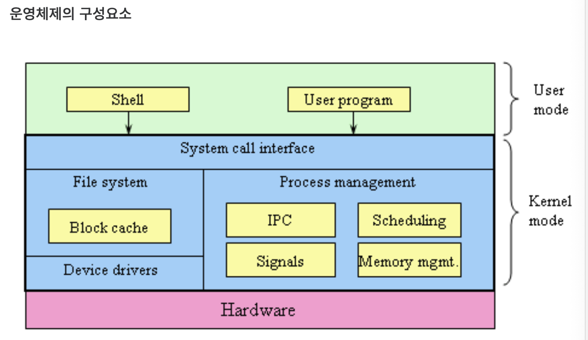

# 운영체제란

Date: 2026년 7월 10일
Status: Done

# 개념

<aside>
📜

하드웨어 자원을 관리하고, HW와 Application 사이를 중재하는 Interace이다.

User mode로 kernel에 ~~ 해주세요 → Kernel mode로 바꿔서 OS가 Hardware를 직접 control

일반 응용 프로그램(웹 브라우저, 게임 등)이 하드웨어를 마음대로 조작하면 시스템이 망가질 수 있다. 따라서 평소에는 권한이 제한된 **유저 모드**로 작동하다가, 파일 저장이나 네트워크 연결 등 하드웨어 접근이 필요할 때만 커널에 부탁(**시스템 콜, System Call**)하여 **커널 모드**로 전환되어 안전하게 실행된다.

</aside>



---

# 역할

<aside>
📜

1. 프로세스 관리 (CPU Sheduler)
2. 메모리 관리 (Memory Management)
3. 파일 시스템 관리(Storage Management)
4. 입출력 관리(Device Management)
5. 장치 드라이버 관리
6. 보안 및 권한 관리
7. 네트워킹
8. 시스템 호출 인터페이스
</aside>

---

## 프로세스 관리

프로세스는 실행 중인 프로그랢을 의미

- 프로세스 생성 / 종료
- 프로세스 상태 관리
- CPU 시간 할당
- 프로세스 간 전환
- 프로세스 간 통신
- 동기화 / 교착상태 관리

CPU 스케줄링을 통해 각 프로세스에 CPU를 얼마나 할당할지 결정

- FCFS
- SJF
- Priority Scheduling
- RR

---

## 메모리 관리

- 프로세스에 메모리 할당 및 회수
- 프로세스 간 메모리 영역 보호
- 물리 메모리와 가상 메모리 관리
- 디스크 ↔ 메모리

가상 메모리!

- Paging
- Segmentation

---

## 파일 시스템 관리

- 파일 생성 / 삭제
- 파일 읽기 / 쓰기
- Directory 생성 / 삭제
- 파일 이름, 위치 관리
- 저장 공간 할당
- 접근 권한 관리
- 메타데이터 관리

---

## 입출력 장치 관리 (I/O)

- 장치 사용 요청 처리
- 입출력 작업 순서 관리
- 장치 간 속도 차이 조정
- 버퍼링, 캐싱
- Interrupt 처리
- 예외 처리

---

## 장치 드라이버 관리

```
응용 프로그램
    ↓
운영체제
    ↓
장치 드라이버
    ↓
하드웨어 장치
```

---

## 보안 및 권한 관리

- 사용자 인증
- 사용자와 그룹 관리
- 파일 접근 권한 설정
- 프로세스 권한 제한
- 메모리 접근 보호
- 관리자 권한 관리
- 시스템 자원 보호

---

## 네트워킹

- 네트워크 장치 관리
- IP주소, 포트 관리
- TCP/IP 프로토콜 처리
- Socket Interface 제공
- 데이터 송수신
- 연결 상태 관리
- 방화벽과 접근 제어

---

## 시스템 호출 인터페이스

아래 System call을 사용하면 Kernel mode로 전환하여 os가 hardware를 control 함

- 파일 열기 / 저장
- 프로세스 생성
- 메모리 할당
- 네트워크 연결
- 장치 사용
- 현재 시간 확인

---

# 프로그램 실행 흐름

```
1. 사용자가 프로그램 실행을 요청한다.
2. 운영체제가 실행 파일을 저장장치에서 찾는다.
3. 프로그램의 코드와 데이터를 메모리에 적재한다.
4. 프로그램을 관리하기 위한 프로세스를 생성한다.
5. 필요한 메모리와 시스템 자원을 할당한다.
6. CPU 스케줄러가 해당 프로세스에 CPU를 할당한다.
7. CPU가 프로그램의 명령어를 실행한다.
8. 프로그램이 파일이나 장치를 사용하면 시스템 호출을 수행한다.
9. 프로그램이 종료되면 운영체제가 사용한 자원을 회수한다.
```