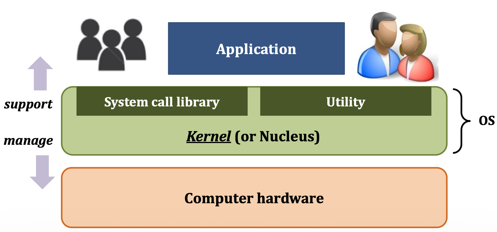

# Day 8 - 운영 체제와 컴퓨터 시스템 동작 원리

# 운영체제

하드웨어 자원을 관리하고, 사용자 어플리케이션과 컴퓨터 하드웨어 사이를 중재하는 인터페이스이다.

> 인터페이스는 상위 레이어가 하위 레이어의 복잡한 기능(구현)을 몰라도 그 기능을 쓸 수 있게 해주는 것

## 역할

1. 자원 관리 : 여러 응용 프로그램이 자원을 요청하면 적절한 순서로 배분하고 회수하여 자원을 효율적으로 관리
2. 자원 보호 : CPU, 메모리 등에 대한 사용자와 응용 프로그램의 직접 접근을 막음 (system call로 접근 가능)
3. 하드웨어 인터페이스 제공 : 별도의 설치 과정 없이 다양한 마우스와 키보드 등을 사용할 수 있다
4. 소프트웨어 인터페이스 제공 : GUI 등

## 커널

운영체제 중 항상 메모리 공간에 올라가 있는 운영체제의 핵심 부분으로, 하드웨어와 응용 프로그램 사이에서 인터페이스를 제공하며 컴퓨터 자원들을 관리하는 역할을 한다.

커널 내부에는 시스템 호출과 드라이버가 존재한다.

시스템 호출(System call)은 사용자 혹은 응용 프로그램이 자원에 접근할 수 있는 인터페이스이다.

드라이버는 시스템 호출과 달리 하드웨어의 인터페이스 역할을 한다. 커널 내부의 드라이버는 간단한 입출력 정도의 입력만 제작하고 개별 하드웨어의 특성을 반영한 소프트웨어는 추가적인 드라이버와 함께 실행되도록 한다.

### 커널의 구조

#### 단일형 구조 (Monolithic architecture)

초창기 운영체제 구조로, 기능들이 단일의 모듈로 구성되어 있다.

- 장점
  - 모듈 간 통신 비용이 줄어 효율적인 운영이 가능하다
- 단점
  - 버그나 오류를 처리하기 어렵다
  - 기능 간 상호 의존성이 높아 작은 결함이 시스템 전체로 확산될 수 있다
  - 다양한 환경의 시스템에 적용하기 위해서는 수정이 필요한데 단일형 구조의 경우 수정이 어려워 이식성아 낮다
  - 현대의 운영체제는 매우 크고 복잡해 단일형 구조로 구현하기 어렵다

#### 계층형 구조 (Layered architecture)

단일형 구조 커널의 발전도니 형태로 비슷한 기능을 가진 모듈들을 하나의 계층으로 묶어 계층 간 통신을 통해 운영체제를 구현한다

- 장점
  - 모듈화와 유지보수성이 좋다
  - 검증 및 구현이 단순하다
  - 정보 은닉에 유리하다
- 단점
  - 성능 저하 (낮은 효율성)
  - 엄격한 계층 분리의 어려움

#### 마이크로 구조 커널 (Micro architecture)

다른 커널과 달리 많은 기능이 사용자 영역에 구현되어 있으며, 각 모듈 간의 정보 교환은 프로세스 간 통신으로 이루어진다.

- 장점
  - 높은 안정성과 신뢰성, 보안성, 확장성, 유연성, 이식성
- 단점
  - 성능 저하
  - 설계 및 개발의 복잡성

## CPU와 I/O 연산

입출력 장치들의 I/O 연산은 I/O 컨트롤러가 담당하고 컴퓨터 내에 수행되는 연산은 메인 CPU가 담당한다.

Local Buffer는 하드웨어 내부에 있으며 하드웨어와 주고 받는 데이터를 임시로 저장하기 위한 작은 메모리이다.

Interrupt는 I/O 컨트롤러들이 CPU의 서비스가 필요할 때 통보하는 방법으로 CPU가 작업을 하던 중 인터럽트 라인에 신호가 들어오면 해당 인터럽트를 처리한다.

## 메모리 구조

1. 코드 영역 (텍스트 영역)

   실행할 프로그램의 코드가 저장되는 영역이다. CPU는 코드 영역에 저장된 명령어를 하나씩 가져가서 처리한다.

2. 데이터 영역 (static 영역)

   전역 변수와 지역 변수가 저장되는 영역으로, 프로그램이 시작되는 동시에 할당되며, 프로그램이 종료되면 함께 소멸한다.

3. 힙 영역 (Heap)

   사용자가 직접 관리하는 영역이며 메모리 공간이 동적으로 할당 및 해제된다.

4. 스택 영역 (Stack)

   함수의 호출에 따른 지역변수와 매개변수가 저장되는 영역으로, 컴파일 시 크기가 결정된다. 함수의 호출과 함께 할당되고, 함수의 호출이 종료되면 소멸한다.
