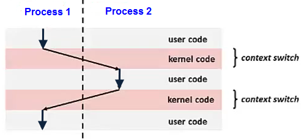

# day9-2. Context Switching
## Context Swtiching

현재 실행 중인 프로세스 또는 스레드의 상태를 저장하고, 다음 작업의 상태를 불러와 실행을 전환하는 과정

### 과정

1. 현재 Task의 PC, 레지스터 등의 실행 상태를 저장한다.
2. 다음에 실행할 Task의 상태를 불러온다.
3. 저장된 지점부터 실행을 이어간다.

### 비용

Context Switching 중에는 실제 작업을 수행하지 않으므로 오버헤드가 발생한다.

#### 오버헤드의 원인
- 현재 작업의 실행 상태를 저장해야 함
- 다음 작업의 실행 상태를 불러와야 함
- 프로세스가 바뀌면 사용하는 메모리 공간도 바꿔야 함
- 실행 대상이 바뀌면서 캐시 효율이 떨어질 수 있음
- 운영체제가 다음 작업을 선택하는 시간이 필요함

프로세스 전환은 주소 공간까지 변경해야 하므로, 같은 프로세스 내의 스레드 전환보다 일반적으로 비용이 크다.
=> 스레드 전환은 주소 공간을 공유하므로 프로세스 전환보다 일반적으로 비용이 적다.