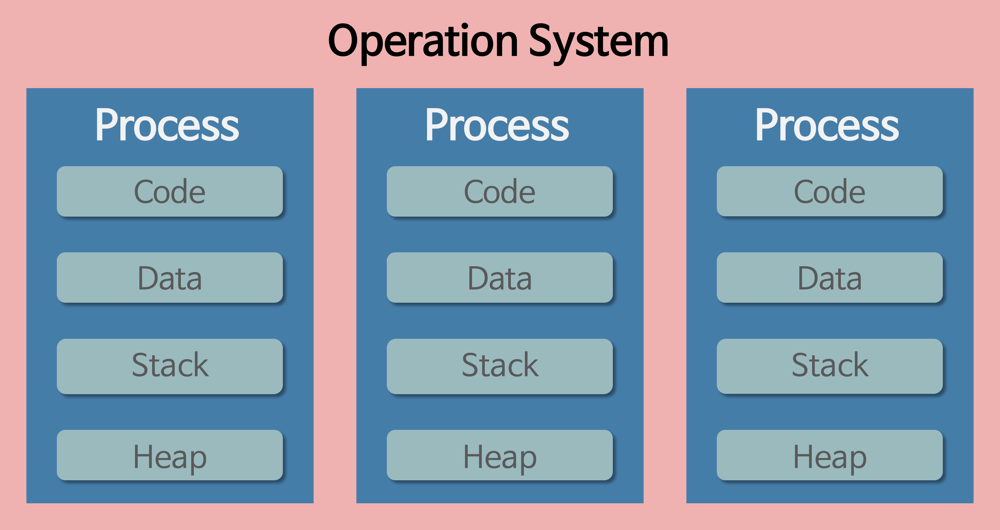
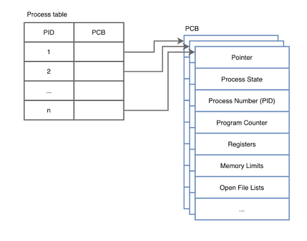
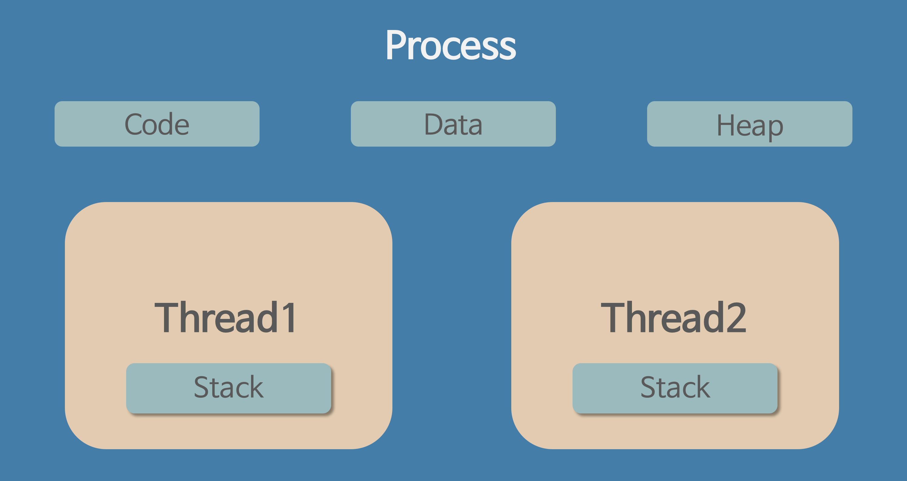
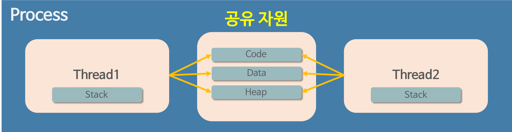

# day 9 Process vs Thread
## 1. Process
- 실행 중인 프로그램으로, 운영체제로부터 메모리와 각종 시스템 자원을 할당받는 작업의 단위

- 프로세스의 메모리 영역 구성
    - `Code`: 실행할 명령어
    - `Data`: 전역 변수와 정적 변수
    - `Heap`: 동적으로 할당되는 메모리
    - `Stack`: 함수 호출 정보와 지역 변수

- 각 프로세스는 독립된 주소 공간을 가짐 -> 다른 프로세스의 메모리에 직접 접근할 수 없음
- 프로세스끼리 데이터를 주고받으려면 파이프, 소켓, 공유 메모리 등의 `IPC`가 필요함
- 프로세스는 기본적으로 하나 이상의 스레드를 가짐

## 2. PCB(Process Control Block; 프로세스 제어 블록)
- 운영체제가 프로세스를 관리하기 위해 사용하는 커널 내부의 자료구조

- PCB에 저장되는 정보
    - 프로세스 식별자(PID)
    - 프로세스 상태
    - CPU 스케줄링 정보
    - 메모리 관리 정보
    - 열린 파일과 입출력 상태
    - CPU 사용 기간 등의 어카운팅 정보

프로세스 테이블의 각 항목은 해당 프로세스의 PCB를 가리키며, PCB에는 프로세스 관리에 필요한 정보가 저장된다.

- 프로세스가 실행 중단 후 다시 CPU를 할당받으면, 운영체제는 저장된 정보를 이용해 이전 실행 지점부터 작업을 이어감

## 3. Thread(스레드)
- 프로세스 내부에서 실행되는 하나의 실행 흐름

- 같은 프로세스에 속한 스레드들이 공유하는 영역
    - `Code`, `Data`, `Heap`, 열린 파일 등의 프로세스 자원

- 스레드마다 독립적으로 가지는 정보
    - `Stack`, `PC(Program Counter; 프로그램 카운터)`, `CPU 레지스터`

- 각 Thread는 서로 다른 함수를 실행하고 서로 다른 위치까지 명령어를 수행할 수 있음 <- 독립적인 스택, PC, 레지스터가 필요
- Thread들은 Data와 Heap 영역을 공유하기 때문에 데이터를 쉽게 주고받을 수 있지만, 동시에 같은 데이터를 수정할 경우 동기화 문제가 발생할 수 있음

## 4. Process vs Thread

| 구분 | 프로세스 | 스레드 |
|---|---|---|
| 의미 | 실행 중인 프로그램 | 프로세스 내부의 실행 흐름 |
| 주요 역할 | 자원 할당의 단위 | CPU 실행의 단위 |
| 메모리 | 프로세스마다 독립적 | Code, Data, Heap 공유 |
| 독립 자원 | 주소 공간과 시스템 자원 | Stack, PC, 레지스터 |
| 통신 | IPC 필요 | 공유 메모리를 통해 가능 |
| 장애 영향 | 다른 프로세스와 비교적 격리 | 프로세스 전체에 영향을 줄 수 있음 |

- 프로세스: 자원을 할당받는 단위
- 스레드: 프로세스 내부에서 명령어를 실행하는 단위

## 5. Multi Process / Multi Thread

### 5.1. Multi Processs
- 하나의 프로그램을 여러 프로세스로 구성하여 작업을 처리하는 방식

#### 장점
- 프로세스마다 메모리가 독립되어 있어 장애를 격리하기 쉬움
- 한 프로세스의 오류가 다른 프로세스에 미치는 영향이 비교적 적음

#### 단점
- 프로세스마다 독립적인 메모리를 가짐 -> 자원 사용량이 크다
- 프로세스 전환 비용이 비교적 큼
- 데이터를 주고받기 위해 IPC가 필요함

### 5.2. Multi Thread
- 하나의 프로세스 안에서 여러 스레드가 작업을 나누어 처리하는 방식

#### 장점
- 프로세스의 메모리와 자원을 공유 -> 자원 사용량이 적음
- `공유 메모리`를 이용해 스레드 간 데이터를 쉽게 전달할 수 있음
- 같은 프로세스 내 스레드 전환은 프로세스 전환보다 일반적으로 빠름

#### 단점
- 여러 스레드가 공유 자원에 동시에 접근하면 동기화 문제가 발생할 수 있음
- 한 스레드에서 치명적인 오류가 발생하면 프로세스 전체가 종료될 수 있음
- 실행 순서가 일정하지 않음 -> 디버깅 어려움

안정성 / 장애 격리 중시 -> 멀티프로세스
빠른 데이터 공유 / 적은 자원 사용 중시 -> 멀티스레드

## 참고

### Context Switching
Context Switching은 현재 실행 중인 프로세스 또는 스레드의 상태를 저장하고, 다음 작업의 상태를 불러오는 과정이다.

전환 시 PC, CPU 레지스터, 스택 포인터 등을 저장하고 복원한다. 같은 프로세스의 스레드들은 주소 공간과 페이지 테이블을 공유하므로, 스레드 전환은 프로세스 전환보다 일반적으로 비용이 적다.

> Context Switching 시 CPU 캐시가 반드시 초기화되는 것은 아니지만, 실행 대상이 바뀌면서 캐시 미스나 TLB 미스가 증가할 수 있다.

### Race Condition

Race Condition은 여러 스레드가 공유 자원에 동시에 접근할 때, 실행 순서에 따라 결과가 달라지는 현상이다.

예를 들어 두 스레드가 동시에 `count`를 증가시키면 기대한 결과가 2여도 실제 결과는 1이 될 수 있다.

### Thread-safe

Thread-safe란 여러 스레드가 동시에 공유 자원에 접근하더라도 의도한 결과가 보장되는 상태를 의미한다.

이를 위해 공유 자원에 접근하는 임계영역을 뮤텍스나 세마포어 등의 동기화 기법으로 제어한다.

### Reentrant

재진입 가능한 함수는 실행 도중 같은 함수가 다시 호출되어도 각 호출이 서로 영향을 주지 않는 함수이다.

보통 수정 가능한 전역 변수나 정적 변수를 사용하지 않고, 매개변수와 지역 변수를 중심으로 동작한다.

> Reentrant 함수는 일반적으로 Thread-safe하지만, Thread-safe 함수가 항상 Reentrant한 것은 아니다.

[자주 나오는 질문]

Q. 스택을 스레드마다 독립적으로 할당하는 이유는 뭘까?

스택은 함수 호출시 전달되는 인자, 복귀 주소값 및 함수 내에서 선언하는 변수 등을 저장하기 위해 사용되는 메모리 공간.

스택 메모리 공간이 독립적이라는 것은 독립적인 함수 호출이 가능함을 의미하고 이는 독립적인 실행 흐름이 추가된다는 것이다. 따라서 스레드의 정의에 따라 독립적인 실행 흐름을 추가하기 위한 최소 조건으로 독립된 스택을 할당하는 것이다.

Q. PC 레지스터를 스레드마다 독립적으로 할당하는 이유는 뭘까?

PC 값은 스레드가 명령어의 어디까지 수행했는지를 나타내게 된다. 스레드는 CPU를 할당받았다가 스케줄러에 의해 다시 선점당한다. 그렇기 때문에 명령어가 연속적으로 수행되지 못하고 어느 부분까지 수행했는지 기억할 필요가 있다. 따라서 PC 레지스터를 독립적으로 할당한다.

Q. 멀티 프로세스 대신 멀티 스레드를 사용하는 이유는?

- 프로그램을 여러 개 키는 것보다 하나의 프로그램 안에서 여러 작업을 해결하는 것이 더욱 효율적이기 때문이다.
- 프로세스를 생성하여 자원을 할당하는 시스템 콜이 줄어들어 자원을 효율적으로 관리할 수 있다.
- Context Switching시, 캐시 메모리를 비울 필요가 없기 때문에 비용이 적고 더 빠르다.-> 스레드는 Stack 영역만 초기화하면 되기 때문이다.
- 스레드는 프로세스 내의 메모리를 공유하기 때문에 데이터 전달이 간단하므로 IPC에 비해 비용이 적고 더 빠르다. -> 스레드는 프로세스의 Stack 영역을 제외한 모든 메모리를 공유하기 때문이다.