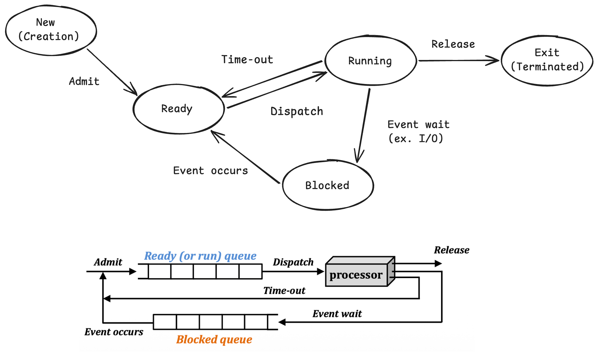

# Day 9 - Process vs Thread, Context Switching

## 프로그램 동작 원리

우선 프로그램이 프로세서에서 어떻게 동작하는지부터 알아보자.

```
main.c (소스코드)
  ⬇️ (컴파일러)
main.o (오브젝트 파일)
  ⬇️ (링커)
프로그램 (-> fully-linked된 실행 가능한 오브젝트 파일)
  ⬇️ (로더)
프로세스 생성
  ⬇️
코드, 데이터, 힙, 스택이 메모리에 배치
  ⬇️
CPU가 PC(Program Counter)를 따라 명령어 실행
```

프로세스는 실행 중인 프로그램의 **인스턴스**로 메모리 공간에 위치해 있다. (CPU에 의해 실행될 준비가 된 상태)

프로그램은 실행되기 위한 코드들의 순서(집합)와 그 코드와 관련된 데이터의 집합이다. 프로세스와는 달리 디스크 공간에 저장되어 있다. (실행될 준비가 안됨)

## 프로세스 상태

프로세스 상태는 3가지(Runnig, Ready, Blocked)로 이루어져 있다.

각 상태를 구분하는 기준은 CPU에 대한 권한을 가지고 있는지와 수행에 필요한 모든 리소스를 소유하고 있는지 여부로 나뉜다.

Running 상태는 CPU와 리소스를 모두 가지고 있고, Ready는 리소스만, Blocked는 아무것도 없다.

| 상태    | CPU | 리소스 |
| ------- | --- | ------ |
| Running | O   | O      |
| Ready   | X   | O      |
| Blocked | X   | X      |

프로세스 상태를 프로세스 생명 주기 전체 관점으로 프로세스의 생명과 종료까지 나타내면 아래와 같이 5개의 상태로 나타낼 수 있다.



#### New (creation)

- `fork()` 시스템 콜에 의해 프로세스 생성
- PCB (Process Control Block)이 할당되었지만 아직 메모리에는 올라가지 않은 상태

#### Running

- 프로세서와 리소스 모두 가지고 있는 상태

#### Ready

- 프로세스가 실행될 준비가 된 상태
- 리소스를 가지고 있지만 프로세서가 없음 Ready queue에 올라가 OS가 스케쥴링 해주기를 기다린다.

#### Blocked

- I/O 요청 등을 처리하고 있어서 아직 리소스가 없는 상태

#### Terminated

- 메인 메모리로부터 제거 되고 PCB도 삭제된 상태

## PCB (Process Control Block)

- 프로세스를 정상적으로 수행하기 위한 필요한 모든 정보가 담겨 있음
- PID, Process State, Program Counter, CPU registers, Scheduling information, Memory management information, I/O status information, Accounting information, Context save area 정보가 있음
- 이중에서 Context(Program Counter + CPU registers)와 PID는 반드시 필요함
- 메모리 공간에 저장되어 있어 접근 시 I/O 비용이 발생함

## Context Switching

CPU가 현재 실행 중인 프로세스의 실행 상태(context)를 저장하고, 다른 프로세스의 실행 상태를 복원하여 CPU를 넘겨주는 작업이다.

CPU는 한 순간에 하나의 프로세스만 실행할 수 있기 때문에 프로세스의 상태를 저장/불러오는 작업이 필요한데 이것이 Context Switching이다.

발생하는 경우는 다음과 같다.

1. Time Slice 만료
2. I/O 요청
3. 우선 순위가 높은 프로세스 등장

정리하면, CPU가 현재 프로세스의 실행 상태를 저장하고 다른 프로세스의 실행 상태를 복원하여 CPU의 실행 대상을 변경하는 과정이다. 이 과정에서 PCB에 레지스터와 PC 등의 정보를 저장·복원하며, 오버헤드가 발생한다.

## 쓰레드 (Thread)

쓰레드는 프로세스 내부에서 실행되는 **작업의 흐름(실행 단위)**이다.

프로세스는 자신만의 자원을 가지고, 프로세스 A, B가 있다면 서로 메모리를 공유하지 않는다. 따라서 다른 프로세스의 메로리에 직접 접근할 수 없다.

반면 쓰레드는 프로세스 내부의 실행 흐름이다. 따라서 같은 프로세스에 속한 프로그램은 Code, Data, Heap, Open Files 영역을 공유한다. (PC, Register, Stack은 독립적으로 가짐)

또한 프로세스의 PCB와 유사하게 TCB(Thread Contorl Block)이 메모리에 저장되어 OS가 관리한다.

쓰레드는 프로세스보다 생성 및 context switching 비용이 적고 자원 공유가 용이하다는 장점이 있다. 하지만 수행 순서를 보장하지 않고, Race condition이 존재한다는 단점이 있다.
